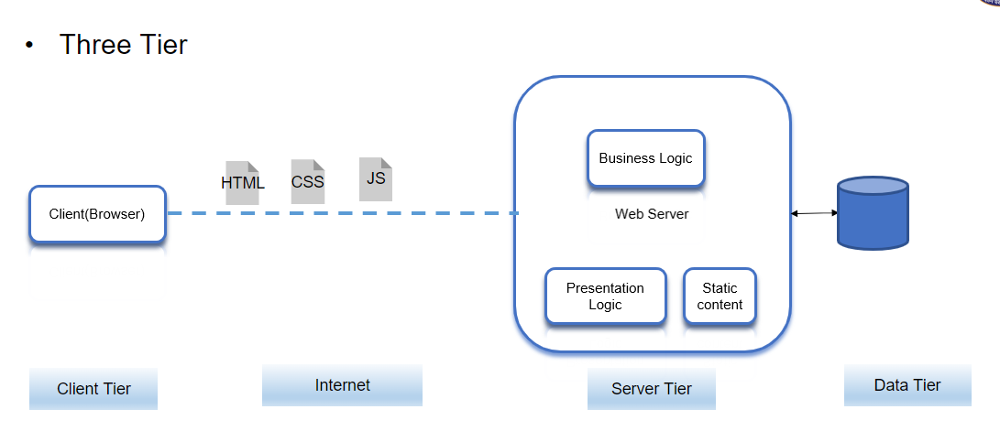
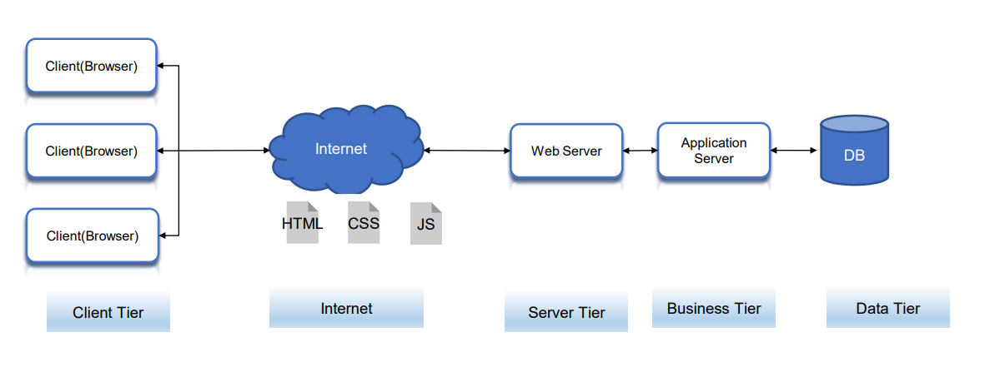
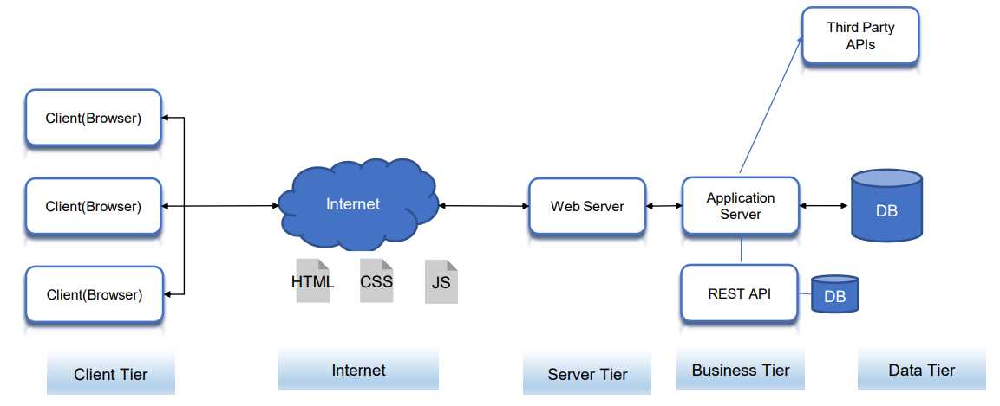
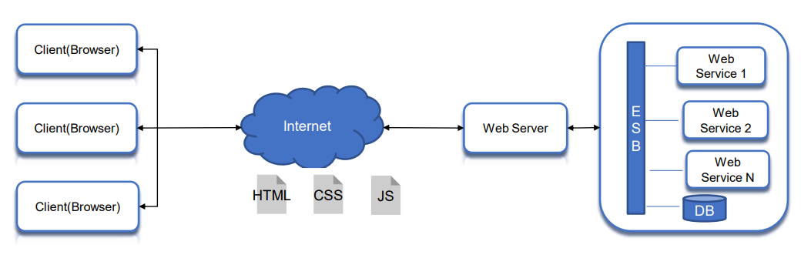
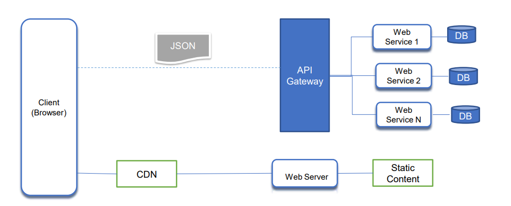

### Full Stack Application Development

---

### Website
- **Definition**: A group of interlinked web pages with a single domain name, hosted on a web server, accessible via the internet.
- **Use Cases**: Portfolios, personal blogs, informational websites, small business websites with minimal content updates, landing pages, and temporary promotions.

### Web Application
- **Definition**: An application program stored on a remote server, delivered over the internet, and accessed through a web browser.
- **Common Examples**: E-commerce shops, webmail, social networking sites.

---

### Application Types

#### Native Apps
- **Definition**: Developed for a specific platform or operating system and installed directly onto the device.
- **Pros**: Offline usage, direct hardware access, device-specific gestures, full feature access, app store approval, improved security.
- **Cons**: Higher development and maintenance costs, tedious app store approval process, needs updates.
- **Technologies**:
  - **iOS**: Swift, Objective-C, Xcode (Example: Instagram)
  - **Android**: Java, Kotlin, Android Studio (Example: WhatsApp)

#### Web Apps
- **Definition**: Internet-enabled applications accessible via a web browser, written in HTML, CSS, JavaScript.
- **Pros**: Instant accessibility, easier updates and maintenance, discoverable via search engines, cost-effective.
- **Cons**: Limited device feature access, browser variations, challenging stable performance across devices, not listed in app stores, unavailable offline.
- **Technologies**: HTML, CSS, JavaScript, React, Angular, Vue.js (Example: Google Docs)

#### Progressive Web Applications (PWAs)
- **Definition**: Built using web technologies, can be installed on devices, offering offline and background operations.
- **Technologies**: HTML, CSS, JavaScript, Workbox, Lighthouse, Service Workers, Web App Manifests.

#### Hybrid Apps
- **Definition**: Combine elements of native and web applications, built using web technologies but run inside a native container.
- **Pros**: No need for a web browser, access to device’s internal APIs and hardware, single codebase.
- **Cons**: Slower than native apps, reliant on third-party platforms, limited customization support.
- **Technologies**: HTML, CSS, JavaScript, Ionic, Apache Cordova, PhoneGap.

#### Cross-Platform Applications
- **Definition**: Developed to run on multiple devices, ensuring multi-platform compatibility.
- **Pros**: Cost-effective, code reusability, larger audience reach.
- **Cons**: Slower performance than native apps.
- **Technologies**: React Native, Flutter, Xamarin (Examples: Facebook, Google Ads, Microsoft Outlook).

---

### Cloud-Native Applications

#### Definition
- **Cloud-native** is an approach to developing, deploying, and running applications using modern methods and tools.
- **CNCF Definition**: Technologies that empower organizations to build and run scalable applications in modern environments like public, private, and hybrid clouds. Examples include containers, service meshes, microservices, immutable infrastructure, and declarative APIs.

#### Cloud-Enabled Solutions
- **Monolithic Application**: Traditional software design where the entire application is a single, self-contained unit.
  - **Characteristics**: Single codebase, tight coupling, single deployment unit, centralized database, development and scaling challenges, longer development cycles, limited fault isolation.
- **Cloud-Based Application**: Existing app shifted to the cloud, not fully leveraging cloud potential. Issues include lack of scalability, less automation, longer time to market.
- **Cloud-Native Applications**: Designed to run on cloud architecture, leveraging automation and scalability.

#### Comparison: Cloud Native vs. Traditional Applications
- **Cloud-Enabled**: Developed for traditional data centers, later modified for cloud environments.
- **Cloud-Native**: Built for the cloud, scalable, platform-agnostic, composed of microservices.

---

### Pillars of Cloud-Native Applications

#### Building Blocks
1. **Microservices**:
   - Architectural approach where applications are a collection of small services.
   - Each service implements business capabilities, runs independently, and communicates via HTTP APIs or messaging.
2. **Containers**:
   - Offer efficiency and speed compared to standard VMs.
   - OS-level virtualization allows isolated containers with unique file systems and resource quotas.
   - Low overhead and high packing density make containers ideal for deploying microservices.
3. **DevOps**:
   - Collaboration between software developers and IT operations for high-quality software delivery.
   - Promotes rapid, frequent, and consistent building, testing, and releasing.
4. **Continuous Delivery**:
   - Automation for shipping small software batches to production constantly.
   - Ensures reliable releases, frequent delivery, and faster user feedback.

#### Advantages
- Reduced time to market
- Ease of management
- Scalability and flexibility
- Reduced cost

---

### Serverless Applications

#### Definition
- **Serverless Architecture**: Allows developers to build and run services without managing infrastructure. Cloud providers handle provisioning, scaling, and managing infrastructure.

#### Function as a Service (FaaS)
- Application code is written as discrete functions performing specific tasks triggered by events.
- Cloud provider executes the function, abstracting the execution process from developers.
- **Examples**:
  - **AWS**: AWS Lambda
  - **Microsoft Azure**: Azure Functions
  - **Google Cloud**: Cloud Functions

#### Serverless Benefits and Drawbacks
- **Benefits**:
  - Reduced operational cost
  - Easier operational management
  - Scalability
- **Drawbacks**:
  - Loss of control
  - Vendor lock-in
  - Multitenancy problems
  - Security concerns

#### AWS Serverless Offerings
- **AWS Lambda**: Run code without provisioning or managing servers.
- **AWS Fargate**: Serverless compute engine for containers.
- **Amazon API Gateway**: Fully managed service for creating, publishing, maintaining, monitoring, and securing APIs at any scale.

#### Reference Architecture: Web Application
- **General-purpose, event-driven web application backend**:
  - **AWS Lambda** and **Amazon API Gateway** for business logic
  - **Amazon DynamoDB** as the database
  - **Amazon Cognito** for user management
  - **AWS Amplify Console** for hosting static content
  

---
### Layered Pattern
- **Context**: Separation of concerns.
- **Problem**: Ensuring that system modules are independently developed and maintained, promoting portability, modifiability, and reuse.
- **Solution**: Dividing software into units called layers, where each layer is a cohesive set of services.
  - **Interaction**: Strict unidirectional ordering.
  - **Interface**: Each partition is exposed through an interface.

---

### Web Application Architecture
- **Layered Architecture**: Fundamental structure for web applications.
  - **Two-Layer Systems**: Client-server systems where the client holds the user interface and application code, and the server hosts a relational database.
  - **Three-Tier Architecture**:
    - **Presentation (UI)**: User interface components.
    - **Business Logic**: Core functionality and business rules.
    - **Data Access**: Interaction with the database.

---

### Ensuring Clear Separation of Concerns
- **Scenario 1**: Highlight products with over 10% increase in sales.
  - **Method 1**: Embed logic directly into the presentation layer.
  - **Method 2**: Use a method in the domain layer to indicate improved sales, then call this method from the presentation layer.
- **Scenario 2**: Adding a command-line interface to a web application.
  - **Method**: Avoid duplicating functionality by properly separating layers, ensuring domain logic does not leak into the presentation.

---

### N-Tier Web Application
- **Structure**: 
  - Client (Browser)
  - Web Server
  - Application Server
  - Database (DB)
- **Characteristics**:
  - Independence of each tier.
  - Security, performance, and availability optimizations.

---

### Service-Based Web Application
- **Components**:
  - REST APIs
  - Third-Party APIs
  - Database
- **Architecture**: Similar to N-Tier but emphasizes RESTful communication.

---

### Monolithic Application
- **Definition**: Deployed as a single, self-contained unit (e.g., a Java WAR file).
- **Challenges**: Scalability issues and the need to redeploy the entire application for changes.

---

### Service-Oriented Architecture (SOA)
- **Definition**: Integrates business functionalities as services.
- **Characteristics**:
  - Loosely coupled and autonomous services.
  - Adheres to the Single Responsibility Principle.
- **SOA-Based Web Application**:
  - Client (Browser)
  - Web Services
  - Enterprise Service Bus (ESB)
  - Database (DB)

---

### Microservice Architecture
- **Characteristics**:
  - Composed of small, independent services.
  - Implements single business capabilities.
  - Loosely coupled, communicating via API contracts.
  - Built by focused development teams.
- **Complexities**: Requires mature DevOps culture and management but results in higher release velocity and resilience.

---

### Application Programming Interface (API)
- **Definition**: A software intermediary that allows two applications to communicate.
- **Types**:
  - **Public API**: External access to assets (e.g., Twitter API, Google Maps API).
  - **Private API**: Internal use for productivity and service-oriented architecture.
- **Paradigms**:
  - Request-Response APIs (e.g., REST, RPC, GraphQL).
  - Event-Driven APIs.

---

### Model-View-Controller (MVC) Pattern
- **Definition**: Divides application logic into three interconnected components: Model, View, and Controller.
  - **Model**: Manages data-related logic and interacts with the database.
  - **View**: User interface, communicates with the controller, and renders data.
  - **Controller**: Handles user input, processes requests, and manages data flow to the view.
- **Example**:
  - Routes: `/users/profiles/:id`
  - Controller: Fetches user profile and renders the view.
  - Model: Queries the database for user data.
  - View: Displays user profile information.

---

### Model-View-Presenter (MVP)
- **Definition**: The view is passive and routes user commands to the presenter.
- **MVC Variant**: Similar to MVC but with a focus on separation of presentation logic.

---

### Model-Template-View (MTV)
- **Definition**: Similar to MVC but with a distinct template component.
  - **Model**: Interface for data.
  - **Template**: Presentation layer, containing static or dynamic HTML.
  - **View**: Executes business logic and interacts with the model, rendering the template.

---