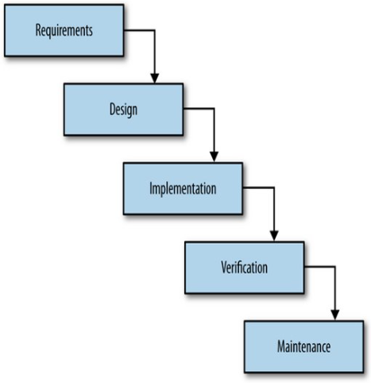
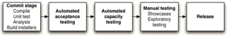
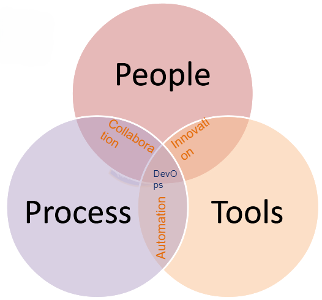
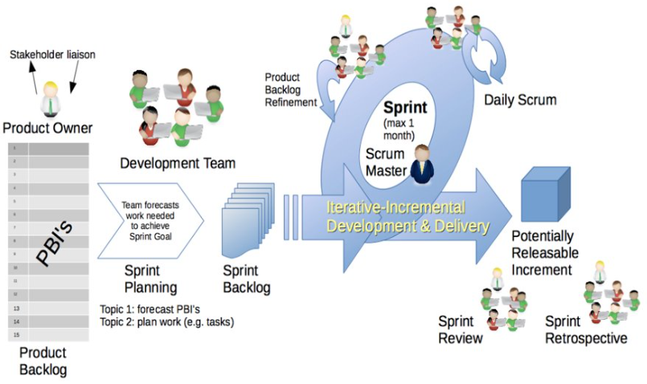
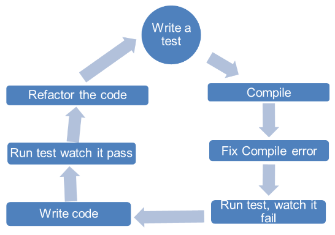
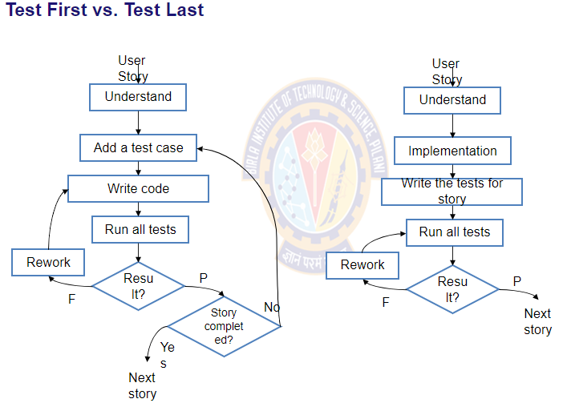
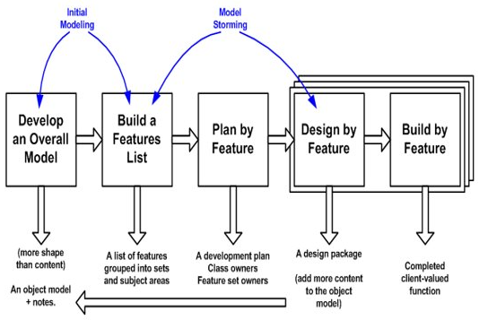
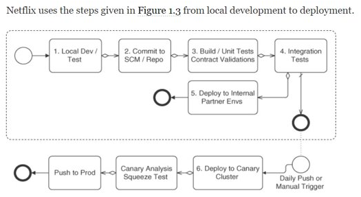

### Introduction to DevOps

---

#### **1. Waterfall Model**
   - **Overview**: A linear and sequential approach to software development where each phase must be completed before moving on to the next.
   - **Pros**:
     - Simple and easy to understand.
     - Works well for small projects with clear requirements.
   - **Cons**:
     - Inflexibility in accommodating changes.
     - Testing phase is late in the process, making it hard to fix issues.

   **Additional Info**: The Waterfall model is often criticized for its rigidity and lack of flexibility, especially in projects where requirements evolve over time.

   

#### **2. Agile Methodology**
   - **Overview**: A flexible approach that values:
     - Individuals and interactions over processes and tools.
     - Working software over comprehensive documentation.
     - Customer collaboration over contract negotiation.
     - Responding to change over following a plan.
   - **Principles**:
     - Continuous delivery of valuable software.
     - Welcome changing requirements, even late in development.
     - Frequent delivery of working software.

   **Additional Info**: Agile emphasizes iterative progress, frequent feedback, and collaboration. It's especially useful in dynamic projects where client needs change rapidly.

#### **3. Scrum**
   - **Overview**: A subset of Agile, Scrum is a framework for managing work with an emphasis on iterative progress through sprints.
   - **Key Elements**:
     - **Sprints**: Fixed-length events (usually 1-4 weeks) where a set amount of work is completed.
     - **Sprint Planning**: Defining what can be delivered in the sprint and how that work will be achieved.
     - **Daily Standups (DSM)**: Quick meetings to discuss progress, plans, and obstacles.
     - **Sprint Review & Retrospective**: Review of completed work and reflection on the sprint to improve future ones.

   **Additional Info**: Scrum is ideal for projects requiring quick adaptations. Its roles, such as Scrum Master and Product Owner, are crucial in facilitating team productivity.

#### **4. Version Control**
   - **Overview**: Systems used to track changes in code or documents, enabling collaboration among developers.
   - **Key Features**:
     - **Commits/Revisions**: Record of changes made.
     - **Branching/Merging**: Parallel development paths that can be integrated.
     - **Restoration**: Ability to revert to previous versions.

   **Additional Info**: Version control is essential for collaboration, as it allows multiple developers to work on different parts of a project simultaneously without overwriting each other's work.

#### **5. Test-Driven Development (TDD)**
   - **Overview**: Writing tests before code to define desired functionality, then writing code to pass these tests.
   - **Benefits**:
     - Clear specifications of what the code should do.
     - Short feedback loops encourage better quality code.
     - Developers take more responsibility for their code.

   **Additional Info**: TDD promotes writing only the necessary code to pass tests, leading to a more focused and efficient development process.

#### **6. Continuous Integration (CI)**
   - **Overview**: The practice of frequently integrating new code into a shared repository, followed by automated testing.
   - **Advantages**:
     - Early detection of integration issues.
     - Smaller, more manageable code changes.
     - Reduced risk of conflicts and bugs.

   **Additional Info**: CI encourages developers to integrate changes regularly, ensuring that the project is always in a deployable state.

#### **7. Continuous Delivery (CD)**
   - **Overview**: Extending CI by ensuring that software can be released at any time through automated testing and integration.
   - **Core Idea**: Every change is deployable, reducing the time and risk associated with releasing software.

   **Additional Info**: Continuous Delivery ensures that code is always ready for deployment, but does not automatically deploy changes without human intervention.

#### **8. Continuous Deployment**
   - **Overview**: An extension of Continuous Delivery where code changes are automatically deployed to production once they pass all tests.
   - **Key Points**:
     - Fully automated deployment pipeline.
     - Reduces manual intervention, speeding up the release process.

   **Additional Info**: Continuous Deployment is ideal for environments requiring frequent updates, such as web services and mobile apps.

#### **9. Deployment Pipeline**
   - **Overview**: A set of automated processes to build, test, and deploy code. Central to CI/CD practices.
   - **Components**:
     - Build Automation: Compiling code into executable form.
     - Automated Testing: Ensuring the code meets quality standards.
     - Deployment: Moving code to production environments.

   **Additional Info**: A well-designed deployment pipeline reduces errors and ensures consistent delivery of software.

   

#### **10. Antipatterns**
   - **Manual Software Deployment**:
     - **Signs**: Extensive documentation, reliance on manual testing, frequent issues during deployment.
   - **Deploying to Production-like Environment Late**:
     - **Signs**: Testing only in development environments, operations team sees the software for the first time during production release.

   **Additional Info**: Avoiding these antipatterns is crucial for a smooth, efficient, and reliable deployment process.

#### **11. Feedback Process**
   - **Key Idea**: Every code change should trigger a feedback loop through automated building and testing.
   - **Requirements for Effective Feedback**:
     - Fast execution.
     - High coverage of the codebase.
     - Immediate response to failures.

   **Additional Info**: Fast and comprehensive feedback loops ensure that issues are caught early, reducing the cost and effort required to fix them.

---
### **DevOps Misconceptions and Dimensions**

#### **DevOps Misconceptions**
1. **DevOps Involves Only Developers and System Administrators**:
   - DevOps is not limited to just development and operations. It involves all roles within an organization, including security, QA, support, and legal.
   
2. **DevOps is a Team**:
   - Creating a DevOps team or renaming an existing team to DevOps doesn't necessarily foster a DevOps culture. Instead, frequent collaboration between development and operations teams is key.
   
3. **DevOps is a Job Title**:
   - The job title "DevOps engineer" is often debated. DevOps is more about specialization in roles, and its core is a cultural movement that requires adoption across the entire organization.

4. **You Need a DevOps Certification**:
   - Certifications test knowledge, but DevOps is about culture and doesn’t have strict technology requirements or one-size-fits-all solutions.

5. **DevOps Means Doing All the Work with Half the People**:
   - This misconception is harmful. DevOps doesn’t reduce the number of engineers needed but enhances the quality and efficiency of work.

6. **DevOps Is About Automation**:
   - Automation is a result of improved technology, but DevOps is not just about automation. It’s about improving efficiency and allowing engineers to focus on more complex tasks.

7. **DevOps Is a FAD**:
   - DevOps is not just a buzzword or a trend. It’s a movement focused on improving organizational effectiveness and employee satisfaction. It's defined by stories and ideas rather than strict processes.

#### **Three Dimensions of DevOps**
- **People**: Emphasizes the importance of human resources and collaboration in DevOps.
- **Process**: Focuses on the methodologies and workflows that drive DevOps practices.
- **Tools/Technology**: Encompasses the technical tools and platforms that support DevOps automation and operations.
   
   
---

## **1. Introduction to Scrum**

### **1.1 Scrum Overview**
- **Definition**: Scrum is an agile framework for managing projects, often used in software development. It emphasizes real-world results and adaptability.
- **Key Features**:
  - **Sprints**: Time-boxed iterations (usually 1-4 weeks) focused on completing specific project tasks.
  - **Inspect and Adapt**: Continuous feedback loops for coping with complexity and risk.

### **1.2 Benefits of Scrum**
- **Flexibility**: Adapt to changing requirements easily.
- **Quality**: Continuous testing ensures a high-quality product.
- **Incremental Progress**: Delivers small, working products frequently.
- **Early to Market**: Faster releases allow quicker time-to-market.
  
  
---

## **2. Test-Driven Development (TDD)**

### **2.1 TDD Overview**
- **Definition**: A development approach where tests are written before code. The cycle involves writing a test, writing code to pass the test, and then refactoring.
- **Key Steps**:
  - **Red**: Write a failing test.
  - **Green**: Write just enough code to pass the test.
  - **Refactor**: Clean up the code and ensure all tests still pass.

  


### **2.2 Benefits of TDD**
- **Modular Code**: Leads to more modular, flexible, and extensible code.
- **Better Design**: Encourages better software design.
- **Improved Documentation**: Code is better documented through tests.
- **Higher Productivity**: Less debugging and better code quality.

  
  
---

## **3. Feature-Driven Development (FDD)**

### **3.1 FDD Overview**
- **Definition**: A client-centric approach to software development, focusing on small, functional features.
- **Key Roles**:
  - **Project Manager**: Oversees project progress.
  - **Chief Architect**: Ensures design integrity.
  - **Development Manager**: Manages the development process.
  - **Class Owners**: Experts responsible for specific classes of code.

### **3.2 FDD Process**
- **Develop an Overall Model**: Create a high-level model of the system.
- **Build a Features List**: Identify and list features.
- **Plan by Feature**: Prioritize and plan features based on business value.
- **Design by Feature**: Design the system incrementally.
- **Build by Feature**: Implement and deliver features.

  

---

## **4. Behavior-Driven Development (BDD)**

### **4.1 BDD Overview**
- **Definition**: An extension of TDD that focuses on the behavior of the application.
- **Key Concepts**:
  - **User Stories**: Describe features from the user's perspective.
  - **Scenarios**: Define how the system should behave in specific situations.

### **4.2 BDD Process**
- **Identify Business Feature**: Understand the business need.
- **Identify Scenarios**: Break down the feature into testable scenarios.
- **Define Steps**: Outline the steps to implement each scenario.
- **Run Tests**: Implement and validate scenarios.

---

## **5. DevOps Team Structure**

### **5.1 Team Composition**
- **Small Teams**: Ideal for quick decision-making and communication.
- **Roles**:
  - **Team Lead**: Facilitates the team and resolves issues.
  - **Team Members**: Developers responsible for coding, testing, and releasing software.
  - **Service Owner**: Manages system-wide requirements and prioritizes work.
  - **Reliability Engineer**: Monitors and troubleshoots services post-deployment.

### **5.2 Additional Roles**
- **Gatekeeper**: Ensures that only the most stable code is deployed.
- **DevOps Engineer**: Manages the tools and processes in the DevOps pipeline, including automation and configuration management.

  

---

## **6. Team Coordination in DevOps**

### **6.1 Coordination Mechanisms**
- **Human Processes**: Derived from agile practices, such as stand-up meetings.
- **Automated Processes**: Automation of repetitive tasks, continuous integration, and deployment.

### **6.2 Types of Coordination**
- **Upstream**: Coordination with stakeholders and customers.
- **Downstream**: Coordination with operations.
- **Cross-Stream**: Coordination with other development teams.

---

## **7. Transformation to Enterprise DevOps Culture**

### **7.1 Challenges in Large Enterprises**
- **Legacy Technology**: Adapting old systems to new processes.
- **Organizational Culture**: Shifting mindset towards DevOps principles.

### **7.2 Key Steps in Transformation**
- **Design Thinking**: Engage all stakeholders in a collaborative process.
- **DevOps Center of Excellence**: Establish a dedicated team to drive DevOps practices.
- **Program Governance**: Shift KPIs towards holistic business outcomes.

### **7.3 Scaling DevOps**
- **Pilot Projects**: Start with smaller projects to test DevOps practices.
- **Parallel Release Trains**: Implement multiple, simultaneous release pipelines.
- **Ongoing Support**: Continuous monitoring and management of DevOps practices.

---

### **Cloud as a catalyst for DevOps**

#### **1. Introduction**
- **DevOps & Cloud**: 
  - The cloud is considered a critical enabler for DevOps practices. The integration of cloud infrastructure with DevOps processes enhances agility, automation, and efficiency in software development and operations. However, the full potential of this integration is often unrealized by organizations due to various challenges.
  - **Key Focus Areas**:
    - **Adoption of Cloud-based Infrastructure**: Emphasizes the importance of adopting cloud infrastructure to enable scalability, flexibility, and cost-effectiveness.
    - **Management of Cloud Resources**: Focuses on the need to effectively manage cloud resources to avoid wastage and optimize performance.
    - **Cost Benefits**: The pay-per-use model of cloud services is highlighted as a key advantage.
    - **Resilience and Scalability**: Cloud infrastructure provides the ability to quickly scale resources up or down based on demand, improving resilience against failures and traffic spikes.
  - **Risks and Challenges**:
    - **Dependency on Third-party Providers**: Organizations become reliant on cloud service providers, which can introduce risks related to service availability and support.
    - **Data Sovereignty Issues**: The challenge of managing data across different jurisdictions with varying regulations.
    - **Increased Security Risks**: The popularity of cloud platforms makes them a target for cyber threats, necessitating strong security measures.

#### **2. Characterization of the Cloud**
- **NIST Definition of Cloud Computing**:
  - **On-Demand Self-Service**: Users can provision computing resources such as server time and network storage as needed automatically, without requiring human intervention from the service provider.
  - **Broad Network Access**: Resources are available over the network and can be accessed through standard mechanisms by various devices, including mobile phones, laptops, and workstations.
  - **Resource Pooling**: The provider's computing resources are pooled to serve multiple consumers using a multi-tenant model. Different physical and virtual resources are dynamically assigned and reassigned according to consumer demand.
  - **Rapid Elasticity**: Cloud capabilities can be elastically provisioned and released, sometimes automatically, to scale rapidly outward and inward commensurate with demand.
  - **Measured Service**: Cloud systems automatically control and optimize resource use by leveraging a metering capability at some level of abstraction appropriate to the type of service (e.g., storage, processing, bandwidth). Resource usage is monitored, controlled, and reported, providing transparency for both the provider and consumer.

#### **3. Types of Cloud Services**
- **Software as a Service (SaaS)**:
  - The consumer uses the provider’s applications running on a cloud infrastructure. The applications are accessible from various client devices through a web browser or API.
  - **Examples**: Google Apps, Salesforce, Cisco WebEx, Office 365.
  - **Key Points**: 
    - Users do not manage or control the underlying cloud infrastructure or even individual application capabilities.
    - SaaS is typically subscription-based and often includes ongoing updates and support from the provider.

- **Platform as a Service (PaaS)**:
  - The consumer can deploy consumer-created or acquired applications onto the cloud infrastructure using programming languages, libraries, services, and tools supported by the provider.
  - **Examples**: Google App Engine, Microsoft Azure, .NET Development Platform.
  - **Key Points**: 
    - Users control the deployed applications and possibly configuration settings for the application-hosting environment.
    - They do not manage the underlying cloud infrastructure including network, servers, operating systems, or storage.

- **Infrastructure as a Service (IaaS)**:
  - The consumer can provision processing, storage, networks, and other fundamental computing resources where they can deploy and run arbitrary software, which can include operating systems and applications.
  - **Examples**: Amazon Web Services (AWS), Microsoft Azure, Google Compute Engine.
  - **Key Points**: 
    - Users have control over operating systems, storage, deployed applications, and possibly limited control of select networking components (e.g., host firewalls).

#### **4. Cloud as a Catalyst for DevOps**
- **Advantages of Using Cloud in DevOps**:
  - **Redundancy**: Cloud environments often provide built-in redundancy, which improves system resilience and availability.
  - **Scalability**: Cloud platforms allow for dynamic scaling of resources to handle varying workloads, which is critical for DevOps practices that emphasize rapid development and deployment.
  - **Strong Ecosystem**: Cloud providers offer a broad ecosystem of services, tools, and integrations that support various aspects of the DevOps pipeline, from development to deployment and monitoring.
  
- **Potential Risks**:
  - **Dependency on Third-Party Providers**: Organizations may become overly reliant on cloud providers for critical services, which can be risky if the provider experiences downtime or other issues.
  - **Data Sovereignty**: Managing data in compliance with different jurisdictions' laws and regulations can be challenging, especially when data is stored across multiple regions.
  - **Security Risks**: Cloud platforms are popular targets for cyberattacks, and ensuring robust security practices is essential to mitigate risks.

#### **5. Practical Examples of Cloud Usage in DevOps**
- **Graceful Degradation**:
  - **Concept**: In case of partial service outages, systems should degrade gracefully to maintain a basic level of service. For example, an e-commerce site might display static product recommendations instead of personalized ones if the recommendation engine is unavailable.
  - **Benefits**: This approach helps maintain user satisfaction even during service disruptions, thereby ensuring business continuity.

#### **6. Summary of Cloud Benefits for DevOps**
- **Metered Usage**: The cloud's pay-per-use model allows organizations to optimize costs by paying only for the resources they use.
- **Rapid Elasticity**: Cloud platforms enable rapid scaling of applications, which is crucial for handling varying workloads and ensuring performance under different conditions.
- **Distributed Platform**: Virtualization allows cloud platforms to distribute workloads across multiple virtual machines (VMs), improving reliability and performance.
- **Operational Considerations**: Managing virtual machines, databases, and environments in the cloud requires careful planning and monitoring to meet both development and operations needs.

#### **7. Introduction to Version Control**
- **Definition of Version Control**:
  - Version control is a system that records changes to a file or set of files over time so that specific versions can be recalled later. It is essential for software development as it helps teams collaborate and manage changes effectively, ensuring the integrity of the codebase.
  
#### **8. Evolution of Version Control**
- **First Generation VCS**:
  - **Tools**: Revision Control System (RCS), Source Code Control System (SCCS).
  - **Characteristics**:
    - No networking capabilities; all operations were local.
    - Operated on a per-file basis, making it difficult to manage changes across multiple files.
    - Lock-based concurrency model, where only one user could edit a file at a time, leading to potential bottlenecks.
  
- **Second Generation VCS**:
  - **Tools**: Concurrent Versions System (CVS), Subversion (SVN).
  - **Characteristics**:
    - Centralized version control with networking capabilities.
    - Allowed for multi-file operations, making it easier to manage changes across a project.
    - Introduced the concept of merging before committing changes, which improved collaboration but could lead to complex conflicts.

- **Third Generation VCS**:
  - **Tools**: Git, Bazaar, Mercurial.
  - **Characteristics**:
    - Distributed version control, where each developer has a complete copy of the repository.
    - Changesets are the basic unit of work, making it easier to track and manage changes.
    - The commit-before-merge model allows developers to work independently and merge their changes later, reducing conflicts and improving workflow flexibility.

#### **9. Version Control Systems (VCS)**
- **Benefits of Version Control**:
  - **Long-term Change History**: Tracks every change made to the project over time, providing a detailed history of the development process.
  - **Restore Previous Versions**: Allows developers to revert to previous versions of files or the entire project if necessary.
  - **Branching & Merging**: Supports the creation of branches for independent development, which can later be merged back into the main project.
  - **Traceability**: Links changes to specific tasks, issues, or features, providing transparency and accountability.
  - **Backup**: Version control systems act as a backup mechanism, protecting the project against data loss due to accidental deletion or corruption.

#### **10. Types of Version Control Systems**
- **Centralized VCS**:
  - **Examples**: Subversion (SVN), Perforce.
  - **Advantages**: 
    - Simple to set up and manage.
    - Provides a single source of truth for the project.
    - Administrative control over access and permissions.
  - **Disadvantages**: 
    - Single point of failure; if the central server goes down, development halts.
    - Slow commits when working remotely, as all changes must be sent to the central server.
    - Potential for data loss if the central repository is compromised.

- **Distributed VCS**:
  - **Examples**: Git, Mercurial.
  - **Advantages**: 
    - Fast local operations since all changes are made locally before being shared.
    - Offline work is possible, allowing developers to work without a constant internet connection.
    - Decentralized collaboration, where each developer has a full copy of the project, improving redundancy and resilience.
  - **Disadvantages**: 
    - Requires more disk space as each developer has a complete copy of the repository.
    - Managing

 a longer history can be cumbersome, especially in large projects.

#### **11. VCS Terminology**
- **Baseline**: An approved revision of a document or project that serves as a starting point for future changes.
- **Branch**: An independent line of development created from a common starting point in the project’s history.
- **Commit**: The action of saving changes to the version control repository, making them a permanent part of the project’s history.
- **Clone**: A complete copy of a version control repository, including all its history and branches.
- **Merge**: The process of integrating changes from one branch into another, combining different sets of changes into a unified codebase.

#### **12. VCS Operations**
- **Creating a Repository**:
  - A repository is the storage location for all versions of the files in a project. It contains the complete history of changes made over time.
  
- **Working Copy**:
  - A working copy is a snapshot of the repository, typically on a developer’s local machine, where they can make changes to the project.

- **Committing Changes**:
  - The process of saving modifications from the working copy to the repository. Each commit creates a new revision in the project’s history.

- **Updating**:
  - Synchronizing the working copy with the latest version from the repository, ensuring that the local environment is up-to-date with any changes made by other developers.

- **Adding Files**:
  - Including new files or directories in version control, making them part of the project’s history.

- **Deleting Files**:
  - Removing files or directories from version control, ensuring they are no longer part of the project.

#### **13. Summary**
- **Comparison of Centralized vs Distributed VCS**:
  - Centralized version control systems are simpler to set up and manage but have limitations in terms of resilience and performance, particularly when working remotely. Distributed version control systems offer greater flexibility, speed, and resilience but require more disk space and can be more complex to manage, especially for large projects with a long history.

---

#### **Overview of Git**

Git is a widely used distributed version control system. It allows teams to collaborate on code, track changes, and maintain a historical record of the project. Git operations are local, meaning that you can commit and view history without needing access to a central server.

---

### **Core Concepts and Commands**

#### **1. Git Repository Creation**

- **Option 1: Initialize a repository in an existing directory**
  - To add version control to a project that’s not currently under Git, navigate to the directory and initialize a repository using:
    ```bash
    git init
    ```
  
- **Option 2: Cloning an existing repository**
  - Clone a remote Git repository to your local machine. This copies the entire history of the project:
    ```bash
    git clone <url>
    ```

#### **2. Tracking Changes**

- **Checking Differences**
  - To see the exact lines of code that have been added or removed, you can use the `git diff` command:
    ```bash
    git diff
    ```

- **Viewing Status**
  - To see the status of your working directory and which files have been modified:
    ```bash
    git status
    ```

#### **3. Adding Files to Staging**

- Before committing changes, files need to be staged. This is done using the `git add` command:
  ```bash
  git add <file_name>
  ```
  Staging helps prepare files for the next commit by adding changes to the "index."

#### **4. Committing Changes**

- After staging changes, commit them to the repository:
  ```bash
  git commit -m "Commit message"
  ```
  This captures a snapshot of the project's current state.

#### **5. Removing Files**

- To remove a file from the repository, use the `git rm` command:
  ```bash
  git rm <filename>
  ```
  It removes the file from both the working directory and the index.

#### **6. Renaming or Moving Files**

- Git doesn’t store metadata for file renaming. Instead, use:
  ```bash
  git mv <old_filename> <new_filename>
  ```

#### **7. Viewing Commit History**

- Use `git log` to view the commit history in reverse chronological order:
  ```bash
  git log
  ```
  You can also filter by author:
  ```bash
  git log --author=<name>
  ```

---

### **Branching and Merging**

#### **1. Git Branching**

- **Creating a branch**:
  - Branching allows isolated development without affecting the mainline. To create a new branch:
    ```bash
    git branch <branch_name>
    ```
  - The `HEAD` pointer refers to your current branch.

- **Switching branches**:
  - To switch between branches:
    ```bash
    git checkout <branch_name>
    ```

#### **2. Merging Branches**

- After developing a feature or fixing a bug, merge it back into the main branch:
  ```bash
  git merge <branch_name>
  ```

#### **3. Resolving Conflicts**

- If there are conflicting changes during a merge, Git will prompt for manual conflict resolution. Use:
  ```bash
  git status
  ```
  to check which files are in conflict.

---

### **Reverting and Resetting**

#### **1. Git Revert**

- The `git revert` command undoes a specific commit by creating a new commit that reverses the changes:
  ```bash
  git revert <commit_id>
  ```

- **Important Points**:
  - It does not remove the commit from history but appends a new commit with the reverse changes.
  - A safer option than `git reset`, as it preserves history integrity.

#### **2. Git Reset**

- While `git reset` can undo commits and remove them from history, it’s less safe than `revert` as it can lead to losing changes.

#### **1. Overview of Git Reset**
The `git reset` command is used to undo changes in Git repositories. It can operate in three modes: **soft**, **mixed**, and **hard**, each of which affects the commit history, staging index, and working directory in different ways.

#### **2. Git Reset Modes**

- **Soft Reset**:
  - Only updates the reference pointer. The staging index and working directory remain untouched. This mode moves the commit pointer but keeps all changes staged for commit.
    ```bash
    git reset --soft <commit>
    ```
  
- **Mixed Reset (Default)**:
  - Resets the staging index but leaves changes in the working directory. This means that any changes that were staged for commit are now unstaged and are present in the working directory.
    ```bash
    git reset --mixed <commit>
    ```
  
- **Hard Reset**:
  - The most dangerous option. It resets everything—commit history, staging index, and working directory—to the specified commit. This results in losing all pending work, making this the most destructive option.
    ```bash
    git reset --hard <commit>
    ```

#### **3. Git Reset vs. Git Revert**

- **Git Reset**:
  - Moves the commit pointer backward. It can potentially lose commits or changes that have not been pushed to a remote repository.
  - Risky, as commits may become "orphaned" and no longer accessible from any branch reference.
  
- **Git Revert**:
  - A safer alternative to reset, as it creates a new commit that reverses the changes made by a previous commit. It does not alter history or risk losing work.
    ```bash
    git revert <commit>
    ```

---

### **Git Pull and Push**

#### **1. Git Pull**

- The `git pull` command is used to fetch changes from a remote repository and immediately update the local repository. It is a combination of two commands: `git fetch` (downloads content) and `git merge` (merges changes).
  ```bash
  git pull
  ```

#### **2. Git Push**

- The `git push` command is used to upload commits from the local repository to a remote one. This is how local changes are shared with others on the team.
  ```bash
  git push
  ```

---

### **Git Tagging**

#### **1. Creating Tags**

- Git tags are used to mark specific points in history, often for release versions.
  - **Annotated tags**: Include metadata (e.g., name, date, email) and are used for public releases.
  - **Lightweight tags**: Simple pointers to commits, mainly for internal use or quick references.
  
    ```bash
    git tag <tag_name>
    ```

#### **2. Listing and Deleting Tags**

- **Listing tags**: Shows all tags in the repository.
  ```bash
  git tag
  ```
  
- **Deleting tags**: Removes a tag from the repository.
  ```bash
  git tag -d <tag_name>
  ```

#### **3. Sharing Tags**

- By default, `git push` does not push tags. You must explicitly push tags to the remote repository.
  ```bash
  git push origin <tag_name>
  ```

---

### **Best Practices for Clean Code**

#### **1. General Rules for Clean Code**

- **Readability**: Code should be easy to understand, not just for the author but for other developers.
- **Maintainability**: Code should be easy to extend and modify.
- **Consistency**: Apply the same logic throughout the project.

#### **2. Clean Code Practices**

- **Follow Standard Conventions**: Adhere to standard coding styles and conventions.
- **Keep It Simple**: Avoid complexity wherever possible.
- **Use Descriptive Names**: Choose variable and function names that clearly describe their purpose.
- **Small Functions**: Functions should focus on doing one thing and doing it well.
- **Less Arguments in Functions**: Keep function parameters to a minimum to avoid complexity.
- **Declare Variables Near Their Use**: Keep variable declarations close to where they are used in the code.
- **Comment Where Necessary**: Use comments to explain the intent behind complex code sections.

---

### **Component-Based Software Design**

#### **1. What is a Component?**

- A **component** is a reusable, modular piece of a larger system. It can represent a large-scale structure within the application, providing specific behavior and interactions with other components.

#### **2. Benefits of Component-Based Design**

- **Reusability**: Components can be reused across different parts of an application or even in different projects.
- **Loose Coupling**: Reduces dependencies between components, making the system easier to maintain and evolve.

#### **3. Challenges of Component-Based Design**

- **Dependency Management**: Large systems often consist of multiple components, each with its own dependencies. Managing these dependencies, especially across different versions, can be a challenge.
- **Release Cycles**: Finding compatible versions of components for a stable release can be time-consuming, and this can delay system deployment.

---

### **Introduction to DevOps - Lecture 5 (Components and Dependencies)**

---

### **1. Components in Software Development**

#### **Overview of Components**
- **Components** refer to large-scale code structures that are integral to the functioning of an application. These are reusable parts of a system that provide specific behavior or functionality.
- A **component-based software system** breaks down an application into discrete pieces that can be independently developed, tested, and maintained.

#### **Component-Based Design**
- **Encourages reusability**: Components can be reused across different parts of a system or in different projects, saving development time.
- **Loose Coupling**: Components interact with each other through well-defined interfaces, reducing the interdependency between different parts of the system.
  
#### **Managing Components**
- **Challenges**: As the application grows in size and complexity, managing dependencies between components becomes crucial.
- **Solutions**:
  - **Pipelining**: Breaking down the system into multiple components, each with its own development lifecycle and pipeline, helps manage complexity and optimizes the build process.
  - **Branching by Abstraction**: When large changes need to be made, abstraction layers are introduced to allow new implementations to run in parallel with existing ones, preventing disruption to the main application.

---

### **2. Continuous Delivery and Keeping Applications Releasable**

#### **Continuous Delivery**
- The goal of **continuous delivery** is to ensure that the application is always in a releasable state, allowing for frequent, incremental releases instead of large-scale deployments.
  
#### **Strategies for Continuous Delivery**
- **Feature Workflows**: By using branches in version control, teams can work on features independently. Once completed, they are merged into the main branch, keeping the application releasable.
- **Hiding Incomplete Features**: In cases where a feature takes time to develop, it can be hidden from users until it is ready, thus keeping the application in a releasable state.
- **Incremental Changes**: Breaking down large changes into smaller, releasable units helps maintain stability.

---

### **3. Software Dependencies**

#### **Overview of Dependencies**
- A **dependency** occurs when one piece of software relies on another to build or run. For example:
  - **Java applications** depend on the Java Virtual Machine (JVM).
  - **.NET applications** depend on the Common Language Runtime (CLR).
  - **C applications** depend on the C standard library.
  
#### **Types of Dependencies**
- **Libraries**:
  - External packages that your team does not control but relies on for functionality. They are updated infrequently.
- **Components**:
  - Internal packages or modules developed by your team or another team within your organization. These are updated more frequently.
  
#### **Build-Time vs. Run-Time Dependencies**
- **Build-Time Dependencies**: These must be present when the application is compiled and linked.
- **Run-Time Dependencies**: These are needed when the application is executed.

---

### **4. Dependency Problems**

#### **Dependency Hell (DLL Hell)**
- Occurs when an application depends on a specific version of a library, but a different version is available during deployment. This issue was especially prevalent in early Windows versions due to the lack of version control for shared libraries.
  
#### **Solving Dependency Hell**
- **.NET Framework**: Introduced the concept of **assemblies**, which allows different versions of a library to coexist.
- **Linux**: Avoids dependency issues by using naming conventions that distinguish different versions of libraries.

---

### **5. Managing Dependencies**

#### **Managing Libraries**
- **Version Control**:
  - One method of managing dependencies is to check them into version control. This ensures that every build of the application is repeatable. However, this can lead to large repository sizes, making it difficult to track which libraries are still in use.
- **Automated Dependency Management**:
  - Tools like **Maven** or **Ivy** can automate the process of downloading and managing libraries from external repositories, which simplifies dependency management.
  
#### **Managing Components**
- Components are treated as independent units with their own lifecycle. By splitting an application into different components, each with its own build and deployment pipeline, development and testing become more manageable.

---

### **6. Dependency Graphs**

#### **Managing Dependency Graphs**
- A **dependency graph** shows the relationship between components or libraries in a system. It is crucial that this graph is a **directed acyclic graph (DAG)**, meaning it has no circular dependencies.
  
#### **Circular Dependencies**
- Circular dependencies occur when two or more components depend on each other, forming a loop. This makes it difficult to build and manage components. Breaking circular dependencies often requires reworking the system design.

---

### **7. Pipelines for Managing Components**

#### **Pipelining Components**
- Each component or set of components should have its own build pipeline, performing tasks such as:
  1. Compiling code.
  2. Running unit and acceptance tests.
  3. Supporting manual testing.
  
- **Integration Pipeline**:
  - After individual components are built and tested, they feed into an integration pipeline where the entire system is assembled and tested.

#### **Visualizing Dependencies**
- **Upstream Dependencies**: Shows what components your code relies on.
- **Downstream Dependencies**: Shows which components depend on your code.

---

### **Additional Concepts**

- **Distributed Nature of Git**:
  - Git pulls down all project history during a `git clone`, ensuring resilience. Even if the central server is lost, other cloned repositories can restore the history.

- **Snapshot-based Storage**:
  - Git doesn’t track individual file changes. Instead, it stores snapshots of the entire project’s state at each commit. This model makes branching and committing efficient.

---

### **Conclusion**

Git provides powerful tools to manage project history, collaborate effectively, and ensure code integrity. Key operations like branching, committing, and merging allow smooth workflows and safe experimentation. Additionally, commands like `git revert` ensure safe undoing of changes without affecting the commit history.

---

### **Further Reading and Additional Notes**

- **.gitignore file**: A key part of Git usage is managing which files should not be tracked. Files like system logs, build outputs, and temporary files can be ignored using `.gitignore`.
  
- **Remote Management**: Understanding how to push and pull changes between local and remote repositories is crucial for collaborating with teams. Look into:
  - `git push`
  - `git pull`
  
- **Git Workflows**: Consider learning about popular Git workflows like GitFlow and Feature Branching to improve team collaboration.

### **Key Takeaways**

1. **Git Reset**: Use carefully, especially the `--hard` option, as it can lead to data loss.
2. **Git Revert**: A safer alternative to reset, especially when undoing changes in a shared repository.
3. **Git Pull and Push**: Crucial for keeping local and remote repositories in sync. Always ensure you pull changes before starting new work to avoid merge conflicts.
4. **Clean Code**: Focus on simplicity, readability, and maintainability. The goal is to write code that can be understood by others and easily extended.
5. **Component Design**: Emphasizes reusability and loose coupling, making systems more maintainable but introducing challenges in dependency management.
6. **Component-Based Design**: Divides an application into smaller, manageable parts that can be independently developed and maintained. This design promotes reusability and reduces complexity.
7. **Continuous Delivery**: Ensures that the application is always releasable by employing strategies like feature workflows, incremental changes, and abstraction.
8. **Managing Dependencies**: A critical aspect of software development, dependency management ensures that all necessary libraries and components are available for both build-time and run-time.
9. **Dependency Hell**: A historical problem that modern frameworks like .NET and dependency management tools like Maven aim to solve.
10. **Pipelining**: A process where each component is built and tested independently before being integrated into the main system, reducing the complexity of managing large projects.

---

### **1. Introduction to Build Automation and Tools**
**Build Automation**: 
- Automates the process of software builds, which typically involve several dependent steps such as compiling source code, running tests, and creating artifacts (like JAR or WAR files).
- These steps vary depending on the programming language and target platform.

**Key Steps in a Build Process**:
1. **Compiling Source Code**: Converts human-readable code into binary executable form.
2. **Running Unit Tests**: Tests individual components of the software to ensure functionality.
3. **Processing Resource Files**: Configurations or files needed during runtime.
4. **Generating Artifacts**: Packages (e.g., WAR, EAR files, Debian packages) for deployment.

**Additional Steps**:
- **Managing Dependencies**: Handling external libraries required by the project.
- **Additional Testing**: Acceptance tests, load tests, etc.
- **Code Quality Analysis**: Ensuring coding conventions are met (static code analysis).
- **Archiving Artifacts**: Storing builds in a central repository.

---

### **2. Popular Build Tools**
1. **Maven**: A popular Java build tool known for dependency management and automating software projects.
2. **Gradle**: A modern build automation system used for Java and other languages.
3. **Other Tools**:
   - **Rails**: Uses Rake as a build tool.
   - **.NET**: Uses MSBuild.
   - **Java**: Ant, Maven, Buildr, Gradle.
   - **C/C++**: Uses SCons.

---

### **3. Maven Overview**
**History**:
- Maven means “accumulator of knowledge.”
- Initially developed to simplify the build process for the Jakarta Turbine project.
- Maven addressed the need for a standardized build system that allowed projects to share JARs efficiently.

**Primary Benefits**:
- Simplifies Java developers' work by automating builds and managing dependencies.
- Can manage projects written in various languages like C#, Ruby, and Scala.
- Hosted by Apache Software Foundation; initial release in 2004.

**Maven Functionality**:
- Handles dependency management, project build, and documentation.
- Supports Java Archive (JAR), Web Application Archive (WAR), and Enterprise Archive (EAR) files.

---

### **4. Maven Objectives**
Maven aims to:
- Simplify the build process.
- Provide a uniform build system.
- Offer high-quality project information.
- Facilitate adherence to best practices.
- Enable easy migration to new features.

---

### **5. Maven Build Lifecycle**
Maven has a default lifecycle with predefined phases, such as:
1. **Validate**: Validates the project configuration.
2. **Compile**: Compiles source code.
3. **Test-Compile**: Compiles test source files.
4. **Test**: Runs unit tests.
5. **Package**: Packages the compiled code into distributable formats (JAR, WAR, etc.).
6. **Integration-Test**: Tests the package.
7. **Verify**: Verifies that the tests are complete.
8. **Install**: Installs the package into a local repository.
9. **Deploy**: Deploys the project to a remote repository.

---

### **6. Maven POM (Project Object Model)**
**POM**: Describes the project and its build configuration. It uses XML by default and contains:
- **Group ID**: Identifier for the project group, typically based on the Java package structure.
- **Artifact ID**: Unique name of the project.
- **Version**: Indicates the project's version.

**GAV Syntax**:
- Represents a Maven project's identity: `groupId:artifactId:version`.
  
**POM Components**:
- **Dependencies**: External libraries used by the project.
- **Plugins**: External tools that can be used during the build process.
- **Profiles**: Alternate build configurations.

---

### **7. Maven Project Packaging**
- Maven supports multiple packaging types such as JAR, WAR, and EAR.
- **Default Packaging Type**: JAR (Java Archive).
- **Multi-Module Support**: Maven supports multi-module projects, where a parent POM is used to group different modules together.

---


### **8. Maven Overview**

**Maven Goals and Commands**:
- **mvn install**: Executes generate, compile, test, package, integration-test, and install.
- **mvn clean**: Removes old build files.
- **mvn clean compile**: Cleans old builds and compiles source code.
- **mvn compile install**: Runs all necessary phases from compile to install.
- **mvn test clean**: Compiles, runs tests, and then cleans up build artifacts.

---

### **9. Gradle Overview**

**Gradle**: A powerful build automation tool that emphasizes performance and flexibility. It uses Groovy (DSL) to write build scripts and offers a high-performance build cache, which reuses outputs from previous builds to improve speed.

**Why Gradle?**
- **Performance**: Only executes tasks that have changed, using a build cache to improve speed.
- **JVM Foundation**: Built on Java Development Kit (JDK), although not limited to Java projects.
- **Task Graph**: Gradle constructs a directed acyclic graph (DAG) to determine the order of task execution. This graph can change dynamically with plugins and dependencies.

**Key Concepts**:
- **Tasks and Dependencies**: Gradle uses tasks (actions) that can have inputs (data needed to perform an action) and outputs (generated results).
- **Plugins**: Extends functionality to support additional languages (Groovy, C++, Objective-C).

**Gradle Build Phases**:
1. **Initialization**: Setting up the environment.
2. **Configuration**: Constructs a task graph and identifies which tasks need to be executed.
3. **Execution**: Executes tasks based on the defined task graph.

---

### **10. Comparison: Gradle vs Maven**
| **Feature**               | **Gradle** | **Maven** |
|---------------------------|------------|-----------|
| **Flexibility**            | High flexibility with user-friendly, customizable options. | Limited flexibility with rigid conventions. |
| **Performance**            | Executes only necessary tasks, utilizing build cache for faster builds. | Processes entire build every time, no build cache. |
| **User Experience**        | Evolving IDE support (e.g., Android Studio, IntelliJ IDEA), modern CLI. | Mature IDE support, classic CLI. |
| **Build Speed**            | Faster due to selective task execution. | Slower as it rebuilds everything. |

---

### **11. Selenium Overview**

**What is Selenium?**
- Selenium automates web browser interactions. It allows scripts to mimic user behavior, performing tasks such as filling forms, clicking buttons, and navigating pages.

**Benefits of Test Automation**:
- **Frequent Regression Testing**: Selenium allows repeated testing to catch issues early.
- **Rapid Feedback**: Developers receive quick insights from tests.
- **Iteration**: Test cases can be run multiple times without manual effort.
- **Agile Support**: Selenium complements Agile and extreme programming by supporting frequent testing.
- **Documentation**: Provides a record of tests and customized defect reporting.
- **Defect Detection**: Automation helps find bugs that may be missed through manual testing.

---

### **12. Selenium Components**

1. **Selenium IDE**: A Firefox plugin that records and plays back user interactions for simple testing.
2. **Selenium RC (Remote Control)**: Deprecated, used to execute scripts with JavaScript (replaced by WebDriver).
3. **WebDriver**: The most commonly used component, interacts directly with browsers via APIs.
4. **Selenium Grid**: Executes tests in parallel across different machines and browsers, speeding up the testing process.

---

### **13. Selenium Usage Example: Testing a Login Page**

A typical test script will automate the following steps:
1. Enter the user ID and password.
2. Click the login button.
3. Check for successful login or error messages.

---

### **14. Selenium History**

- Selenium started in 2004 as a JavaScript library created by Jason Huggins at ThoughtWorks.
- In 2006, Simon Stewart developed WebDriver at Google, which was later merged with Selenium to form Selenium 2 in 2009.
- This merge brought together top minds in test automation and resulted in a widely adopted tool.

---

### **15. Selenium Architecture**

Selenium operates using a **Client-Server Architecture**:
- **Client Side**: WebDriver API (to create test scripts) and RemoteWebDriver (communicates with the server).
- **Server Side**: Selenium Server, which receives client requests and runs tests on server-side browsers.

---

### **16. Selenium Grid**

Selenium Grid allows for parallel and distributed test execution, improving test speed by running tests across multiple browsers and machines simultaneously. This is particularly useful for:
- Testing across various operating systems (Windows, macOS, Linux).
- Testing on different browsers (Chrome, Firefox, Safari, etc.).

---

### **17. Selenium - Test Automation**

**Benefits of Selenium**:
1. **Faster Feedback**: Improves communication among product owners, developers, and designers by quickly identifying and fixing malfunctions in real-time.
2. **Accelerated Results**: Repetitive execution of tests delivers quicker results, saving time and effort.
3. **Reduced Business Expenses**: Faster testing leads to lower costs and higher accuracy, enabling teams to handle more work within the same timeframe.
4. **Testing Efficiency Improvement**: Even minor improvements in testing efficiency can significantly reduce project timelines.
5. **Reusability of Automated Tests**: Once created, automated tests can be reused, providing long-term savings.
6. **Early Detection of Defects**: Helps in early defect identification, reducing the cost of fixing code later in development.
7. **Faster Time-to-Market**: Efficient automation shortens project duration, allowing faster product launches.

---

### **18. Continuous Code Inspection**

**What is Continuous Code Inspection?**
- A process of continuously scanning and reviewing code to detect defects early, helping reduce testing costs by preventing errors during code development. Code inspection helps identify 90% of defects using inspection tools, improving code quality before functional testing.

**Key Differences from Testing**:
- **Testing**: Verifies software functionality but can be time-consuming and expensive if done repeatedly.
- **Code Inspection**: Catches defects at the code level, even in complex code that might not be fully testable.

---

### **19. Code Inspection Measures**

**Functional and Structural Requirements**:
- **Functional Requirements**: Focus on user needs, such as interface or cosmetic changes.
- **Structural Requirements**: Focus on system re-engineering or core functionality.

**Run-time Defects**: Continuous inspection can catch run-time defects like initialization issues, arithmetic errors, array out-of-bounds errors, and pointer-related problems before program execution.

**Preventative Practices**:
- Identify error-prone code and improve readability by enforcing best practices such as safe typing, access protection, and better function argument management.

**Coding Style**:
- Using a proven coding standard improves quality rather than relying solely on in-house style guidelines, which may focus more on layout or naming conventions.

---

### **20. Code Inspection Process**

**Involving Stakeholders**:
- Involves developers, management, and customers in the code review process.

**Collaboration**:
- Encourage collaborative coding and inspections to ensure higher-quality output.

**Recognize Exceptions**:
- While perfect compliance with coding standards is ideal, there may be necessary exceptions based on real-world constraints.

**Document Traceability**:
- Maintain documentation to track code changes for audits and ensure traceability of software quality.

**What to Look for in Code Inspection Tools**:
- Focus on automation and collaboration features to streamline the inspection process and improve efficiency.

---

### **21. SonarQube - Continuous Code Inspection Tool**

**SonarQube Overview**:
- A tool used to provide real-time insights into code health and detect newly introduced issues.
- SonarQube’s **Quality Gate** ensures systematic improvement by highlighting critical issues as soon as they occur.

---

### **22. SonarQube Terminology**

1. **Bug**: An error in the code that might not have caused a failure yet but could lead to future problems.
2. **Code Smell**: Maintainability issues that make the code harder to understand and modify. It can confuse developers and introduce new errors.
3. **Vulnerability**: A security flaw in the code that provides opportunities for attackers to exploit the system.

---

### **23. Water Leak Paradigm**

- SonarQube promotes a "Water Leak" approach to code quality, similar to fixing the source of a water leak instead of just mopping up the mess. This method encourages focusing on identifying and fixing the root cause of code issues rather than patching individual bugs.

---

### **24. Enforcing a Quality Gate**

- A **Quality Gate** is a set of conditions or rules that determine whether a project is ready for production. This approach helps enforce a consistent quality policy across teams and ensures that code meeting these standards is deployed.
- SonarQube uses the concept of a **Leak Period**, tracking new code and failing the build if new issues worsen code quality during this period.

---

### **25. SonarQube Features**

1. **Branch Analysis**: Tracks code quality across both short-lived (feature) and long-lived (main) branches. This ensures that only clean code gets merged into the main codebase.
2. **Pull Request Analysis**: SonarQube can analyze pull requests before they are merged, enabling early detection of potential issues.

---

### **Benefits of SonarQube**:
- Continuous tracking of code health.
- **Shortened feedback loops**: Quick analysis of pull requests and feature branches helps teams resolve issues faster before they become larger problems.

---


### **Additional Information:**

#### **Gradle vs. Maven**
- **Maven**: Based on XML and widely adopted in large Java projects. It has a standardized lifecycle, which is beneficial for teams adhering to structured development processes.
- **Gradle**: Uses a Groovy-based DSL (Domain Specific Language) and offers more flexibility. It supports incremental builds, making it faster for large projects.

#### **Key Terminologies**:
- **JAR (Java Archive File)**: Packages compiled Java classes and metadata into a single file.
- **WAR (Web Application Archive)**: Packages web applications for deployment on a server.
- **EAR (Enterprise Archive)**: Bundles JARs, WARs, and other resources for enterprise-level applications.

#### **Dependency Management in Maven**:
- Dependencies are declared in the POM, and Maven automatically downloads them from central repositories, saving time and effort in managing external libraries.


#### **Gradle Features Expanded**:
- **Extensibility**: Developers can create custom task types, extend build models, and define their own build conventions.
- **IDE Integration**: Gradle integrates seamlessly with popular IDEs like Android Studio and IntelliJ IDEA, allowing developers to run and manage builds within the IDE.
- **Build Insights**: Gradle build scans provide detailed insights into build performance, helping identify bottlenecks and errors.

#### **Selenium Test Automation Expanded**:
- **Cross-Browser Testing**: Selenium supports major browsers like Chrome, Firefox, Safari, and Edge, making it ideal for ensuring web application compatibility across different environments.
- **Language Support**: Selenium supports multiple programming languages (Java, Python, C#, Ruby), offering flexibility in test script development.
- **Continuous Integration (CI)**: Selenium integrates well with CI tools like Jenkins, ensuring that automated tests are run every time new code is pushed to the repository.

---

### **Introduction to DevOps: Continuous Integration (CI)**

---

**1. Basic Functionality of Continuous Integration Software:**
   - **Operations:**
     - Poll version control systems for any new commits.
     - Check out the latest software version upon detecting changes.
     - Trigger a build script to compile the software.
     - Run automated tests.
     - Notify the user of build and test results.
   - **Available CI Tools:**
     - There are many tools available that can automate build and testing processes.

**2. CI Server Components:**
   - **Long-running process:**
     - Continuously polls the version control system at regular intervals.
     - When a change is detected, it checks out a copy of the project, builds the application, and runs automated tests.
   - **User Interface:**
     - Provides reports on build status (success or failure).
     - Displays test results, and artifacts like installers.
     - Many CI servers include a web interface to show build history and results.

**3. Build Status Monitoring:**
   - **Tools for status visibility:**
     - Red and green lights (e.g., lava lamps) to indicate build success/failure.
     - Health boards integrating build status, commits, and other configuration results.
   - **Advanced methods:**
     - Flashing lights, sirens, or text-to-speech for notifying build failures.
     - Public status displays showing the team members who caused the build break.

---

### **History of Software Development before CI:**
   - **Nightly Builds:**
     - Traditionally, code integration happened overnight.
     - Developers could only fix failed builds the next day, delaying overall progress.
     - This method is inefficient, especially for geographically dispersed teams.

---

### **Best Practices in CI:**
   - **Avoid checking in during a broken build:**
     - If a build is broken, no one should be allowed to check in until the issue is fixed.
     - Checking in during broken builds can lead to longer fixes and more integration problems.
   - **Commitment from development teams:**
     - Developers should perform local builds and test them before committing to the main branch to avoid conflicts and build failures.
     - Local testing helps catch missing artifacts and configuration errors.

**4. Responsibilities of Developers:**
   - Monitor the build process after check-in.
   - Do not start new tasks or leave the system until the build passes.
   - If a build fails, the developer must either fix the issue or revert to a previous version.
   - **Timeboxing:**
     - Developers should fix broken builds within a specific time frame (e.g., 10 minutes).
     - If they cannot resolve the issue within the time limit, they must revert their changes and retry later.

---

### **Continuous Integration (CI) Overview:**
   - **Definition:**
     - CI is a development practice where developers frequently integrate their code, typically multiple times a day.
     - Automated builds and tests are used to detect integration issues early.
   - **CI Workflow:**
     1. Integration: All changes are combined into the project.
     2. Build: The code is compiled.
     3. Testing: Automated test suites are executed.
     4. Archiving: Build artifacts are stored for later use.
     5. Deployment: The built project is deployed for further testing or use.

---

### **Benefits of CI:**
   - **Reduces integration overhead:**
     - Makes it easier to merge changes from multiple developers.
   - **Early detection of defects:**
     - Automated testing identifies issues as soon as they arise.
   - **Improves collaboration:**
     - Encourages frequent code sharing among team members.
   - **Decreases manual testing efforts:**
     - Automated tests reduce the need for manual testing, saving time.
   - **Prevents code divergence:**
     - Regular integration helps avoid the challenges of long-running feature branches.
   - **Facilitates feature flagging:**
     - Developers can integrate features without releasing them immediately by using feature flags.

---

### **Best Practices for CI:**
   1. **Maintain a code repository**: Store all code in a centralized version control system.
   2. **Automate builds**: Ensure that the build process is automated.
   3. **Self-testing builds**: Include automated tests in the build process.
   4. **Daily commits**: Ensure that everyone commits code changes daily.
   5. **Build after every commit**: Trigger a new build after every commit to the main branch.
   6. **Fast builds**: Keep the build process quick to encourage frequent integration.
   7. **Clone production environment**: Test code in an environment that mimics the production setup.
   8. **Easy access to builds**: Make build artifacts easily accessible to the team.
   9. **Visible build results**: Ensure that everyone on the team can see the results of the latest build.
   10. **Automate deployment**: Automate the deployment process to reduce errors and improve efficiency.

---

### **Continuous Delivery (CD) Process:**
   - **Checklist for CD:**
     1. **Check build status before submitting code**: Ensure the build is successful before pushing new changes.
     2. **Rebase locally**: Before submitting code, update your local environment with the latest changes from the main branch.
     3. **Local tests**: Run tests locally to verify that your changes don’t break the build.
     4. **Submit changes**: Push your code only if the local build passes.
     5. **Monitor the CI system**: Ensure the build passes in the CI environment.
     6. **Fix any issues**: If the build fails, fix the issue locally before continuing.
     7. **Iterate**: Continue working on the next task once the build passes.

---

### **Areas of the CD Process:**
   - **Source Control**: Manages code versions and handles conflicts.
   - **Build Process**: Automates the compilation of code and testing.
   - **Testing and QA**: Ensures that the code meets quality standards through rigorous testing.
   - **Deployment**: Manages the process of delivering the application to production environments.
   - **Visibility**: Ensures that the team has access to the build results and can track progress effectively.

---

### **Additional Information:**
   - **Importance of Reverting Builds:**
     - If a build cannot be fixed quickly, developers should revert to the last working version and resolve issues locally. This ensures that the main branch remains stable.
   - **Distributed Teams and CI:**
     - In globally distributed teams, quick build fixes are necessary to avoid delays caused by different time zones.
   - **Responsibility for Breakages:**
     - Developers must take responsibility for fixing any issues caused by their commits.
   - **Always Be Ready to Revert:**
     - Like a pilot prepared to abort a landing, developers should always be ready to revert changes to maintain stability.

---