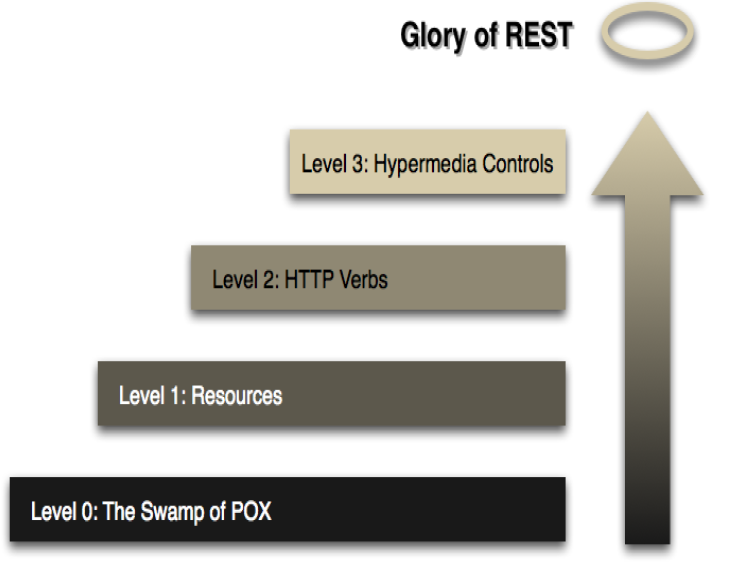
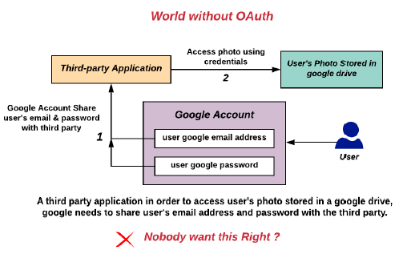

### Full Stack Application Development

---

### Website
- **Definition**: A group of interlinked web pages with a single domain name, hosted on a web server, accessible via the internet.
- **Use Cases**: Portfolios, personal blogs, informational websites, small business websites with minimal content updates, landing pages, and temporary promotions.

### Web Application
- **Definition**: An application program stored on a remote server, delivered over the internet, and accessed through a web browser.
- **Common Examples**: E-commerce shops, webmail, social networking sites.

---

### Application Types

#### Native Apps
- **Definition**: Developed for a specific platform or operating system and installed directly onto the device.
- **Pros**: Offline usage, direct hardware access, device-specific gestures, full feature access, app store approval, improved security.
- **Cons**: Higher development and maintenance costs, tedious app store approval process, needs updates.
- **Technologies**:
  - **iOS**: Swift, Objective-C, Xcode (Example: Instagram)
  - **Android**: Java, Kotlin, Android Studio (Example: WhatsApp)

#### Web Apps
- **Definition**: Internet-enabled applications accessible via a web browser, written in HTML, CSS, JavaScript.
- **Pros**: Instant accessibility, easier updates and maintenance, discoverable via search engines, cost-effective.
- **Cons**: Limited device feature access, browser variations, challenging stable performance across devices, not listed in app stores, unavailable offline.
- **Technologies**: HTML, CSS, JavaScript, React, Angular, Vue.js (Example: Google Docs)

#### Progressive Web Applications (PWAs)
- **Definition**: Built using web technologies, can be installed on devices, offering offline and background operations.
- **Technologies**: HTML, CSS, JavaScript, Workbox, Lighthouse, Service Workers, Web App Manifests.

#### Hybrid Apps
- **Definition**: Combine elements of native and web applications, built using web technologies but run inside a native container.
- **Pros**: No need for a web browser, access to device's internal APIs and hardware, single codebase.
- **Cons**: Slower than native apps, reliant on third-party platforms, limited customization support.
- **Technologies**: HTML, CSS, JavaScript, Ionic, Apache Cordova, PhoneGap.

#### Cross-Platform Applications
- **Definition**: Developed to run on multiple devices, ensuring multi-platform compatibility.
- **Pros**: Cost-effective, code reusability, larger audience reach.
- **Cons**: Slower performance than native apps.
- **Technologies**: React Native, Flutter, Xamarin (Examples: Facebook, Google Ads, Microsoft Outlook).

---

### Cloud-Native Applications

#### Definition
- **Cloud-native** is an approach to developing, deploying, and running applications using modern methods and tools.
- **CNCF Definition**: Technologies that empower organizations to build and run scalable applications in modern environments like public, private, and hybrid clouds. Examples include containers, service meshes, microservices, immutable infrastructure, and declarative APIs.

#### Cloud-Enabled Solutions
- **Monolithic Application**: Traditional software design where the entire application is a single, self-contained unit.
  - **Characteristics**: Single codebase, tight coupling, single deployment unit, centralized database, development and scaling challenges, longer development cycles, limited fault isolation.
- **Cloud-Based Application**: Existing app shifted to the cloud, not fully leveraging cloud potential. Issues include lack of scalability, less automation, longer time to market.
- **Cloud-Native Applications**: Designed to run on cloud architecture, leveraging automation and scalability.

#### Comparison: Cloud Native vs. Traditional Applications
- **Cloud-Enabled**: Developed for traditional data centers, later modified for cloud environments.
- **Cloud-Native**: Built for the cloud, scalable, platform-agnostic, composed of microservices.

---

### Pillars of Cloud-Native Applications

#### Building Blocks
1. **Microservices**:
   - Architectural approach where applications are a collection of small services.
   - Each service implements business capabilities, runs independently, and communicates via HTTP APIs or messaging.
2. **Containers**:
   - Offer efficiency and speed compared to standard VMs.
   - OS-level virtualization allows isolated containers with unique file systems and resource quotas.
   - Low overhead and high packing density make containers ideal for deploying microservices.
3. **DevOps**:
   - Collaboration between software developers and IT operations for high-quality software delivery.
   - Promotes rapid, frequent, and consistent building, testing, and releasing.
4. **Continuous Delivery**:
   - Automation for shipping small software batches to production constantly.
   - Ensures reliable releases, frequent delivery, and faster user feedback.

#### Advantages
- Reduced time to market
- Ease of management
- Scalability and flexibility
- Reduced cost

---

### Serverless Applications

#### Definition
- **Serverless Architecture**: Allows developers to build and run services without managing infrastructure. Cloud providers handle provisioning, scaling, and managing infrastructure.

#### Function as a Service (FaaS)
- Application code is written as discrete functions performing specific tasks triggered by events.
- Cloud provider executes the function, abstracting the execution process from developers.
- **Examples**:
  - **AWS**: AWS Lambda
  - **Microsoft Azure**: Azure Functions
  - **Google Cloud**: Cloud Functions

#### Serverless Benefits and Drawbacks
- **Benefits**:
  - Reduced operational cost
  - Easier operational management
  - Scalability
- **Drawbacks**:
  - Loss of control
  - Vendor lock-in
  - Multitenancy problems
  - Security concerns

#### AWS Serverless Offerings
- **AWS Lambda**: Run code without provisioning or managing servers.
- **AWS Fargate**: Serverless compute engine for containers.
- **Amazon API Gateway**: Fully managed service for creating, publishing, maintaining, monitoring, and securing APIs at any scale.

#### Reference Architecture: Web Application
- **General-purpose, event-driven web application backend**:
  - **AWS Lambda** and **Amazon API Gateway** for business logic
  - **Amazon DynamoDB** as the database
  - **Amazon Cognito** for user management
  - **AWS Amplify Console** for hosting static content
  
  

---
### Layered Pattern
- **Context**: Separation of concerns.
- **Problem**: Ensuring that system modules are independently developed and maintained, promoting portability, modifiability, and reuse.
- **Solution**: Dividing software into units called layers, where each layer is a cohesive set of services.
  - **Interaction**: Strict unidirectional ordering.
  - **Interface**: Each partition is exposed through an interface.

---

### Web Application Architecture
- **Layered Architecture**: Fundamental structure for web applications.
  - **Two-Layer Systems**: Client-server systems where the client holds the user interface and application code, and the server hosts a relational database.
  - **Three-Tier Architecture**:
    - **Presentation (UI)**: User interface components.
    - **Business Logic**: Core functionality and business rules.
    - **Data Access**: Interaction with the database.


---

### Ensuring Clear Separation of Concerns
- **Scenario 1**: Highlight products with over 10% increase in sales.
  - **Method 1**: Embed logic directly into the presentation layer.
  - **Method 2**: Use a method in the domain layer to indicate improved sales, then call this method from the presentation layer.
- **Scenario 2**: Adding a command-line interface to a web application.
  - **Method**: Avoid duplicating functionality by properly separating layers, ensuring domain logic does not leak into the presentation.

---

### N-Tier Web Application
- **Structure**: 
  - Client (Browser)
  - Web Server
  - Application Server
  - Database (DB)
- **Characteristics**:
  - Independence of each tier.
  - Security, performance, and availability optimizations.


---

### Service-Based Web Application
- **Components**:
  - REST APIs
  - Third-Party APIs
  - Database
- **Architecture**: Similar to N-Tier but emphasizes RESTful communication.


---

### Monolithic Application
- **Definition**: Deployed as a single, self-contained unit (e.g., a Java WAR file).
- **Challenges**: Scalability issues and the need to redeploy the entire application for changes.

---

### Service-Oriented Architecture (SOA)
- **Definition**: Integrates business functionalities as services.
- **Characteristics**:
  - Loosely coupled and autonomous services.
  - Adheres to the Single Responsibility Principle.
- **SOA-Based Web Application**:
  - Client (Browser)
  - Web Services
  - Enterprise Service Bus (ESB)
  - Database (DB)


---

### Microservice Architecture
- **Characteristics**:
  - Composed of small, independent services.
  - Implements single business capabilities.
  - Loosely coupled, communicating via API contracts.
  - Built by focused development teams.
- **Complexities**: Requires mature DevOps culture and management but results in higher release velocity and resilience.


---

### Application Programming Interface (API)
- **Definition**: A software intermediary that allows two applications to communicate.
- **Types**:
  - **Public API**: External access to assets (e.g., Twitter API, Google Maps API).
  - **Private API**: Internal use for productivity and service-oriented architecture.
- **Paradigms**:
  - Request-Response APIs (e.g., REST, RPC, GraphQL).
  - Event-Driven APIs.

---

### Model-View-Controller (MVC) Pattern
- **Definition**: Divides application logic into three interconnected components: Model, View, and Controller.
  - **Model**: Manages data-related logic and interacts with the database.
  - **View**: User interface, communicates with the controller, and renders data.
  - **Controller**: Handles user input, processes requests, and manages data flow to the view.
- **Example**:
  - Routes: `/users/profiles/:id`
  - Controller: Fetches user profile and renders the view.
  - Model: Queries the database for user data.
  - View: Displays user profile information.

---

### Model-View-Presenter (MVP)
- **Definition**: The view is passive and routes user commands to the presenter.
- **MVC Variant**: Similar to MVC but with a focus on separation of presentation logic.

---

### Model-Template-View (MTV)
- **Definition**: Similar to MVC but with a distinct template component.
  - **Model**: Interface for data.
  - **Template**: Presentation layer, containing static or dynamic HTML.
  - **View**: Executes business logic and interacts with the model, rendering the template.

---

### Web Application

### **1. Client-Server Pattern**
- **Context:** Shared resources and services accessed by multiple clients.
- **Problem:** Managing shared resources efficiently while promoting modifiability and reuse.
- **Solution:** Clients send requests for services to servers, which manage and provide these services. Some components can act as both clients and servers.

**Key Points:**
- **Request-Response Model:** Clients request services, and servers respond.
- **Server:** Provides services/resources.
- **Client:** Requests services/resources.
  
**Benefits:**
- **Higher Security:** Centralized control improves security.
- **Centralized Data Access:** Data is managed centrally, making it easier to update and control.
- **Ease of Maintenance:** Centralized systems are easier to maintain than distributed ones.

### **2. Variants of Client-Server Pattern**
- **Peer-to-Peer (P2P) Applications:** Each node acts as both a client and server.
- **Application Servers:** Provide services to client applications.
- **Asynchronous Requests:** Clients don't block while waiting for data.
- **Server-Initiated Actions:** Servers can initiate actions on clients in some scenarios.
  

### **3. Traditional vs. Modern Web Applications**
- **Traditional Web Application (Three-Tier Architecture):**
  - **Client Tier:** User interface (UI) in the browser (HTML, CSS, JavaScript).
  - **Server Tier:** Web server handles business logic.
  - **Data Tier:** Database stores data.
  
- **Modern Web Application:**
  - **AJAX:** Enables asynchronous updates without reloading the page.
  - **JSON:** Lightweight data format for efficient data exchange.
  
### **4. Front-End Responsibilities**
- **User Interface Design:** HTML, CSS, JavaScript, and frameworks like React, AngularJS, or Vue.js.
- **Asynchronous Request Handling:** Using AJAX.
- **Single-Page Applications:** Focus on smooth user experience without full page reloads.
- **Responsive Web Design:** Ensuring compatibility across different devices and browsers.

### **5. Back-End Responsibilities**
- **Software Architecture:** Designing the application's structure.
- **Application Logic:** Core functionalities and processing.
- **Database Management:** Handling data storage and retrieval.
- **Security:** Authentication, authorization, and ensuring data security.

### **6. Understanding URLs**
- **URL Components:**
  - **Scheme:** Protocol used (e.g., HTTP, HTTPS).
  - **Host Name:** Domain name or IP address.
  - **Port Number:** Specifies the exact server application.
  - **Path:** The specific resource on the server.
  - **Query Parameters:** Additional data for processing.
  - **Fragment:** Refers to a specific section of the webpage.

### **7. Domain Name System (DNS)**
- **Function:** Translates domain names (like google.com) into IP addresses.
- **DNS Hierarchy:**
  - **Root Server:** First step in name resolution.
  - **TLD Server:** Top-Level Domain servers (e.g., .com, .org).
  - **Authoritative Name Server:** Final server that resolves the domain name.

**Importance of DNS:**
- **Eliminates the Need to Remember IP Addresses:** Easier for users to access websites.

  

### **8. Content Delivery Network (CDN)**
- **Purpose:** Improves website load times by caching content closer to users.
- **Benefits:**
  - **Improved Load Times:** Content is delivered faster.
  - **Reduced Bandwidth Costs:** Efficient data management reduces costs.
  - **Increased Availability:** Content is redundant across multiple locations, ensuring availability.
  - **Enhanced Security:** Provides additional security layers.

### **9. Client-Side Rendering (CSR)**
- **Process:** Web content is rendered on the client-side, in the user's browser.
- **Benefits:** 
  - **Improved Performance:** Faster interactions as only necessary data is reloaded.
  - **Rich User Experience:** Smooth and responsive UI.
  

### **10. Server-Side Rendering (SSR)**
- **Process:** Web content is rendered on the server before being sent to the client.
- **Benefits:**
  - **Better SEO:** Search engines can crawl content more effectively.
  - **Faster Initial Load:** Content is ready to display as soon as it arrives at the client.
  - **Improved Accessibility:** Works better on low-powered devices.

### **11. Static Site Generation (SSG)**
- **Definition:** Generates static HTML files ahead of time and serves them to users.
- **Benefits:**
  - **High Performance:** Pre-built pages load quickly.
  - **SEO-Friendly:** Search engines can index static pages easily.
  
- **Limitations:**
  - **Not Suitable for Real-Time Data:** Static content can't reflect live updates.
  
**Popular Tools:** Jekyll, Hugo, Gatsby.

### **12. Client-Side Programming**
- **Technologies:**
  - **HTML/CSS:** Structure and style web content.
  - **JavaScript (JS):** Adds interactivity to web pages.
  - **Frameworks:** Angular, React, Vue for creating dynamic web applications.

### **13. Server-Side Programming**
- **Technologies:**
  - **Languages:** JavaScript (Node.js), Python (Django, Flask), Ruby (Rails), Java (Spring), PHP (Laravel).
  - **Databases:** MySQL, PostgreSQL (Relational), MongoDB (NoSQL).
  - **Caching:** Memcached, Redis to manage high traffic and reduce database load.
  
**Server Management:**
- **Web Servers:** Apache, Nginx handle client requests.
- **Load Balancers:** Distribute incoming traffic across multiple servers.

### **14. Example Tech Stacks**
- **MEAN/MERN/MEVN Stack:**
  - **MongoDB:** NoSQL database.
  - **Express.js:** Web framework for Node.js.
  - **Angular/React/Vue.js:** Frontend frameworks.
  - **Node.js:** JavaScript runtime for server-side scripting.

- **Python Stack:**
  - **Flask/Django:** Web frameworks.
  - **SQLAlchemy:** ORM for database management.
  - **Django REST Framework:** For building APIs.

---

### Web Protocols: (HTTP)

#### 1. **Introduction to HTTP**
- **HTTP (HyperText Transfer Protocol)**: 
  - A stateless request-response protocol used for distributed and collaborative hypermedia information systems.
  - Operates in a client-server model.
  - Each HTTP communication includes:
    - **Header**: Contains information about the communication.
    - **Body**: Contains the data of the communication (optional).

#### 2. **HTTP Request-Response Structure**
- **HTTP Request** consists of:
  1. Request Line (method, URI, HTTP version).
  2. Header fields.
  3. Blank line.
  4. Message body (optional).

  Example:
  - `GET /test.html HTTP/1.1`
  - `POST /index.html HTTP/1.1`
  
  

- **HTTP Response** structure:
  1. Status line (HTTP version, status code, reason phrase).
  2. Response headers.
  3. Blank line.
  4. Response body (optional).

  Example status line:
  - `HTTP/1.1 200 OK`
  - `HTTP/1.0 404 Not Found`
  
  

#### 3. **HTTP Methods (Verbs)**
- **GET**: Fetches a URL without changing the state of the server.
- **POST**: Submits data to the server and can change the server's state.
- **PUT**: Replaces a resource at a specified URL.
- **DELETE**: Deletes the specified resource.
- **HEAD**: Similar to GET but does not return the response body.
- **OPTIONS**: Describes communication options for the target resource.
- **PATCH**: Applies partial modifications to a resource.
- **TRACE**: Performs a message loop-back test.
- **CONNECT**: Establishes a tunnel to the server.
  
    

#### 4. **Common HTTP Status Codes**
- **1xx**: Informational.
- **2xx**: Success.
  - `200 OK`: Request succeeded.
  - `201 Created`: New resource created.
  - `204 No Content`: No response body.
- **3xx**: Redirection.
  - `301 Moved Permanently`: New URI assigned.
  - `302 Temporary Redirect`.
- **4xx**: Client Error.
  - `400 Bad Request`: Invalid request.
  - `401 Unauthorized`: Invalid credentials.
  - `403 Forbidden`: Access denied.
  - `404 Not Found`: Resource not found.
- **5xx**: Server Error.
  - `500 Internal Server Error`: Server encountered a problem.

#### 5. **HTTP Headers**
- **Request Headers**: Information about the client or request.
  - `Host`, `Connection`, `Accept`, `User-Agent`.
- **Response Headers**: Information about the server or the response.
  - `Content-Type`, `Content-Length`, `Keep-Alive`.

- **Caching Headers**:
  - **Cache-Control**: Specifies caching mechanisms.
    - `no-cache`, `no-store`, `public`, `private`.
  - **Expires**: Sets expiration time for cached responses.
  - **ETag**: Unique identifier for a specific version of a resource.
  - **Last-Modified**: Timestamp for the last modification of the resource.

#### 6. **Synchronous vs Asynchronous Communication**
- **Synchronous**: The client waits for the server to process and return the response.
- **Asynchronous**: The client continues with other tasks and processes the response later (used in modern web apps with AJAX, Fetch API, etc.).

#### 7. **Communication with Backend**
- **AJAX (Asynchronous JavaScript and XML)**: A method for sending and retrieving data asynchronously.
- **Fetch API**: Modern method for making HTTP requests in JavaScript, returning promises.
- **Webhooks**: Used to send real-time data from one application to another when an event occurs.
- **Polling**: The client repeatedly checks the server for updates at regular intervals.
- **Server-Sent Events**: Allows servers to push data to the browser.
- **WebSockets**: Enables full-duplex communication channels over a single, long-lived connection.

#### 8. **Bidirectional Communication**
- **WebSockets**: Provides a persistent connection between the client and server, allowing data to be sent in both directions.

#### 9. **Redirection**
- A **3xx status code** indicates a redirection, with the browser using the new URL provided in the `Location` header.
  - **Permanent Redirection**: `301 Moved Permanently`.
  - **Temporary Redirection**: `302 Temporary Redirect`.

#### 10. **HTTP Cookies**
- **Cookies**: Small pieces of data sent by the server to the client, stored by the browser, and sent back with future requests.
  - **Set-Cookie**: Header used to store a cookie on the client.
  - **Cookie**: Header used by the client to send stored cookies to the server.

#### 11. **Security Features**
- **HTTPS**: Secured version of HTTP using SSL/TLS encryption to protect data transmission between the client and server.

---

### Additional Notes:
- **AJAX and Fetch**: Key for modern web applications to provide a smooth user experience without page reloads.
- **WebSockets**: Particularly useful in real-time applications like chat apps or live notifications.
- **Statelessness in HTTP**: HTTP does not retain information between requests unless explicitly managed using cookies or tokens.

---

### Web Protocols (HTTP, HTTPS, HTTP/2, and QUIC)

---

#### **1. HTTP Connection Management**
- **Connection Header**: Controls whether the network connection stays open after the current transaction.
  - `Connection: keep-alive`: Keeps the connection persistent for future requests.
  - `Connection: close`: Closes the connection after the transaction.
  
- **Keep-Alive Header**: Sets a timeout and a maximum number of requests before closing the connection.
  - Example: `Keep-Alive: timeout=5, max=1000`

---

#### **2. HTTP/1.x**
- **Drawbacks of HTTP/1.x**:
  - Clients need multiple connections for concurrent requests.
  - **Head of Line Blocking**: Only one request is processed at a time.
  - No compression of request and response headers, causing network congestion.
  - Poor resource prioritization, leading to inefficient TCP usage.
  
  

---

#### **3. HTTP/2**
- **Improvements in HTTP/2**:
  - **Header Field Compression**: Reduces the size of headers using HPACK compression.
  - **Multiplexing**: Multiple concurrent exchanges over a single connection, reducing latency.
  - **Stream Prioritization**: Requests are prioritized, improving resource allocation.
  - **Binary Protocol**: HTTP/2 uses binary framing, improving message efficiency.

  
  
- **Structure**:
  - **Frame**: Smallest unit of communication, which contains headers for stream identification.
  - **Message**: A sequence of frames representing a complete request or response.
  - **Stream**: A bidirectional flow of bytes within a single connection, carrying one or more messages.
  
- **Benefits**:
  - Fewer TCP connections improve network capacity.
  - **Server Push**: Server can push resources proactively into the client cache without waiting for requests.
  - Reduced round-trip time (RTT), leading to faster page loads.

  
---

#### **4. QUIC (Quick UDP Internet Connections)**
- **Introduction**:
  - A new encrypted-by-default transport protocol designed to improve HTTP/2 performance.
  - Combines TCP and TLS handshakes into a single step.
  - **UDP-based**: It operates over User Datagram Protocol (UDP).
  
- **Benefits**:
  - Faster connection setup (only a single round trip needed).
  - Better congestion control and reduced **Head-of-Line blocking**.
  - Built-in security with encrypted connection metadata.
  
  

---

#### **5. HTTP Versions**

  

---

#### **6. HTTPS (HyperText Transfer Protocol Secure)**
- **Overview**:
  - HTTPS is the secure version of HTTP, used to encrypt communication between a client (browser) and a server.
  - **Port 443**: Default port for HTTPS.
  - Protects requests from being intercepted or modified by using encryption.

- **TLS Handshake**:
  - Establishes a secure connection between client and server.
  - Agrees on the protocol version and cryptographic algorithms.
  - Both parties authenticate each other via digital certificates.
  - **Symmetric Encryption**: Used for faster encryption once the handshake is complete.

  
  

---

#### **7. Digital Certificates and Certificate Authority (CA)**
- **Certificates**:
  - The server sends a public key certificate (SSL/TLS certificate) to the client to validate its identity.
  - A **Certificate Authority (CA)** issues these certificates, ensuring trust between the client and server.

---

### **Summary of Key Points**:
1. **HTTP Connection Management**: Keep-Alive for persistent connections.
2. **HTTP/1.x**: Limitations such as head-of-line blocking and inefficient resource use.
3. **HTTP/2**: Binary protocol with features like multiplexing and server push for better performance.
4. **QUIC**: A faster, more secure, UDP-based protocol with reduced handshake time and improved congestion control.
5. **HTTPS**: Encrypts data transmission using the TLS protocol, secured by digital certificates.

---
### Web Protocols (Module 3)

---

### **1. Introduction to Web Protocols**
- **Web Protocols** are essential for client-server communication on the internet.
- This module covers important web protocols such as HTTP, HTTP methods, headers, connection management, and communication between frontend and backend.

---

### **2. HTTP (HyperText Transfer Protocol)**
- **HTTP Request-Response Model**:
  - HTTP is a unidirectional protocol where the client (browser) initiates requests, and the server responds.
  - Request and response both have headers and body sections.
  
- **Request Structure**:
  - Method (GET, POST, etc.), URL, HTTP version.
  - Headers: Name-value pairs providing additional context (e.g., `Content-Type`, `Authorization`).
  - Body (optional): Data sent with the request (for POST, PUT).

- **Response Structure**:
  - Status line (HTTP version, status code, reason phrase).
  - Headers: Provide metadata about the response (e.g., `Content-Length`, `Content-Type`).
  - Body: The resource or data being returned.

---

### **3. HTTP Methods**
- **GET**: Retrieves data from the server.
- **POST**: Submits data to the server, often changing its state.
- **PUT**: Replaces all current data at the target URL.
- **DELETE**: Deletes the specified resource.
- **PATCH**: Partially modifies a resource.
- **OPTIONS**: Describes communication options for the resource.
  
---

### **4. Fetch API & Axios**
- **Fetch API**:
  - A modern interface for making HTTP requests from the client.
  - Uses the `fetch()` method, which returns a Promise.
  - Can be configured to handle different HTTP methods and headers.
  
- **Axios**:
  - A popular JavaScript library for making HTTP requests.
  - More user-friendly than Fetch, with built-in JSON parsing.
  - Can be used for both browser-based and Node.js HTTP requests.

**Key Differences**:
- Fetch API is built-in and doesn't require external dependencies.
- Axios needs to be installed but simplifies handling and transformations (e.g., JSON data).


---

### **5. Synchronous vs Asynchronous Communication**
- **Synchronous Communication**: The client waits for the server to finish processing before proceeding (e.g., typical form submissions).
- **Asynchronous Communication**: The client can continue executing other tasks while waiting for the server response (e.g., AJAX).


---

### **6. Long-Running Transactions**
- If a server task exceeds a typical request timeout, it often returns a **202 Accepted** response, indicating that the request is still being processed.
- Common techniques to handle long-running tasks:
  - **Polling**: The client checks the server at regular intervals for updates.
  - **Webhooks**: Server sends a notification to the client when the task is complete.
  - **Server-Sent Events (SSE)**: Server pushes updates to the client.
  - **WebSockets**: Full-duplex communication between client and server.

---

### **7. Communication Techniques**
- **HTTP Polling**:
  - The client makes repeated requests at set intervals, waiting for a server response.
  - Servers return either the requested resource or an empty response.
  - **Headers**: 
    - `Location`: The URL the client should poll.
    - `Retry-After`: Informs the client when to poll again.
  
  

- **Webhooks**:
  - Event-driven, HTTP-based callbacks.
  - The server sends data to the client only when an event occurs (no need for the client to poll).
  - Uses HTTP POST to send a payload to the client's webhook URL.

  

- **Server-Sent Events (SSE)**:
  - A unidirectional channel where the server sends real-time updates to the client.
  - The client connects using the **EventSource** API and listens for messages.
  - Common in live dashboards, notifications, or live feeds.

- **WebSockets**:
  - Provides bidirectional communication over a single TCP connection.
  - Allows real-time, full-duplex communication, ideal for chat applications, gaming, etc.
  - Uses a handshake protocol to upgrade from HTTP to WebSockets (via headers like `Upgrade` and `Sec-WebSocket-Key`).

  

---

### **8. Summary of Communication Methods**
- **Polling**: Client initiates repeated requests.
- **Webhooks**: Server initiates communication after an event.
- **SSE**: Server sends updates over a single HTTP connection.
- **WebSockets**: Real-time, bidirectional communication over a persistent connection.

---

### Client-Side and Server-Side in Web Communication

#### **Client-Side**
- **Definition**: The client-side refers to operations that are performed by the user's device (browser, mobile app) when interacting with a server. 
- **Key Characteristics**:
  - The **client-side application** (e.g., frontend like React JS or AngularJS) sends requests to the server via HTTP protocols.
  - The **client-side** often cannot directly implement advanced techniques like Webhooks because they require a server to handle incoming HTTP POST requests.
  - **Pure frontend applications** (like React, Angular) cannot directly receive webhooks; instead, webhooks need a backend server to listen for events from the server.
  
- **Usage**:
  - Client-side applications make HTTP requests using **Fetch API** or **Axios** to retrieve data from the server or interact with APIs.
  - These client-side apps rely on server-side APIs to receive data asynchronously or synchronously.

#### **Server-Side**
- **Definition**: The server-side refers to operations carried out by the server in response to requests from the client. It includes handling business logic, database interactions, and providing resources back to the client.
  
- **Key Characteristics**:
  - The **server-side** runs server-based logic, processes requests, and sends responses to the client.
  - For communication like Webhooks, the server is responsible for receiving HTTP POST requests that are triggered by events from other systems.
  
- **Webhooks**:
  - In Webhooks, the **server-side** application sets up a URL (a webhook) that receives the POST request from another system when an event occurs.
  - When the event happens (e.g., a payment being completed), the event information is sent to the **server-side** webhook.
  
- **Full-Duplex Communication**:
  - **WebSockets**: The server and client engage in bidirectional communication over a persistent connection. 
  - The **server-side** handles real-time updates and pushes them to the client.

---

### **Use Cases**
- **Fetch API & Axios**: Ideal for making HTTP requests in client-server applications, such as fetching data or submitting forms.
- **Polling**: Useful when there is no other way for the client to be informed of a change.
- **Webhooks**: Best for applications needing notifications on specific events (e.g., payments, status changes).
- **SSE**: Great for live dashboards, news feeds, and live sports scores.
- **WebSockets**: Suited for real-time applications like chats, gaming, and live collaboration tools.

---

## REST (Representational State Transfer)

### 1. **Introduction to REST**
   - **Definition**: REST stands for Representational State Transfer. It is an **architectural style** for distributed hypermedia systems like the web.
   - **RESTful Web Services**: These expose information about resources (like docs, data, images, etc.) and allow the client to perform CRUD operations (Create, Read, Update, Delete) on them.

### 2. **Key REST Concepts**
   - **Resource**: Anything that can be uniquely identified and acted upon, such as a document, image, or data. Each resource has a unique identifier (URI).
   - **Representation**: The state of a resource returned to the client, usually in **JSON**, **XML**, or **HTML** formats.
   - **Example**: Fetching a specific Instagram user via their API will return details like name, post count, follower count, etc.

### 3. **Resources in REST**
   - **Main Building Blocks**: Resources and their representations (in formats like binary, JSON, XML).
   - **Identifiers**: Unique URIs used to retrieve specific resources.
   - **Metadata**: Information like content type and last modified time.
   - **Control Data**: Includes cache-control, is-modifiable-since headers, etc.

### 4. **REST and HTTP**
   - REST leverages **HTTP methods** to operate on resources:
     - **GET**: Retrieve a resource.
     - **POST**: Create a new resource.
     - **PUT**: Update an existing resource.
     - **PATCH**: Modify an existing resource.
     - **DELETE**: Remove a resource.
   - Other methods:
     - **HEAD**: Retrieve headers.
     - **OPTIONS**: Request allowed communication options for a URL.

### 5. **How REST Works**
   - **URL** (Uniform Resource Locator) identifies resources.
   - **HTTP Methods** define actions to perform on resources.
   - The client sends a request, and the server returns the state of the resource.

### 6. **HTTP Request Examples**
   - **GET Request**: Example of requesting `http://www.oreilly.com/index.html`, where the server returns the page with status code, headers, and content.

      

   - **SOAP vs REST**: 
     - SOAP: Uses XML-based messaging.
     - REST: Uses HTTP and is more lightweight and flexible.

      

   - **XML-RPC**: XML-based remote procedure call, an alternative to REST and SOAP.

      

### 7. **Scoping and Method Information**
   - **Scoping**: Identifying the specific resource or subset to operate on, often via URI path or query parameters.
   - **Method and Scoping**: RESTful services map the method to HTTP verbs and scoping to URIs.

### 8. **Key Principles of REST**
   - **Everything is a resource**: Every resource is uniquely identified via URIs.
   - **Use of standard HTTP methods**: Such as GET, POST, PUT, DELETE.
   - **Multiple representations**: Resources can have various representations like JSON, XML.
   - **Stateless communication**: Each request is independent, and the server does not retain any client information between requests.

### 9. **REST Constraints**
   To be RESTful, services must adhere to these six constraints:
   - **Client-Server Separation**: Server and client interact only via requests/responses, and are independent.
   - **Stateless**: The server does not remember the client's state between requests.
   - **Cacheable**: Clients can cache responses for efficiency.
   - **Uniform Interface**: A consistent interface across the web with self-descriptive messages.
   - **Layered System**: Clients don't need to know if intermediaries (e.g., caching, security) exist between them and the server.
   - **Code-on-Demand (Optional)**: Clients can request executable code from servers.

### 10. **Detailed REST Constraints**
   - **Client-Server Separation**:
     - The client initiates requests, and the server only responds to these requests.
   - **Stateless**:
     - The server does not store any session information; each request is self-contained.
     - Improves scalability and reliability.
   - **Cacheable**:
     - Responses include metadata (e.g., version numbers, expiration times) to inform clients whether the data can be cached.
     - Helps avoid redundant requests.
   - **Uniform Interface**:
     - Ensures that the API is simple and consistent.
     - Principles:
       1. **Identification of Resources**: Resources identified via URIs.
       2. **Manipulation of Resources**: Resources are manipulated via representations in requests.
       3. **Self-Descriptive Messages**: Each request and response contains enough information for both client and server to understand it.
       4. **HATEOAS (Hypermedia as the Engine of Application State)**: Hypermedia links in responses guide clients on how to proceed with further actions.

### 11. **HATEOAS**
   - **Hypermedia as the Engine of Application State**: Clients receive links to perform actions on resources in responses, allowing them to navigate the system dynamically.

      

### 12. **Layered System**
   - REST allows for intermediary layers (e.g., security, caching) between the client and server.
   - Clients are unaware of these layers, and these layers should not affect the response or request.

### 13. **Code on Demand (Optional)**
   - Though optional, the server can send executable code (like JavaScript) that the client can execute, adding additional flexibility.

### 14. **REST Maturity Model**
   - A model used to evaluate the maturity of a REST service based on:
     - **URI** usage.
     - **HTTP Methods**.
     - **HATEOAS** implementation.

      

### 15. **Conclusion**
   - REST is a stateless, cacheable, and scalable architecture that relies on standard HTTP methods and URIs to operate on resources.
   - Adherence to its constraints ensures flexibility, scalability, and simplicity, making it a popular choice for web services.

---

### Additional Information for Better Understanding:
1. **Idempotency**: 
   - In REST, certain operations (like GET, PUT, DELETE) are idempotent, meaning calling the same method multiple times results in the same state.
   - **POST** is not idempotent, as it may create multiple resources with repeated calls.

2. **REST vs SOAP**:
   - **REST** is lightweight, stateless, and uses JSON/XML. It is well-suited for web-based APIs.
   - **SOAP** is more rigid, requires XML, and is used in enterprise applications requiring strict contracts and advanced security.

3. **Content Negotiation**:
   - REST allows clients and servers to negotiate the format of the response (e.g., JSON, XML) through HTTP headers like `Accept`.

4. **Versioning**:
   - REST APIs often support versioning via URI paths (e.g., `/v1/users`), query parameters, or headers.

---

### **REST Design**

---

### **1. Agenda: Key Topics Covered**

- Interaction Design with HTTP (response codes, request methods)
- Identifier Design with URIs
- Metadata Design (Media Types, content negotiation)
- Representation Design (Message body format, Hypermedia Representation)

---

### **2. REST API Design**

REST API design is considered an art, with many practices implied by the HTTP standard. Key concerns in REST design:
- **Resource Naming**: Should URI path segments use singular or plural nouns?
- **Methods**: Which HTTP method should be used for different resource states?
- **Non-CRUD operations**: Mapping these to URIs.
- **Versioning**: Managing different versions of resources.
- **Hyperlinks in JSON**: How to structure these links.

### **3. API Design**

- **Resources**: Core elements around which REST APIs are designed.
  - A resource could be any object, data, or service accessible to the client.
- **Identifiers**: Each resource has a unique identifier (URI).
  - URIs should be based on **nouns** (resources), not **verbs** (actions on the resource).

#### **API Design Elements:**
- **Resource Representation**: How resources and their relations are represented.
- **HTTP Headers**: Standard and custom headers for requests and responses.
- **URI Structure**: Query interfaces for resource location and interaction.
- **Client Behaviors**: Handling retries, DNS caching, etc.

---

### **4. Interaction Design with HTTP**

REST APIs follow the **HyperText Transfer Protocol (HTTP)** model, embracing its request methods, response codes, and headers.

- **HTTP Methods**:
  - **GET**: Retrieve a resource's state.
  - **HEAD**: Retrieve metadata of a resource.
  - **PUT**: Add or update a resource.
  - **POST**: Create new resources or execute controllers.
  - **DELETE**: Remove a resource.

**Design Rules:**
- **GET**: Must be used to retrieve data, not to tunnel other methods.
- **POST**: Create resources or execute commands.
- **PUT**: Insert or update stored resources.
- **DELETE**: Remove resources.
- **OPTIONS**: Retrieve metadata on resource interactions.

#### **HTTP Response Codes:**
- **200 OK**: Generic success.
- **201 Created**: A new resource has been created.
- **204 No Content**: The response is empty but successful.
- **301 Moved Permanently**: Resource has a new permanent URI.
- **401 Unauthorized**: Authentication failure.
- **403 Forbidden**: Denied access.
- **404 Not Found**: Resource not found.
- **405 Method Not Allowed**: Invalid HTTP method for the request.
- **500 Internal Server Error**: Server-side error.

---

### **5. Identifier Design**

REST APIs rely on **Uniform Resource Identifiers (URIs)** to locate resources.

#### **URI Format**:
`URI = scheme "://" authority "/" path [ "?" query ] [ "#" fragment ]`

- Use forward slashes (/) to show hierarchical relationships between resources.
- Consistent subdomain names should be used across APIs.

#### **Resource Modeling**:
- **Paths** represent resources.
- Example URIs:
  - `/books/harry-potter`: Specific book.
  - `/books`: A collection of books.

#### **URI Design Rules**:
- **Singular Nouns** for documents.
- **Plural Nouns** for collections.
- **Verbs** for controllers.

    

#### **Antipatterns** to Avoid:
- Avoid CRUD function names in URIs (e.g., `/getUser` or `/deleteUser`).

  

#### **Filtering and Pagination**:
- Use query parameters to filter or paginate collections.
  - Example: `/orders?limit=25&offset=50`.

---

### **6. Metadata Design**

HTTP headers play a significant role in communication. Important headers include:
- **Content-Type**: Defines the media type of the resource (e.g., JSON, XML).
- **Content-Length**: Size of the response body.
- **Last-Modified**: Timestamp of the last modification.
- **E-tag**: Unique identifier for resource versions.
- **Location**: URI of newly created resources.

    

#### **Content Negotiation**:
When multiple representations of a resource are available, the API should support media type negotiation.

---

### **7. Representation Design**

The representation is the data format returned to the client. Common formats:
- **JSON** (preferred for REST APIs).
- **XML** or other formats as needed.

Representations should be:
- **Consistent**: Media types, links, and errors should follow a standard format.
- **Flexible**: To cater to varying application use cases.

**Example (JSON representation of a person)**:
```json
{
  "name": "John",
  "id": "urn:example:user:1234",
  "link": {
    "rel": "self",
    "href": "http://www.example.org/person/john"
  }
}
```

---

### **8. Best Practices**

- **Nouns over Verbs**: Use only nouns in URIs.
- **GET should be safe**: Must not alter resource state.
- **Plural nouns for collections**.
- **Use sub-resources** for resource relationships (e.g., `/books/1/authors`).
- **Use HTTP headers** for input/output formats.
- **Provide Pagination and Filtering** for large collections.
- **Versioning**: Include versioning in the API design.
- **Meaningful HTTP Status Codes**: Use proper response codes to convey the result of a request.

#### **Error Handling**:
Provide meaningful errors:
- Example: `invalid_auth` for revoked tokens.
- Example: `name_too_long` for invalid name inputs.

---

### **9. RESTful Services Example: Customer API**

| HTTP Verb | CRUD Operation | Entire Collection (`/customers`) | Specific Item (`/customers/{id}`) |
|-----------|----------------|----------------------------------|-----------------------------------|
| POST      | Create          | `201 Created`                   | `404 Not Found` or `409 Conflict` |
| GET       | Read            | `200 OK` (with pagination)       | `200 OK` or `404 Not Found`       |
| PUT       | Update/Replace  | `405 Method Not Allowed`         | `200 OK` or `204 No Content`      |
| PATCH     | Update/Modify   | `405 Method Not Allowed`         | `200 OK` or `204 No Content`      |
| DELETE    | Delete          | `405 Method Not Allowed`         | `200 OK` or `404 Not Found`       |

---

### **10. Summary**

- Focus on **simplicity** in API design.
- Use **consistent naming conventions** and **clear resource modeling**.
- Follow **HTTP standards** for methods, status codes, and headers.
- Provide **well-defined resource representations** for ease of use and flexibility.
- Ensure **meaningful error messages** to enhance client-side experience.

---

### API Documentation and Versioning


#### 1. REST Design Principles
REST (Representational State Transfer) leverages HTTP protocols to build scalable and flexible APIs. Here's how to approach RESTful API design:

- **Resource Identification**: REST APIs are structured around resources, usually modeled after the main entities in a database (e.g., user profiles, orders). Use domain nouns that align with CRUD operations (Create, Read, Update, Delete).
  
- **Resource Actions**: While the CRUD model is a foundation, it may not always fully cover specific use cases. For instance, replacing a photo or listing the latest photos uploaded by a user might not map directly to CRUD but would instead represent more complex actions.

- **Collections and Resources**:
  - **Collections** (e.g., `/photos`) group resources under a shared context, while **items** represent individual resources (e.g., `/photos/1`).
  - **HATEOAS (Hypermedia As The Engine of Application State)**: Enables easier navigation between related resources. Use URIs such as `/orders/99/products` to retrieve all products in an order, reducing endpoint complexity.

- **Avoid Database Mirroring**: Design APIs to present resources logically for users rather than mimicking the database's internal structure.

---

#### 2. API Versioning

APIs need versioning to accommodate changes while maintaining backward compatibility. Breaking changes usually occur in four categories:

1. **Format Changes**: e.g., changing from XML to JSON.
2. **Property Changes**: e.g., renaming or changing the data type.
3. **Required Fields**: Adding a required field in requests.
4. **Removing Properties**: Deleting fields from responses can affect existing client implementations.

##### API Versioning Strategies

Several approaches can be used for versioning:

- **URI Path Versioning**: Embeds the version directly in the URL (e.g., `https://api.example.com/v1/resource`). Useful for major, incompatible changes.
- **Query Parameters**: Appends the version to the query string (e.g., `?version=v2`). Suitable for maintaining backward compatibility.
- **Custom Headers**: Uses HTTP headers to specify the version (e.g., `api-version: 1`). Keeps URLs clean but adds complexity to API requests.
- **Content Negotiation**: Uses MIME types in headers (e.g., `Accept: application/vnd.example.v1+json`). Often used in complex systems with many endpoints.

---

#### 3. API Change Management

Effective API change management minimizes disruption for clients by balancing innovation with stability:

- **Non-breaking Changes**: Add new features or fields rather than modifying existing ones, allowing old clients to continue without disruption.
- **Sunsetting Deprecated Endpoints**: Gradually remove outdated endpoints with clear deprecation notices, giving clients time to adapt.

Change scope can be categorized as follows:

- **Leaf**: Minor change affecting an isolated endpoint.
- **Branch**: Changes impacting a group of related endpoints.
- **Trunk**: Significant changes across the application, often prompting a version update for all endpoints.
- **Root**: Structural changes affecting all API resources.

---

#### 4. Semantic Versioning

Semantic Versioning follows a standardized numbering system for version control. Typical format is `MAJOR.MINOR.PATCH`:

- **MAJOR**: For backward-incompatible changes (e.g., adding a new required parameter).
- **MINOR**: For backward-compatible new features (e.g., additional endpoints).
- **PATCH**: For backward-compatible bug fixes.

For APIs, semantic versioning often uses a simplified `BREAKING.NONBREAKING` format, focusing on the distinction between disruptive and non-disruptive changes.

---


#### 5. API Documentation

Comprehensive API documentation guides developers on how to integrate and use the API effectively. Popular documentation frameworks include:

- **OpenAPI/Swagger**: A widely-used, standardized format that documents available endpoints, operations, and parameters.
  - **Features**: Supports YAML/JSON, details endpoint parameters, HTTP methods, and authentication methods.
  - **Tools**: Swagger UI offers an interactive interface to test API calls, helping teams visualize and test endpoints.

- **Other Formats**:
  - **API Blueprint**: Markdown-based format that generates API documentation, useful for teams working on simpler documentation.
  - **RAML (RESTful API Modeling Language)**: Originally developed by MuleSoft, now maintained by Salesforce, also provides a structured way to document RESTful APIs.

---

### gRPC

This summary explains **gRPC's role, structure, communication patterns**, and **implementation details** for building efficient and high-performance APIs.

---

#### 1. Introduction to gRPC
gRPC (Google Remote Procedure Call) is an open-source RPC framework developed by Google in 2015. It allows **inter-process communication** across distributed, heterogeneous applications, aiming to make remote communication as simple as invoking local functions.

- **Dynamic Naming**: Google frequently changes the meaning of the "g" in gRPC (e.g., Google, Good, Great), emphasizing gRPC's versatility.
  
---

#### 2. gRPC Architecture

gRPC relies on **Protocol Buffers (protobuf)**, Google's language-agnostic data serialization format, for defining services and exchanging messages between client and server.

- **Service Definition**:
  - A **service** is defined in a `.proto` file, specifying the interface methods and data types for client-server communication.
  - Protobuf defines **messages** as structured data records containing fields (name-value pairs).

- **Code Generation**:
  - The `.proto` file is compiled using `protoc` (protocol buffer compiler), generating client and server code for any supported language.
  - This generated code provides a **server skeleton** on the server side and a **client stub** on the client side.

- **Client-Server Communication**:
  - **Server**: Implements service logic and runs a gRPC server that listens for and responds to client requests.
  - **Client**: Uses the client stub to invoke the server's methods, with the stub handling network calls to the server.


---

#### 3. Protocol Buffers (protobuf)

Protocol Buffers serve as both the **interface definition language (IDL)** and **message format** in gRPC. Here's how protobuf structures data:

- **Message Definition**: A message is defined with fields assigned unique identifiers (tags) used to encode data.
  - Example:
    ```protobuf
    message Person {
      string name = 1;
      int id = 2;
      string description = 3;
    }
    ```
  
- **Service Definition Example**:
  - Service methods are defined in `.proto` files, specifying parameters and return types using protobuf messages.
    ```protobuf
    service ProductInfo {
      rpc addProduct(Product) returns (ProductID);
      rpc getProduct(ProductID) returns (Product);
    }
    ```


---

#### 4. gRPC Communication Patterns

gRPC supports four key communication patterns that provide flexibility for different use cases:

1. **Unary RPC (Simple RPC)**:
   - The client sends a single request, and the server sends a single response.
   - Example:
     ```protobuf
     rpc getOrder(google.protobuf.StringValue) returns (Order);
     ```

     

2. **Server-Streaming RPC**:
   - The server sends a stream of responses after receiving a single request from the client.
   - Example:
     ```protobuf
     rpc searchOrders(google.protobuf.StringValue) returns (stream Order);
     ```

     

3. **Client-Streaming RPC**:
   - The client sends multiple messages, and the server responds once all messages are received.
   - Example:
     ```protobuf
     rpc updateOrders(stream Order) returns (google.protobuf.StringValue);
     ```

    

4. **Bidirectional Streaming RPC**:
   - Both client and server send streams of messages, enabling a two-way conversation.
   - Example:
     ```protobuf
     rpc processOrders(stream google.protobuf.StringValue) returns (stream CombinedShipment);
     ```

    


---

#### 5. gRPC Features and Benefits

gRPC is designed for high efficiency and strong typing:

- **Protocol Buffers on HTTP/2**: By using protobuf and HTTP/2, gRPC achieves high performance, including support for **multiplexing** (sending multiple requests over a single connection) and **full-duplex streaming**.
- **Contract-First Approach**: gRPC uses a well-defined interface and schema, enabling consistency in communication between services.
- **Cross-Language Compatibility**: gRPC supports multiple languages, making it suitable for polyglot environments.
- **Built-in Commodity Features**: Includes features such as **duplex streaming**, **load balancing**, **circuit breaking**, and **retries**.

---

#### 6. Real-World Use Cases

gRPC is widely adopted in high-demand scenarios:

- **Netflix** uses gRPC to boost productivity and streamline communication between services.
- **Etcd** leverages gRPC for its user-facing API.
- **Dropbox** migrated to gRPC to improve performance.

---

#### 7. Message Encoding

Protocol Buffers encode messages using a **tag-value** system optimized for efficient serialization:

- **Wire Types**: Each protobuf field has an associated **wire type** (e.g., integer, 64-bit fixed, length-delimited) that defines how data is serialized.
- **Length-Prefixed Framing**: gRPC uses a technique called length-prefixed framing, where each message starts with a prefix indicating its length.

---

#### 8. gRPC over HTTP/2

gRPC uses HTTP/2 for **high-performance** message transport:

- **Connection Management**: A gRPC channel represents an HTTP/2 connection to the endpoint, allowing efficient message exchange with multiplexing and flow control.
- **Message Frames**: gRPC messages are split into frames, making it possible to send large messages as a sequence of frames.

---

#### 9. Limitations of gRPC

While powerful, gRPC has limitations:

- **Not Ideal for Public APIs**: gRPC is often better suited for internal microservices as it may not fit the REST model expected by many public-facing APIs.
- **Complex Service Definition Changes**: Major changes to service definitions can be challenging.
- **Evolving Ecosystem**: gRPC tools and community are still growing, and best practices continue to evolve.

---

### Summary

gRPC offers a modern, efficient framework for building high-performance, strongly-typed, and scalable microservices. With protocol buffers, HTTP/2, and support for multiple communication patterns, it has become a popular choice for internal communication in distributed systems. However, understanding its limitations and carefully planning schema changes are crucial for effective use.

### GraphQL

This summary delves into **GraphQL's structure, operations, schemas, types, and resolvers**highlighting its advantages over REST and its practical implementation in modern APIs.

---

#### 1. Introduction to GraphQL

GraphQL is a **query language** and **runtime** for APIs, enabling clients to specify the data they need precisely, avoiding overfetching or underfetching.

- **Single Endpoint**: GraphQL typically operates over a single HTTP endpoint, representing the full set of service capabilities, usually responding in JSON.
- **Operations**: GraphQL supports three types of operations:
  - **Query**: To read data.
  - **Mutation**: To modify data on the server.
  - **Subscription**: For continuous data updates.

---

#### 2. Drawbacks of REST and GraphQL's Advantages

REST APIs often struggle with:

- **Overfetching**: Clients receive more data than necessary.
- **Underfetching**: Clients receive insufficient data, necessitating additional requests.
- **Lack of Flexibility**: Changing client requirements often force REST APIs to add new endpoints or modify existing ones.

GraphQL solves these issues by allowing clients to request exactly what they need, making the API highly flexible and adaptable.

---

#### 3. GraphQL Queries

GraphQL queries allow clients to fetch deeply nested and related data with a single request, enhancing efficiency. Here's a sample query and response:

```graphql
query {
  posts {
    title
    author {
      name
      email
    }
  }
}
```

**Response**:
```json
{
  "data": {
    "posts": [
      {
        "title": "Introduction to GraphQL",
        "author": {
          "name": "John Doe",
          "email": "john.doe@example.com"
        }
      },
      {
        "title": "Introduction to SQL",
        "author": {
          "name": "Mary Ann",
          "email": "mary.ann@example.com"
        }
      }
    ]
  }
}
```

---

#### 4. Query Arguments and Variables

Queries in GraphQL can accept arguments, making them dynamic:

- **Arguments**: Define parameters for fields and objects.
- **Variables**: Allow dynamic values in queries, declared using `$` (e.g., `$personid`) and passed in a dictionary.
  
Example:
```graphql
query ($personid: String!) {
  human(id: $personid) {
    name
    height(unit: FOOT)
  }
}
```

---

#### 5. Mutations

**Mutations** in GraphQL modify server-side data and are defined similarly to queries. The `Mutation` type acts as a root for all write operations.

Example:
```graphql
mutation {
  addUser(name: "Alice", age: 30) {
    id
    name
    age
  }
}
```

---

#### 6. Schemas and Types

The **schema** is the backbone of a GraphQL API, defining available data types, relationships, and operations. It is a strongly-typed contract between the client and server.

- **Core Types**: Define the structure and fields of data accessible in the API.
- **Special Types**:
  - **Query Type**: Defines entry points for reading data.
  - **Mutation Type**: Defines entry points for modifying data.

Example:
```graphql
type User {
  id: ID!
  name: String!
  age: Int!
}

type Query {
  getUser(id: ID!): User
}

type Mutation {
  addUser(name: String!, age: Int!): User
}
```

---

#### 7. Resolvers

**Resolvers** are functions that define how to retrieve or modify data for each type and field in the schema. They act as the bridge between the GraphQL schema and the data source (e.g., databases, other APIs).

- **Structure**: Each field in the schema has a corresponding resolver function.
- **Data Sources**: Resolvers can pull data from databases, REST APIs, or any other service.

---

#### 8. GraphQL Service and Structure

GraphQL services consist of two main parts:

1. **Structure**: Defined through a schema, dictating the API's type system.
2. **Behavior**: Implemented with resolver functions that process and return data according to schema requirements.

---

#### 9. GraphQL's Graph-Based Model

GraphQL uses a graph model, reflecting business domains as interconnected objects, enhancing the semantic representation of relationships and dependencies within data. The schema effectively acts as a shared, expressive language for developers, helping define the API's domain model.

---

#### 10. GraphQL Language and Document Structure

GraphQL requests consist of **documents** that may include multiple **operations** (queries, mutations, subscriptions) and **fragments** (reusable pieces of query structure).

- **Document**: Contains the raw request, combining multiple queries or mutations.
- **Fragments**: Allow reuse of query parts, enhancing modularity and readability.

---

### Summary

GraphQL offers a flexible, efficient alternative to REST, solving issues of overfetching and underfetching by allowing clients to query precisely what they need. With a graph-based schema model, types, resolvers, and three operation types, GraphQL enables efficient, versatile, and strongly-typed API development.

### Full Stack Application Development: Securing Applications

This summary explains **authentication and authorization**, key security mechanisms like **API Keys**, **JSON Web Tokens (JWT)**, and **OAuth**, along with practical use cases and implementation details.

---

#### 1. Authentication and Authorization

- **Authentication**: Verifies **who** a user is (identity).
- **Authorization**: Determines **what** resources or operations the user has access to (permissions).

---

#### 2. Basic Authentication

Basic Authentication uses HTTP headers to transmit credentials:

- **Structure**: The `Authorization` header contains `Basic <credentials>`, where `<credentials>` is the Base64-encoded combination of username and password (`username:password`).
- **Common Uses**: Often paired with HTTPS to ensure confidentiality during transmission.
- **Advantages**:
  - Simple to implement.
  - Compatible with most systems.
  - Stateless, ensuring no session tracking.
- **Limitations**:
  - Single-factor authentication.
  - Vulnerable to credential exposure if transmitted insecurely.
  - Lacks advanced security measures.

  

---

#### 3. API Keys

API Keys are **unique identifiers** used to authenticate API access:

- **Transmission**: Sent via query parameters (e.g., `api_key=your_api_key`) or headers (e.g., `Authorization: API-Key your_api_key`).
- **Security Practices**:
  - Treat API keys as sensitive information; avoid hardcoding or exposing them.
  - Use HTTPS for secure transmission.
  - Rotate keys regularly to mitigate risks from compromised keys.
  - Employ **scopes** to limit key permissions (e.g., read-only, admin).
- **Use Cases**: Widely adopted in services like Google Maps API and cloud platforms.

---

#### 4. Token-Based Authentication

Token-based authentication uses tokens instead of traditional credentials:

- **Stateless Communication**: Each request includes a token containing all necessary authentication data.
- **Validation**: Tokens are validated on the server side for every request.
- **Token Types**:
  - **Opaque Tokens**: Random strings requiring server-side introspection.
  - **Structured Tokens**: Encoded tokens (e.g., JWT) that include validation data.

---

#### 5. JSON Web Tokens (JWT)

JWTs are structured tokens used for **authentication**, **authorization**, and **information exchange**.

- **Structure**: A JWT consists of three Base64-encoded parts separated by dots (`.`):
  1. **Header**: Contains the token type (JWT) and hashing algorithm (e.g., HS256).
     ```json
     { "alg": "HS256", "typ": "JWT" }
     ```
  2. **Payload**: Includes claims (e.g., user identity, roles, and metadata).
     ```json
     {
       "sub": "1234567890",
       "name": "John Doe",
       "admin": true
     }
     ```
  3. **Signature**: Verifies token integrity using the encoded header, payload, a secret key, and the algorithm.
     ```text
     HMACSHA256(
       base64UrlEncode(header) + "." + base64UrlEncode(payload),
       secret
     )
     ```

**Example JWT**:
```plaintext
xxxxx.yyyyy.zzzzz
```

- **Advantages**:
  - Securely transmits information between two parties.
  - Enables stateless authentication.
  - Supports **Single Sign-On (SSO)** scenarios.

---

#### 6. OAuth (Overview Mentioned)

OAuth is a protocol for **delegated access** that allows a third-party application to access resources on behalf of a user. While not elaborated here, OAuth typically involves:

1. **Authorization Code Flow**: For server-side applications.
2. **Implicit Flow**: For client-side applications.
3. **Client Credentials Flow**: For machine-to-machine interactions.

---

### Summary of Key Authentication Methods

| **Method**       | **Key Features**                                                | **Use Cases**                |
|-------------------|-----------------------------------------------------------------|------------------------------|
| **Basic Auth**    | Simple, stateless, uses Base64-encoded credentials.             | Small, private applications. |
| **API Keys**      | Unique identifiers, can enforce scopes and rate limits.         | Machine-to-machine APIs.     |
| **JWT**           | Structured tokens, supports SSO, stateless authentication.     | Web apps, mobile apps.       |
| **OAuth**         | Delegated access, token-based, secure third-party interactions. | Social login, API integration.|

---

### Uses of JWT

1. **Information Exchange**: Securely passes information between client and server.
2. **Authentication**: Validates user identity (e.g., login sessions).
3. **Authorization**: Grants access to specific resources based on claims.

---

### Security Recommendations

1. Always use **HTTPS** to encrypt sensitive data during transmission.
2. Regularly **rotate tokens and API keys** to enhance security.
3. Implement **scoping and rate limits** to mitigate misuse.
4. Use **signed and structured tokens** (e.g., JWT) for stateless and verifiable authentication.
5. For more advanced needs, adopt **OAuth** for delegated and token-based access control.

### OAuth

This summary covers **OAuth**, its components, flows, security mechanisms, and the difference between OAuth and OpenID Connect (OIDC).

---

#### 1. What is OAuth?

OAuth (Open Authorization) is an open standard for **access delegation**, enabling third-party applications to securely access a user's data without exposing credentials.

- **Key Features**:
  - Works over HTTPS for secure communication.
  - Decouples **authentication** (identity verification) from **authorization** (access control).
  - Provides **limited access** to resources (scopes) without requiring passwords.


---

#### 2. Without OAuth

Without OAuth, applications may require users to share their credentials directly with third-party services, increasing security risks. OAuth solves this by delegating access while keeping credentials confidential.



---

#### 3. OAuth Components

OAuth relies on several core components:

1. **Scopes**:
   - Define the permissions requested by an application (e.g., access to email, calendar).
   - Users grant or deny these permissions during the authorization process.


2. **Actors**:
   - **Resource Owner**: The user who owns the data.
   - **Resource Server**: The API that stores the user's data.
   - **Client**: The application requesting access to the data.
   - **Authorization Server**: Issues tokens after verifying and authorizing requests.


3. **Tokens**:
   - **Access Tokens**: Used by clients to access the resource server.
   - **Refresh Tokens**: Long-lived tokens for obtaining new access tokens without user intervention.
   - Tokens are often implemented as **JWTs** but may also be opaque strings.

---

#### 4. OAuth Flows

OAuth defines multiple grant types (flows) to address different use cases:

1. **Authorization Code Flow**:
   - **Use Case**: Server-side web apps.
   - **Process**:
     - The user authenticates and grants permission.
     - The client receives an **authorization code**, which is exchanged for an access token.
   - **Security**: Secure since tokens are exchanged server-to-server, bypassing the browser.


2. **Implicit Flow**:
   - **Use Case**: Single Page Applications (SPAs).
   - **Process**:
     - The access token is returned directly from the authorization request.
   - **Limitations**: Less secure, no refresh tokens; vulnerable to token interception.


3. **Client Credentials Flow**:
   - **Use Case**: Machine-to-machine communication (e.g., APIs or cron jobs).
   - **Process**:
     - The client uses its own credentials (client ID and secret) to obtain an access token.
   - **Example**: Automating database imports via an API.


4. **Resource Owner Password Flow** (Legacy):
   - **Use Case**: Native username/password apps.
   - **Process**:
     - The client sends the user's credentials directly to the authorization server.
   - **Security**: Risky; should be avoided in favor of more secure flows.


5. **Authorization Code with PKCE**:
   - **Use Case**: Public clients like mobile or desktop apps.
   - **PKCE (Proof Key for Code Exchange)**:
     - Adds an additional code verifier to prevent **authorization code interception attacks**.


6. **Device Code Flow**:
   - **Use Case**: Input-limited devices like TVs and IoT devices.
   - **Process**:
     - The user authenticates via a secondary device (e.g., mobile phone or browser).


---

#### 5. Tokens and Security

- **Access Tokens**:
  - Used to access protected resources.
  - Short-lived to minimize security risks.

- **Refresh Tokens**:
  - Allow long-term access by obtaining new access tokens without requiring user interaction.

- **Security Best Practices**:
  - Use **HTTPS** for secure communication.
  - Follow **least privilege** by limiting token scopes.
  - Implement token expiration and rotation.

---

#### 6. OAuth as Pseudo-Authentication

While OAuth is an **authorization protocol**, it is sometimes misused for authentication. Access tokens do not contain user information and are designed for resource access rather than identity verification.

- **Solution**: Use **OpenID Connect (OIDC)**, which extends OAuth with authentication capabilities.


---

#### 7. OpenID Connect (OIDC)

OIDC is a layer built on top of OAuth 2.0, providing identity verification:

- **Key Features**:
  - Adds an **ID Token** containing user information.
  - Introduces a **UserInfo endpoint** for fetching additional user attributes.
  - Uses JSON-based identity tokens (JWT) for secure, standard representation.

---

### Comparison: OAuth vs. OpenID Connect

| **Feature**          | **OAuth**                                   | **OIDC**                                 |
|-----------------------|---------------------------------------------|------------------------------------------|
| **Purpose**           | Authorization                              | Authentication and Authorization         |
| **Token Type**        | Access Token                               | Access Token + ID Token                  |
| **Primary Use Case**  | Granting access to resources               | Verifying user identity                  |
| **User Information**  | Not included                               | Provided via ID Token or UserInfo API    |

---

### Summary of OAuth Flows

| **Flow**                    | **Use Case**                                 | **Security Level**    |
|-----------------------------|-----------------------------------------------|-----------------------|
| Authorization Code          | Regular web apps                             | High (server-to-server) |
| Implicit                    | SPAs                                         | Low (browser exposure) |
| Client Credentials          | Machine-to-machine communication             | High                  |
| Resource Owner Password     | Legacy apps                                  | Low (risk of exposure) |
| Authorization Code with PKCE| Mobile/Desktop apps                          | High                  |
| Device Code                 | Input-limited devices (e.g., TVs)            | Moderate              |

---

### Summary

OAuth is a flexible authorization framework that supports a wide range of use cases, from user authentication to machine-to-machine communication. While OAuth itself focuses on delegation and resource access, OpenID Connect builds on it to enable secure identity verification for modern applications. By selecting the appropriate flow and adhering to security best practices, developers can build secure and user-friendly systems.

Here are the detailed notes on the topics covered in the provided PDF, with added explanations where necessary:

---

### **Full Stack Application Development**

#### **Frontend Development**
- Frontend refers to the client side of web applications where user interaction occurs.
- **Key Technologies**:
  - **HTML**: Structures and gives meaning to web content.
  - **CSS**: Styles the HTML content (e.g., fonts, colors, layout).
  - **JavaScript (JS)**: Adds interactivity and dynamic behavior to web pages.

---

### **JavaScript (JS)**

#### **Overview**
- JavaScript is the **language of the web**, widely used for both frontend and backend development.
- It is **single-threaded** and interpreted, meaning code runs line by line.
- Common engines:
  - Chrome uses **V8**.
  - Firefox uses **SpiderMonkey**.

#### **Execution Context**
- Execution occurs in two main areas:
  - **Memory Heap**: Allocates memory.
  - **Call Stack**: Tracks execution flow using a LIFO (Last In, First Out) structure.

#### **Execution Models**
1. **Synchronous Execution**:
   - Code executes in the order it appears.
2. **Asynchronous Execution**:
   - Uses mechanisms like `setTimeout`, AJAX, or Promises for delayed execution.
   - Handled by:
     - **Web APIs**: External tasks like DOM manipulation or fetching data.
     - **Task Queue**: Stores callback functions for execution.
     - **Event Loop**: Manages execution flow between Call Stack and Task Queue.

---

### **Web APIs**

#### **Categories**
1. **Browser APIs**:
   - Built into browsers, allowing interaction with web features like audio, geolocation, and storage.
2. **Third-party APIs**:
   - Created by platforms (e.g., Google Maps API) to extend functionality.

#### **Common APIs**
- **DOM API**: Manipulates the structure and content of a webpage.
- **Fetch API**: Retrieves data from servers.
- **Canvas API**: Handles graphic rendering.
- **Web Audio API**: Controls audio processing.
- **Geolocation API**: Accesses location data.

---

### **Client-Side Storage**

#### **Methods**
1. **Cookies**:
   - Small pieces of data stored by the browser to maintain state across HTTP requests.
   - Limitations: Small size and sent with every request, affecting performance.
2. **Web Storage API**:
   - Provides `localStorage` (persistent) and `sessionStorage` (session-specific) storage options.
   - Stores key-value pairs in string form.
   - Methods:
     - `setItem(key, value)` to store data.
     - `getItem(key)` to retrieve data.
     - `removeItem(key)` to delete specific data.
3. **IndexedDB**:
   - A low-level database for large-scale structured data storage.
   - Organized around:
     - **Database**: Contains object stores (similar to tables).
     - **Object Store**: Holds data (like rows).
     - **Transaction**: Wraps operations for database integrity.

---

### **Node.js Ecosystem**

#### **Key Components**
1. **Node.js Core**:
   - Built on the V8 engine, enabling JavaScript to run outside browsers.
   - Supports non-blocking I/O for better performance.
2. **NPM (Node Package Manager)**:
   - Command-line tool for managing project dependencies.
3. **Express.js**:
   - A minimalist framework for building web applications and APIs.
4. **Webpack**:
   - A bundler that optimizes and organizes code for deployment.

#### **Use Cases**
- Backend development (e.g., servers, file system management).
- Sharing code across client and server.

---

### **Transpiling**
- Converts newer JavaScript (e.g., ES6) into older versions for browser compatibility.
- Tools like **Babel** are widely used for this purpose.

---

### **Additional Notes**
1. **Event Loop**:
   - Central to asynchronous behavior in JavaScript. Learn more via resources like [MDN Web Docs](https://developer.mozilla.org/en-US/docs/Web/JavaScript/Event_loop).
2. **State Management**:
   - Libraries (e.g., Redux) can be integrated to centralize and manage application state effectively.

---

This detailed overview summarizes and explains the PDF content with added context for clarity. If you need further elaboration on any section, let me know!

Here are detailed notes on the topics covered in the provided PDF about ReactJS, along with additional explanations for clarity:

---

### **ReactJS**

#### **Introduction**
- **React** is an open-source JavaScript library for building user interfaces (UI), primarily maintained by Meta and its developer community.
- Focused on creating dynamic and interactive web applications.
- Known for its **declarative programming paradigm** and **component-based architecture**.

---

### **Features**
1. **Declarative Programming**:
   - Simplifies the process of describing the UI, letting React handle updates efficiently.
2. **Component-based Architecture**:
   - Breaks down the UI into reusable components for better organization and maintainability.
3. **Virtual DOM**:
   - Updates only the necessary parts of the actual DOM, improving performance.
4. **Ease of Learning**:
   - Simplifies the creation of modern web applications with reusable and scalable components.

---

### **Key Concepts**

#### **Component-Based Architecture**
- Components are independent, reusable pieces of UI.
- Promote modularity and separation of concerns, allowing developers to focus on specific parts of the UI.
- Can be **functional** or **class-based**.

#### **Declarative Syntax Simplification**
- Example:
  - **Imperative**: Manually creating and appending DOM elements.
  - **Declarative**: Using JSX or React's `createElement()` for a simpler, readable syntax.

---

### **Virtual DOM**
- **Concept**:
  - A lightweight representation of the real DOM.
  - React updates the Virtual DOM first and then synchronizes changes with the real DOM.
- **Benefits**:
  - Minimizes costly browser operations (repaints and reflows).
  - Improves performance by batching updates.

---

### **Core JavaScript Features for React**
1. **Modern Syntax**:
   - `let`, `const`, arrow functions, destructuring.
2. **In-built Functions**:
   - Array methods like `map()`, `forEach()` for data manipulation.
3. **Modules**:
   - Reusability and better organization of code.

---

### **Creating a React Application**

#### **Traditional Approach**
- **Create React App (CRA)**:
  - A boilerplate tool to set up React applications.
  - Deprecated due to lack of flexibility and outdated technologies.

#### **Modern Alternatives**
1. **Vite**:
   - Fast and optimized for modern JavaScript projects.
2. **Next.js**:
   - Full-stack React framework with server-side rendering (SSR) and API routes.
3. **Remix**:
   - Focuses on web standards and full-stack features.
4. **Parcel**:
   - Zero-config bundler for simple setups.

---

### **React Basics**

#### **Folder Structure**
- Key files in a typical React project:
  - `src/`: Contains main application logic.
  - `public/`: Holds static files like `index.html`.
  - `node_modules/`: Contains dependencies.

#### **React Elements and JSX**
- **React Element**:
  - Represents what the actual DOM element should look like.
  - Created using `React.createElement()` or JSX syntax.
- **JSX**:
  - A syntax extension for JavaScript.
  - Example:
    ```jsx
    const element = <h1>Hello, World!</h1>;
    ```
  - Converts into JavaScript objects during compilation.

---

### **Key JSX Features**
- **Embedding Expressions**:
  - Example:
    ```jsx
    const name = 'John';
    const element = <h1>Hello, {name}</h1>;
    ```
- **Changes**:
  - `class` becomes `className`, `for` becomes `htmlFor` due to JavaScript reserved keywords.
- **Inline Styling**:
  - Styles are passed as objects.
  - Example:
    ```jsx
    const style = { color: 'blue' };
    <div style={style}>Hello</div>;
    ```

---

### **Working with Components**

#### **Types of Components**
1. **Functional Components**:
   - Use functions to define components.
   - Support state and lifecycle methods via **React Hooks**.
2. **Class Components**:
   - Use ES6 classes.
   - Include built-in state management and lifecycle methods.

#### **Props**
- Properties passed from parent to child components.
- Read-only and facilitate communication between components.

#### **State**
- Represents dynamic data that affects component rendering.
- Managed via:
  - **Class Components**: `this.state` and `setState()`.
  - **Functional Components**: React Hooks like `useState`.

---

### **React Advanced Features**

#### **React Fragments**
- Allows grouping multiple elements without adding extra DOM nodes.
- Syntax:
  ```jsx
  <>
    <h1>Title</h1>
    <p>Description</p>
  </>
  ```

#### **Conditional Rendering**
- Displays different components or elements based on conditions.
- Techniques:
  - `if` statements.
  - Ternary operator.
  - Short-circuit evaluation.

#### **Mapping Arrays in JSX**
- Example:
  ```jsx
  const courses = ['React', 'Node', 'JavaScript'];
  courses.map(course => <li key={course}>{course}</li>);
  ```

---

### **Hooks**

#### **Introduction**
- Introduced in React 16.8 to add state and lifecycle features to functional components.
- **Rules**:
  - Only call Hooks at the top level.
  - Only call Hooks in React components or custom Hooks.

#### **Common Hooks**
1. **`useState`**:
   - Manages state in functional components.
   - Example:
     ```jsx
     const [count, setCount] = useState(0);
     ```
2. **`useEffect`**:
   - Handles side effects (e.g., data fetching, subscriptions).
   - Combines `componentDidMount`, `componentDidUpdate`, and `componentWillUnmount`.

---

### **Context API**
- Simplifies state sharing across deeply nested components, avoiding **prop drilling**.
- Use cases:
  - Global state management.
  - Sharing data without intermediate components.

---

This comprehensive summary incorporates all major points from the PDF, with additional explanations for better understanding. Let me know if you'd like further clarifications or deep dives into specific topics!

Here are detailed notes based on the content of the PDF file **CS15_React_continued.pdf**, which explains key React concepts and includes additional context for better understanding:

---

### **React Concepts and State Management**

#### **State**
- **Definition**: A built-in object in class components and functional components (via Hooks) that stores property values.
- **Purpose**: Enables components to "remember" information and trigger UI re-renders when it changes.
- **useState Hook**: 
  - Introduced in React 16.8 to manage state in functional components.
  - Example:
    ```jsx
    import React, { useState } from 'react';

    function Example() {
      const [count, setCount] = useState(0);
      return (
        <div>
          <p>You clicked {count} times</p>
          <button onClick={() => setCount(count + 1)}>Click me</button>
        </div>
      );
    }
    ```

#### **Key Points About State**
- Avoid modifying state directly; use methods like `setState` or `setCount`.
- Merge related state variables into one for simplicity and performance.
- Pass state as props to child components if needed.

#### **Hooks**
- Allow state and other React features in functional components.
- Common Rules:
  - Use only at the top level, not inside loops or conditions.
  - Use only in React function components, not regular JavaScript functions.
- Custom Hooks: Facilitate reusable logic between components.

---

### **React Context**
- **Purpose**: Avoids "prop drilling" (passing props down multiple levels unnecessarily).
- **Use Cases**:
  - Deeply nested components requiring shared data.
  - Implementing global state management.
- **Usage**:
  - Provide a context in a parent component.
  - Consume it in child components using `useContext`.

---

### **Conditional Rendering**
- Dynamically renders UI based on specific conditions.
- Common Techniques:
  - `if` or `else` statements.
  - Ternary operators: `condition ? 'Yes' : 'No'`.
  - Logical AND (`&&`): `condition && <div>Render</div>`.

---

### **Event Handling**
- React enables event handling through JSX attributes (e.g., `onClick`).
- Example:
  ```jsx
  <button onClick={handleClick}>Click Me</button>
  ```

---

### **React Router**
- Facilitates routing in Single Page Applications (SPAs) without reloading pages.
- **Packages**:
  - `react-router`: Core functionality.
  - `react-router-dom`: Web-specific bindings.
- **Components**:
  - `<BrowserRouter>`: Manages routing using browser history.
  - `<HashRouter>`: Routes stored in the URL hash (e.g., `#/profile`).
  - `<MemoryRouter>`: Keeps routing in memory (useful for testing).
  - `<Route>`: Defines the component to render for a specific path.
  - `<Link>`: Creates navigational links.
  - `<Outlet>`: Renders nested child routes.

---

### **Redux (State Management Library)**
- **Purpose**: Centralized state management for predictable behavior.
- **Key Features**:
  - **Single Source of Truth**: Entire state stored in one object tree.
  - **Immutability**: State changes only through actions and reducers.
  - **Unidirectional Data Flow**: State flows from parent to child components.

#### **Components of Redux**
1. **Actions**: Objects that describe what changes need to happen in the state.
   - Example:
     ```javascript
     const increment = { type: 'INCREMENT' };
     ```

2. **Action Creators**: Functions that generate actions.
   - Example:
     ```javascript
     export const addNumber = (number) => ({
       type: 'ADD_NUMBER',
       payload: number,
     });
     ```

3. **Reducers**: Pure functions determining how the state changes in response to actions.
   - Example:
     ```javascript
     export const count = (state = 0, action) => {
       switch (action.type) {
         case 'INCREMENT':
           return state + 1;
         default:
           return state;
       }
     };
     ```

4. **Store**:
   - Holds the application's state.
   - Provides methods:
     - `dispatch(action)`: Dispatches an action.
     - `getState()`: Retrieves the current state.
     - `subscribe(listener)`: Registers a listener for state changes.
   - Example:
     ```javascript
     import { createStore } from 'redux';
     const store = createStore(reducer);
     ```

5. **Combining Reducers**:
   - Multiple reducers can manage different parts of the state.
   - Example:
     ```javascript
     import { combineReducers, createStore } from 'redux';

     const rootReducer = combineReducers({
       count: countReducer,
       anotherState: anotherReducer,
     });

     const store = createStore(rootReducer);
     ```

---

### **Additional Notes**
- **SPAs (Single Page Applications)**:
  - React Router enhances user experience by preventing full-page reloads.
  - Challenges: Requires explicit browser history and state management.

- **Best Practices**:
  - Keep components reusable and maintainable.
  - Leverage Context for shared state but switch to Redux for more complex scenarios.
  - Optimize state updates to prevent unnecessary re-renders.

--- 

Feel free to ask for clarification on any section or additional deep dives into specific topics!

Here are detailed notes based on the content of the PDF file **CS16.1_accessibility and performance.pdf**, enhanced with additional context and examples:

---

### **Accessibility in Web Development**

#### **UX Based on Technologies**
- **Considerations**: Websites must accommodate various:
  - Devices (e.g., mobile, tablet, desktop).
  - Browsers and operating systems.
  - Assistive technologies (e.g., screen readers).
- **Design Approaches**:
  - **Responsive Design**:
    - Uses fluid layouts with HTML and CSS.
    - Adapts seamlessly to screen size, resolution, and aspect ratio.
  - **Accessible Design**:
    - Focuses on usability for individuals with disabilities (physical, sensory, cognitive, neurological).
  - **Universal Design**:
    - Ensures usability for everyone regardless of age, status, or ability.

---

### **Designing for Accessibility**
- **Goal**: Remove barriers preventing individuals with disabilities from accessing content.
- **Key Techniques**:
  - Support for keyboard navigation.
  - Compatibility with screen readers.
  - Clear color contrast for readability.
- **Focus**:
  - Design for diverse user needs following usability and accessibility guidelines.

---

### **Principles of Accessibility**
Outlined in **Web Content Accessibility Guidelines (WCAG 2.0)** by W3C:
1. **Perceivable**: Information must be visible to all users.
2. **Operable**: Interfaces must allow smooth navigation and interaction.
3. **Understandable**: Content should be easy to understand.
4. **Robust**: Compatibility with various devices, browsers, and assistive technologies.

---

### **Guidelines for Implementing Accessibility**
1. **Use Semantic HTML**:
   - Helps assistive technologies interpret page structure.
   - Example:
     ```html
     <header>Header Content</header>
     <nav>Navigation Menu</nav>
     <main>Main Content</main>
     <footer>Footer Information</footer>
     ```
2. **Text Alternatives**:
   - Provide descriptive `alt` text for images.
   - Example:
     ```html
     
     ```
3. **Accessible Forms**:
   - Label form inputs correctly.
   - Example:
     ```html
     <label for="email">Email:</label>
     <input type="email" id="email" name="email">
     ```
4. **Keyboard Navigation**:
   - Ensure all interactive elements can be accessed via keyboard (e.g., `tab` key).
5. **Sufficient Contrast**:
   - Maintain contrast between text and background for readability.
     - Tools like [Contrast Checker](https://webaim.org/resources/contrastchecker/) can help.

---

### **Semantic Elements**
Replace generic `<div>` and `<span>` tags with semantic elements:
- `<header>`: Header section.
- `<nav>`: Navigation bar.
- `<main>`: Main content.
- `<article>`: Independent content sections.
- `<section>`: Thematic grouping of content.
- `<aside>`: Sidebars or additional information.
- `<footer>`: Footer section.

---

### **ARIA (Accessible Rich Internet Applications)**
- Developed by WAI (Web Accessibility Initiative).
- Provides additional information for assistive technologies:
  - Roles (e.g., `role="button"`).
  - States (e.g., `aria-expanded="true"`).
  - Properties (e.g., `aria-hidden="true"`).
- Example:
  ```html
  <button aria-expanded="false" onclick="toggleSection()">
    Toggle Content
  </button>
  <div aria-hidden="true">
    <p>Content goes here...</p>
  </div>
  ```

---

### **Testing for Accessibility**
1. **Keyboard Navigation**:
   - Check if the website is fully usable with a keyboard alone.
2. **Screen Readers**:
   - Use built-in or third-party screen readers to verify content accessibility.
     - Example: NVDA, JAWS, or macOS VoiceOver.
3. **Magnification**:
   - Test by enlarging the font to 200%.
4. **Accessibility Checklists**:
   - Reference standards like [WebAIM's WCAG Checklist](http://webaim.org/standards/wcag/checklist/).
5. **Automated Tools**:
   - Use browser extensions like **WAVE** (Web Accessibility Evaluation Tool).

---

### **Resources for Further Learning**
- Accessibility Testing Tools: [Testsigma's Accessibility Tools](https://testsigma.com/tools/accessibility-testing-tools/).
- WCAG Guidelines: [WebAIM Standards](http://webaim.org/standards/wcag/).

---

### **Additional Best Practices**
- Regularly update and test your website against accessibility guidelines.
- Involve users with disabilities in usability testing.
- Focus on inclusive design to ensure a seamless experience for all users.

---

Let me know if you'd like more examples, tools, or specific implementation details!

Here are comprehensive notes from the PDF **CS16_Testing.pdf** on the topic of testing in full-stack application development, supplemented with additional explanations and examples for clarity:

---

### **Testing in Full-Stack Application Development**

#### **Frontend Testing**
Frontend testing ensures that the user-facing part of an application behaves as expected across various scenarios.

1. **Unit Testing**:
   - Focuses on individual components or functionalities in isolation.
   - Detects defects early in the development process.

2. **Visual Regression Testing**:
   - Compares screenshots before and after code changes.
   - Ensures that the UI remains consistent across updates.

3. **Cross-Browser Testing**:
   - Verifies functionality and appearance across different browser, device, and OS combinations.

4. **Responsive Design Testing**:
   - Confirms that the layout adapts correctly to different screen sizes and resolutions.

5. **Accessibility Testing**:
   - Ensures users with disabilities can easily interact with the application.

6. **Acceptance Testing**:
   - Verifies that the application meets the specified business requirements.

---

### **Testing Tools for Frontend**

#### **Jest**
- A JavaScript testing framework with:
  - **Test Runner**: Finds and executes tests, displaying results in the console.
  - **Assertion Library**: Validates test outcomes.
  - **Mocking Library**: Simulates dependencies for unit testing.
- Example of Jest Test Suite:
  ```javascript
  describe('Sample Test Suite', () => {
    test('adds two numbers', () => {
      expect(1 + 2).toBe(3);
    });
  });
  ```
  - `describe`: Groups related tests (test suite).
  - `test`: Defines a single test case.
  - `expect`: Makes assertions about the code's behavior.

#### **React Testing Library**
- A lightweight solution for testing React components.
- Simulates user interactions by querying the DOM as users would.
- Example:
  ```javascript
  import { render, screen } from '@testing-library/react';
  import MyComponent from './MyComponent';

  test('renders the button', () => {
    render(<MyComponent />);
    const buttonElement = screen.getByText(/click me/i);
    expect(buttonElement).toBeInTheDocument();
  });
  ```

---

### **API Testing**
API testing evaluates the functionality, reliability, and security of application programming interfaces.

#### **Scope of API Tests**
1. **Unit Tests**:
   - Test small parts of a service, such as a function or method.
   - Focused on technology and provide quick feedback.

2. **Integration Tests**:
   - Verify interactions between services and infrastructure like databases.
   - Tools like Postman facilitate testing.

3. **Component Tests**:
   - Validate individual services in isolation, ensuring they meet specified requirements.

4. **End-to-End Tests**:
   - Assess the application as a whole to confirm that it behaves as expected.

---

### **Types of Unit Testing**
1. **Solitary Unit Tests**:
   - Test individual classes or components in isolation.
   - Use mock objects for dependencies.

2. **Sociable Unit Tests**:
   - Test a class or component along with its dependencies.

---

### **Integration Testing**
- Confirms proper communication and data flow between components or services.
- Use cases:
  - Verifying APIs' interactions with databases.
  - Testing multiple interconnected services.

---

### **Contract Testing**
- Ensures services or components adhere to agreed-upon interaction standards (contracts).
- Types:
  1. **Consumer-Driven Contract Testing**:
     - The client application defines the contract, dictating how the service provider should respond.
  2. **Provider-Driven Contract Testing**:
     - The service provider defines the contract for clients to follow.
  - Common formats: OpenAPI and Swagger.

---

### **Consumer-Driven Contract Testing**
- Allows consumers to specify the expected behavior from the service provider.
- Example Workflow:
  1. Consumer specifies required API behavior.
  2. Provider develops and tests against these expectations.
  3. Contracts ensure compatibility even if either side updates.

#### **Resources**:
- OpenAPI: [https://www.openapis.org/](https://www.openapis.org/)
- Additional guide: [SemaphoreCI Blog on Microservices Testing](https://semaphoreci.com/blog/test-microservices)

---

### **Best Practices in Testing**
1. Ensure test coverage across all critical areas, including unit, integration, and acceptance testing.
2. Automate repetitive tasks like visual regression and API testing to improve efficiency.
3. Use mocking libraries to isolate dependencies and test individual components effectively.
4. Regularly update test cases to reflect codebase changes.

---

These notes summarize the essential concepts and tools for testing in full-stack application development, ensuring applications are reliable, accessible, and maintainable. Let me know if you'd like deeper insights or examples for any specific topic!