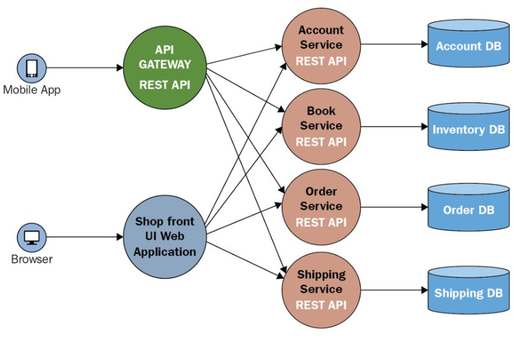
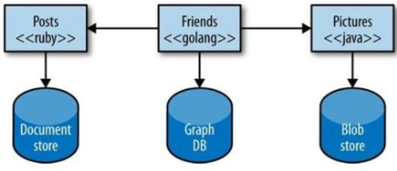
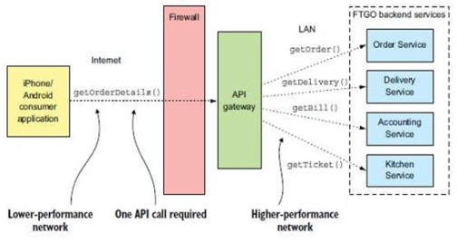

### Scalable Services

---

### Introduction to Scalability

#### Definition
- **Scalability**: The capability of an architecture to handle increased workloads by scaling up (vertical) or scaling out (horizontal).

---

### Key Concepts: Performance, Consistency, and Availability

#### Performance
- **Definition**: The ability of a software system to meet timing requirements.

#### Availability
- **Definition**: The readiness of a software system to perform its tasks when needed.

#### Consistency
- **Definition**: Ensuring every read returns the most recent write.

---

### CAP Theorem

#### Explanation
- **CAP Theorem**: In a distributed system, you can only guarantee two of the following three: Consistency, Availability, and Partition Tolerance.
  - **Consistency**: Every read receives the most recent write.
  - **Availability**: Every request receives a response, regardless of success or failure.
  - **Partition Tolerance**: The system continues to function despite network partitions.
  

---

### Consistency Models

#### Eventual Consistency
- **Definition**: Ensures that the data store will eventually become consistent if no new updates are made.

#### Strong Consistency
- **Definition**: All nodes must contain the same data at any given time.

---

### System Availability

#### Key Resources for High Availability
- Multiple application servers
- Geographic distribution
- Backup systems

---

### Need for Scalable Architectures

#### Monolithic Architecture
- **Definition**: All modules of an application are interconnected in a single, self-contained unit.
- **Advantages**: Simplicity, low network latency, and enhanced security.
- **Disadvantages**: Scalability issues, slow development cycles, and long deployment times.

---

### Principles of Scalability

- Avoid single points of failure.
- Scale horizontally instead of vertically.
- Use APIs and caching mechanisms.
- Emphasize maintenance and automation.
- Implement asynchronous processing.

#### Focus Areas
- Availability
- Performance
- Reliability

---

### Guidelines for Building Highly Scalable Systems

- Avoid shared resources to prevent bottlenecks.
- Minimize reliance on slow services.
- Address the challenges of scaling the data tier.
- Utilize caching.
- Monitor system performance and health.

---

### Scalability Requirements

- Importance of early identification of scalability requirements.
- Criteria for system scalability:
  - Accommodating an increasing number of users.
  - Handling more transactions per millisecond.
  - Managing larger amounts of data.

---

### Challenges for Scalability

- Centralized approaches.
- Synchronous communication.
- Cost considerations.

---

### Case Study: YouTube

#### Architecture
- **Client/Server Architecture**: NetScaler implemented in front of web servers.
- **Web Servers**: Apache with mod_fastcgi, Python.

#### Video Streaming Challenges
- Bandwidth, hardware, and power consumption.
- Cluster methods to address consumption issues.
- Strategies for popular vs. less popular videos.

#### Database Management
- Initial use of MySQL.
- Shard architecture to solve replication problems.

---

### Managing and Processing High Volumes of Data

#### Partitioning and Sharding
- **Partitioning**: Dividing data into partitions for separate management and access.
  - **Benefits**:
    - Improved scalability
    - Enhanced performance
    - Increased security
    - Operational flexibility
    - Higher availability

#### Types of Partitioning
- **Horizontal Partitioning (Sharding)**: Dividing data rows across multiple database nodes.
- **Vertical Partitioning**: Dividing data columns across multiple database nodes.
- **Functional Partitioning**: Dividing data based on functionality or use case.
  
---

### NoSQL Databases

#### Document Model
- **Storage**: Stores and retrieves data as key-value pairs.
- **Structure**: Replaces traditional rows and columns with a document storage model.

#### Graph Model
- **Structure**: Entities as nodes and relationships as edges, each with a unique identifier.
- **Limitation**: Requires all data to reside on one machine, negating some NoSQL advantages.

#### Key-Value Model
- **Functionality**: Uses a key to retrieve and update data.

#### Column-Based Model
- **Structure**: Operates on columns based on Google's BigTable paper.
- **Storage**: Stores values of single columns contiguously.

---

### Hadoop Distributed File System (HDFS)

#### HDFS Components
- **Design**: Distributed file system designed for commodity hardware.
  
#### HDFS Write Process
- **Steps**:
  1. Application writes as to any file system.
  2. Client buffers until it gets a 64K block.
  3. Client informs NameNode of a new block write.
  4. NameNode returns a list of three DataNodes for the block.
  5. Client sends the block to the first DataNode and informs it of the other two replicas.
  6. First DataNode writes and sends the block to the second DataNode.
  7. Each DataNode reports completion to the client.
  8. Client commits the write to the NameNode after hearing from all DataNodes.

#### Failure Handling
- **Client Failure**: Application detects and retries.
- **NameNode Failure**: Backup NameNode takes over with a maintained log file.
- **DataNode Failure**: Client detects and requests a different DataNode.

#### Goals of HDFS
- Fast recovery from hardware failures
- Streaming data access
- Accommodation of large datasets
- Portability

---

### MapReduce Framework

#### How MapReduce Works
- **Map Function**: Processes input <key, value> pairs to produce intermediate pairs.
- **Reduce Function**: Processes intermediate <key, value> pairs to produce final output pairs.

#### Intermediate Steps
- **Combine**: Optional process to reduce data on each mapper server before passing downstream.
- **Partition**: Translates mapper output to feed the reducer and assigns it to a specific reducer.

---

### Content Delivery Network (CDN)

#### Concept
- **Definition**: A network of globally distributed computers that move data efficiently.
- **Example**: YouTube
  
---

### Case Studies

#### Video Streaming: Netflix
- **History**: Launched in 1998 as a DVD rental service, moved to streaming in 2007.
- **Architecture**: Streaming service architecture.
  

#### Web Conferencing: Zoom
- **Features**: Cloud-native, optimized for video, distributed architecture, multimedia routing, multi-bitrate encoding, application layer QoS.

#### Real-Time Fraud Detection
- **Process**: Uses Azure Event Hubs and Stream Analytics for detecting fraudulent transactions.

---

### Messaging Systems

#### Apache Kafka
- **Definition**: Publish-subscribe based durable messaging system.
- **Components**:
  - Kafka Topics
  - Partitioning
  - Kafka Brokers
  - Replication
  - Kafka Producers and Consumers
  - Kafka Connect and Streams
  
---

### Edge Computing

#### Concept
- **Definition**: Distributed IT architecture where client data is processed at the periphery of the network.
- **Benefits**:
  - Low latency
  - Longer battery life for IoT devices
  - Access to data analytics and AI
  - Resilience
  - Scalability
  - Efficient data management

#### Example
- **IoT Image and Audio Processing**: Processes data locally to extract key information like license plate numbers or people count in an area.

---
### Popular Scaling Approaches 

#### **1. Service Replicas**

- **Stateless Services**: 
  - These services do not maintain any state between requests. All instances of a stateless service are identical, and any request can be handled by any instance. 
  - **Example**: Web servers handling HTTP requests.

- **Stateful Services**: 
  - These services maintain state across multiple requests. Each instance might have a different state, so the request routing might depend on where the relevant state is maintained. 
  - **Example**: Database servers, shopping carts.

---

#### **2. Lifecycle of Stateful Replicas**

- **InBuild (IB)**: 
  - The replica is being prepared to join the replica set. Data is being copied to this replica, and it is getting ready to become operational.

- **Ready (RD)**: 
  - The replica is now part of the operational set and actively participates in the system's replication and quorum protocols.

- **Closing (CL)**: 
  - The replica is in the process of being shut down or removed from the replica set.

- **Dropped (DD)**: 
  - The replica has been fully decommissioned. It no longer exists, and its state has been completely removed from the system.

- **Down (D)**: 
  - The replica's service is not currently running, but the state is still preserved on disk.

- **Opening (OP)**: 
  - The replica is being brought back online after being down. It is transitioning back to an operational state.

- **StandBy (SB)**: 
  - The replica is not currently active but can be activated quickly if needed.

---

#### **3. Replica Roles**

- **Primary (P)**: 
  - This replica handles all the write operations. It is the authoritative source of data in the system.

- **ActiveSecondary (S)**: 
  - This replica receives updates from the primary and acknowledges them. It is a backup that can take over if the primary fails.

- **IdleSecondary (I)**: 
  - This is a secondary replica that is still being synchronized with the primary. It is not yet ready to take over.

- **None (N)**: 
  - The replica currently has no role in the replication process.

- **Unknown (U)**: 
  - The replica's role has not been determined yet. This is usually a temporary state during initialization.

---

#### **4. Load Balancing**

- **Concept**: 
  - Distributes incoming network or application traffic across multiple servers. Load balancing ensures that no single server becomes a bottleneck, improving overall application reliability and availability.
  
- **Types**:
  - **Hardware Load Balancers**: Physical devices dedicated to load balancing tasks.
  - **Software Load Balancers**: Software-based solutions often integrated into application delivery controllers (ADCs).

---

#### **5. Command Query Responsibility Segregation (CQRS)**

- **Overview**: 
  - CQRS is a pattern where the read and write operations are separated. It is beneficial in systems with high performance demands, allowing the read side and the write side to be scaled independently.
  
- **Benefits**:
  - Allows optimized data models for reading and writing.
  - Enhances security by segregating read and write access.
  - Improves performance by simplifying queries.

- **Challenges**:
  - Increases complexity due to the need for synchronization between read and write models.
  - Can introduce latency due to eventual consistency.
  

---

#### **6. Protocols for Communication**

- **Synchronous Communication**:
  - The client waits for the server to process the request and send a response before proceeding. Common in APIs where immediate feedback is needed.

- **Asynchronous Communication**:
  - The client sends a request and continues processing without waiting for a response. Useful in scenarios where responses are not time-sensitive, like messaging systems.
  

- **Sync vs Async communications vs Microservices**
    

---

#### **7. Message Broker**

- **Definition**: 
  - A system that manages communication between applications using messages. It supports asynchronous communication, which helps in decoupling applications.
  
- **Advantages**:
  - Reduces dependency between services.
  - Provides reliable message delivery.
  - Can buffer messages during high load, preventing system overload.

- **Disadvantages**:
  - Introduces complexity and potential points of failure.
  - May become a bottleneck if not scaled properly.

---

#### **8. Caching**

- **Purpose**: 
  - A technique to store frequently accessed data in a high-speed data storage layer (cache) to reduce access time and load on primary databases.

- **Distributed Cache**:
  - Spans multiple servers, ensuring that the cache can handle a large number of requests and provides fault tolerance. Common examples include Redis and Memcached.
  
---

#### **9. Scaling Techniques**

- **Vertical Scaling (Scaling Up)**: 
  - Increasing the capacity of a single machine (e.g., adding more CPU, RAM, or storage). It’s simple but has limitations as a single machine can only be scaled so far.

- **Horizontal Scaling (Scaling Out)**: 
  - Adding more machines to distribute the workload. It is more complex but provides greater scalability and fault tolerance.

- **Comparison**

  | **Vertical Vs Horizontal Scaling** | **Vertical Scaling**                        | **Horizontal Scaling**                            |
  |-----------------------------------|---------------------------------------------|--------------------------------------------------|
  | **Data**                          | Data is executed on a single node           | Data is partitioned and executed on multiple nodes |
  | **Data Management**               | Easy to manage – share data reference       | Complex task as there is no shared address space  |
  | **Downtime**                      | Downtime while upgrading the machine        | No downtime                                      |
  | **Upper limit**                   | Limited by machine specifications           | Not limited by machine specifications            |
  | **Cost**                          | Lower licensing fee                         | Higher licensing fee                             |

---

#### **10. Auto-Scaling**

- **Definition**:
  - Automatically adjusts the number of computing resources allocated to an application based on its current load. It helps maintain performance and reduce costs by scaling down during periods of low demand.

- **Benefits**:
  - Ensures applications remain performant during traffic spikes.
  - Reduces costs by scaling down during low usage periods.

---

#### **11. Cloud Scaling**

- **Benefits**:
  - **Speed**: Rapid deployment of additional resources.
  - **Flexibility**: Easy to scale services up or down.
  - **Cost Efficiency**: Pay only for the resources you use.
  - **Capacity**: Virtually unlimited resources available.

---

#### **12. Serverless Architecture**

- **Concept**:
  - Applications run in a stateless compute service where servers are abstracted away. Developers focus only on code, while the cloud provider manages the infrastructure.

- **Advantages**:
  - No need to manage servers, easy to scale.
  - Pay only for execution time, not idle time.

- **Limitations**:
  - May have performance overhead due to "cold starts".
  - Debugging and monitoring can be more challenging compared to traditional architectures.

---

#### **13. Virtualization**

- **Definition**: The creation of virtual (rather than physical) versions of something, such as servers, storage devices, or networks.
- **Benefits**:
  - **Resource Efficiency**: Multiple virtual machines (VMs) can run on a single physical machine, leading to better resource utilization.
  - **Isolation**: VMs are isolated from each other, providing security and fault tolerance.
  - **Flexibility**: Easy to create, modify, and move VMs across physical hosts.
  - **Scalability**: Allows for the rapid deployment of new instances without the need for additional hardware.
  
- **Types of Virtualization**:
  - **Hardware Virtualization**: Virtual machines emulate physical hardware.
  - **Network Virtualization**: Combines multiple network resources into a single, software-based administrative entity.
  - **Storage Virtualization**: Aggregates physical storage from multiple devices into a single storage pool.

- **Hypervisors**:
  - Software that creates and runs virtual machines.
  - **Type 1 (Bare Metal)**: Runs directly on the hardware (e.g., VMware ESXi, Microsoft Hyper-V).
  - **Type 2 (Hosted)**: Runs on a host operating system (e.g., VMware Workstation, Oracle VirtualBox).

---

#### **14. Load Balancer**

- **Definition**: A load balancer is a device or software that distributes incoming network traffic across multiple servers. It ensures that no single server becomes overwhelmed, thereby improving the availability and reliability of applications.

- **Types of Load Balancers**:
  - **Hardware Load Balancers**: Dedicated appliances that handle traffic distribution.
  - **Software Load Balancers**: Applications or services running on general-purpose hardware that distribute traffic (e.g., Nginx, HAProxy).

- **Load Balancing Algorithms**:
  - **Round Robin**: Distributes requests sequentially across servers.
  - **Least Connections**: Directs traffic to the server with the fewest active connections.
  - **IP Hash**: Routes requests based on the IP address of the client.
  - **Weighted Round Robin**: Similar to Round Robin but assigns more traffic to servers with higher capacity.

- **Key Features**:
  - **Health Checks**: Monitors server health to ensure traffic is only sent to healthy servers.
  - **SSL Termination**: Decrypts SSL/TLS traffic before passing it to servers.
  - **Session Persistence**: Ensures that a client is always directed to the same server for the duration of a session (also known as "sticky sessions").
  
- **Benefits**:
  - **Improved Performance**: By distributing the workload, applications can handle more requests efficiently.
  - **High Availability**: If one server fails, traffic is automatically redirected to other available servers.
  - **Scalability**: Simplifies the process of adding or removing servers based on demand.

- **Challenges**:
  - **Complexity**: Requires proper configuration and maintenance.
  - **Single Point of Failure**: If not designed with redundancy, the load balancer itself can become a bottleneck or failure point. 
  

### Microservices

#### 1. **Introduction to Monolithic Architecture**
   - **Monolith**: A single, large system where all components are tightly integrated and deployed together.
     - **Characteristics**:
       - Entire functionality is deployed as a single unit.
       - Typically complex and difficult to maintain over time.
     - **Disadvantages**:
       - Growth in size makes it hard to manage.
       - Slow development and deployment cycles.
       - Adopting new technology is challenging and costly.
      
      

      

#### 2. **Need for Microservices**
   - Modern systems require faster, more scalable solutions.
   - Converting a monolithic system to microservices brings modularity and agility.
   - However, converting every system may not always be necessary.

#### 3. **Microservices Architecture**
   - **Definition**: Microservices are independently deployable services that are designed around a business domain.
   - **Characteristics**:
     - **Small, Autonomous, Focused**: Each service does one thing well.
     - **Loosely Coupled**: Services communicate through networks (HTTP, messaging).
     - **Independent Development**: Each service can be developed, deployed, and scaled separately.
     - **Single Responsibility**: Each microservice focuses on one business capability.
  
      

#### 4. **Comparison: SOA vs Microservices**
   - **SOA (Service-Oriented Architecture)**:
     - Enterprise-wide architecture focused on reusability through service interfaces.
     - Services share a common communication mechanism (Enterprise Service Bus, ESB).

      

   - **Microservices**:
     - Application-scoped architecture with independent communication protocols (API, HTTP).
     - Each service may manage its own data, potentially leading to some data duplication.

   - **Key Differences**:
     - **Scope**: SOA is enterprise-wide, microservices are application-specific.
     - **Communication**: SOA relies on an ESB, while microservices use lightweight protocols.

#### 5. **Key Characteristics of Microservices Architecture** (James Lewis & Martin Fowler)
   - **Componentization via Services**: Each service is a modular unit.
   - **Organized Around Business Capabilities**: Services map directly to specific business functions.
   - **Smart Endpoints, Dumb Pipes**: Services handle logic, while communication remains simple.
   - **Decentralized Governance & Data Management**: Each service governs itself and manages its own data.
   - **Infrastructure Automation**: Continuous delivery and automated deployments are crucial.
   - **Design for Failure**: Systems must be resilient and handle failures gracefully.
   - **Evolutionary Design**: The architecture must evolve over time as business needs change.
  
      

#### 6. **Case Studies**

   - **FTGO (Food to Go) Case Study**:
     - FTGO is an online food delivery service that encountered scaling and development speed issues with its monolithic architecture.
     - **Issues**: Complexity, slow development, difficulty scaling.
     - **Solution**: FTGO transitioned to microservices, improving scalability and allowing independent development of components.

      - **Monolithic Architecture**
      

      - **Microservice Architecture**
      

   - **Netflix Case Study**:
     - Netflix originally started with a monolithic system but struggled with scalability as it transitioned to streaming.
     - **Challenges**: Monolithic codebase, tight coupling, scaling issues.
     - **New Architecture**: Adopted microservices to achieve modularity, scalability, and virtualization, which allowed it to grow as a global streaming service.
    

      - **Monolithic Architecture**
      

      - **Microservice Architecture**
      

      - **Netflix follows continuous learning**
      

   - **Uber**:
     - Uber transitioned to a **Domain-Oriented Microservices Architecture** to manage its large and dynamic operational model.
     - **Domain-Oriented**: Organizes microservices around business domains like ride requests, driver management, and payments.

#### 7. **When to Choose Microservices vs SOA**
   - **Choosing Microservices**:
     - If your application is complex, with distinct business units that need to be independently managed.
     - If your development teams are decentralized and need autonomy.
     - If you require high scalability and flexibility for continuous delivery.
   - **Choosing SOA**:
     - If you are dealing with large, enterprise-wide systems that require centralized control and data governance.

#### 8. **Introduction to Microservices and Decomposition Strategies**
   - **Microservices**: Architectural style where a system is divided into independently deployable services, each serving a specific business function.
   - **Decomposition Strategies**: Techniques used to break down a monolithic system into smaller, manageable services.

---

### 9. **Advantages and Disadvantages of Microservices**
#### **Advantages**:
   - **Technology Heterogeneity**: Different microservices can use different technologies based on what is most suitable.
  
      
   - **Resilience**: Failure in one service does not necessarily impact the entire system.
   - **Ease of Deployment**: Independent deployment without affecting other parts of the system.
   - **Scaling**: Each microservice can be scaled independently based on its demand.

#### **Disadvantages**:
   - **Complexity**: Managing multiple services adds complexity.
   - **Challenging Service Identification**: Defining the right boundaries for each service is difficult.
   - **Development & Testing**: Testing microservices as independent units and then together is complex.
   - **Network Congestion & Latency**: Microservices communicate over a network, adding latency.
   - **Data Integrity Issues**: Ensuring consistency across distributed systems can be challenging.
   - **Careful Coordination**: Requires significant planning to coordinate services.
   - **Versioning**: Managing multiple versions of services can be difficult.

---

### 10. **Organizational and Development Process**
   - **Process & Organization**:
     - As systems grow, refactoring a large engineering team into smaller, independent teams is essential for agility.
   - **Agile Development**: Microservices require continuous delivery and DevOps practices, ensuring software is always deployable.
   - **Emotional Impact**: Transitioning to microservices can impact team dynamics and emotions. It is important to address these during the transition.

      

#### **Three Stage Transition Model**:
   1. **Ending, Losing, and Letting Go**: Accepting the need for change.
   2. **The Neutral Zone**: Transition phase where the system is partially monolithic and partially microservices.
   3. **The New Beginning**: Full transition to microservices.

---

### 11. **Microservices Design Principles**
   - **Single Responsibility Principle**: Each microservice should implement only one business responsibility.
   - **Abstraction & Information Hiding**: Services should expose a standardized API and hide internal implementation details.
   - **Loose Coupling**: Services should minimize dependencies on each other.
   - **Fault Tolerance**: Services should handle failures with minimal impact on the system.
   - **Discoverability**: Services should have clear technical interfaces and business purposes.
   - **Reusability**: While reusability is important, it is typically scoped to specific domains within a business.

---

### 12. **Steps for Defining Microservices Architecture**
   1. **Identify System Operations**: Understand the various operations the system must perform.
   2. **Identify Services**: Define services based on business operations.
      
   3. **Define Service APIs and Collaborations**: Determine how services will interact with each other through APIs.

      

---

### 13. **Shared Libraries and Service Size**
   - **Shared Libraries**: Useful for code reusability but can introduce unintended dependencies between services. Use for functionality that is unlikely to change.
   - **Service Size**: Focus on designing a well-defined service rather than worrying about its size. Aim for small, loosely coupled services.

---

### 14. **Transition from Monolith to Microservices**
   - **Challenges in Rebuilding**: Complete replacement of the monolith takes longer and is riskier.
   - **Strangler Pattern**: Gradual transition from a monolith to microservices by replacing one functionality at a time with a new service.
     - **Issues with Strangler Pattern**:
       - Handling data and services used by both legacy and new systems.
       - Deciding which functionality to start replacing first.

---

### 15. **Strangler's Pattern**

#### **Overview of Strangler Pattern**
   - **Definition**: A gradual approach to refactoring a monolithic application by incrementally replacing it with microservices. The new system coexists with the legacy monolith, eventually “strangling” or replacing it.

      

#### **How Strangler Pattern Works**:
   - **Step-by-Step Migration**: Instead of a complete rewrite of the monolith, the system transitions gradually by replacing parts of the monolith with new microservices.
   - **New Functionality**: Any new feature is added as a new microservice, not in the monolith.
   - **Existing Functionality**: Slowly migrate existing monolith functionalities to microservices one by one.
  
      
      

#### **When to Use the Strangler Pattern**:
   - **Large, Complex Systems**: Best suited for large systems where a complete rewrite is not feasible.
   - **Reduced Risk**: By incrementally replacing components, it reduces the risk of breaking the system.
   - **Easy Transition**: You can continue using parts of the legacy system while building and deploying microservices.

#### **Challenges with Strangler Pattern**:
   - **Service and Data Handling**: Managing services and data stores shared by both the monolith and new microservices can be tricky.
   - **Choosing Where to Start**: Deciding which part of the monolith to break off first can be challenging.
   - **Coordinating Migration**: Keeping track of which functionalities are migrated and which still rely on the monolith is critical.

#### **When Not to Use the Strangler Pattern**:
   - **No Intercepting Requests**: If you cannot intercept requests to the back-end system, this pattern might not be suitable.
   - **Smaller Systems**: For smaller, simpler systems, a full rewrite may be easier than using the Strangler Pattern

---

### 16. **Decomposition Patterns**
#### **Decompose by Business Capability**:
   - A **business capability** is a core function that generates value for the business.
     - Example: For an online store, business capabilities include order management, inventory management, shipping, etc.
   - Once capabilities are identified, services are defined for each capability or a group of related capabilities.

      

#### **Decompose by Subdomain (DDD)**:
   - **Domain-Driven Design (DDD)**: Focuses on building software around business subdomains.
     - Subdomains for an online food delivery service (FTGO) could include order taking, order management, delivery, and financials.
   - Each subdomain forms a bounded context, which becomes a microservice or a set of microservices.

      

---

### 17. **Decomposition Guidelines**
   - **Single Responsibility Principle**: Services should have only one reason to change.
   - **Common Closure Principle**: Group changes together that occur for the same reason.

---

### 18. **Decomposition Strategies and Communication Between Microservices**
   - **Decomposition Strategies**: Techniques to break down monolithic applications into microservices.
   - **Communication Between Microservices**: Defines how services communicate and exchange data, either synchronously or asynchronously.

---

### 19. **Database-Related Patterns for Microservices**

#### **Shared Database Pattern**:
   - **Use Case**: When multiple services need access to shared, read-only static reference data or during transitions.
   - **Problems**:
     - Conflict between shared and hidden data.
     - Control over data is limited.
  
      

#### **Database View Pattern**:
   - **Description**: A view can be used for a single source of data shared by multiple services.
   - **Limitation**: Views are read-only and cannot be used for write operations.

      

#### **Database Wrapping Service Pattern**:
   - **Description**: Wrap the database behind a service that acts as a thin layer to abstract database access.
   - **Use Case**: When clients only need database queries without direct access.

      

#### **Database-as-a-Service Pattern**:
   - **Description**: The database is treated as a service that is accessed by microservices as needed.
   - **Use Case**: This is commonly used when microservices need to query data but shouldn’t handle database management directly.

      

#### **Physical vs. Logical Database Separation**:
   - **Strategy**: Split the database either physically (separate databases) or logically (within the same system).
   - **Challenges**: Managing network latency, ensuring data consistency, and avoiding God classes during decomposition.

      

---

### 20. **Obstacles to Decomposing Applications Into Services**
   - **Network Latency**: Communication over the network introduces delays.
   - **Synchronous Communication Issues**: Services waiting for responses can reduce availability.
   - **Data Consistency**: Maintaining consistency across distributed services is challenging.
   - **God Classes**: Large classes that handle too much responsibility, making decomposition harder.

---

### 21. **Defining Service APIs**

#### **Service API Operations**:
   - **External Operations**: Invoked by external clients or other services.
   - **Internal Operations**: Exist to support collaboration between services.
   - **Assigning System Operations to Services**: Operations can be assigned based on the data needed by a service or the information it provides.

---

### 22. **Communication Protocols for Microservices**

#### **Synchronous Communication**:
   - **Description**: The client sends a request and waits for a response (e.g., REST).
   - **Example**: FTGO’s `CreateOrder` request follows a synchronous protocol.

      

#### **Asynchronous Communication**:
   - **Description**: The sender doesn’t wait for a response. Communication happens in the background.
   - **Common Implementations**:
     - **Message Queues**: Messages are queued and processed independently.
     - **Event-Based Systems**: Services respond to events rather than direct requests.

---

### 23. **REST: Representational State Transfer**
   - **Description**: A popular software architectural style used for designing networked applications, especially for the web.
   - **Guiding Principles**:
     - **Client-Server**: Separates concerns between the client and the server.
     - **Stateless**: Each request from a client contains all the information needed to process it.
     - **Cacheable**: Responses should define whether or not they are cacheable.
     - **Uniform Interface**: Provides a standard method of communication across services.
     - **Layered System**: Services can be composed into a layered structure.

---

### 24. **gRPC (Google Remote Procedure Call)**
   - **Introduction**: gRPC is a high-performance RPC framework used to connect services.
   - **Key Features**:
     - Supports multiple languages (e.g., Java, Go, Python, Ruby).
     - Google APIs use gRPC, making it easy to integrate Google services.
     - Allows the creation of clients and servers across different environments.

      

---

#### **Conclusion**
   - Microservices offer flexibility, scalability, and modularity, making them an excellent choice for modern, large-scale applications.
   - However, they bring complexity in terms of management, communication, and data duplication, which must be carefully handled.
   - Both microservices and SOA have their unique strengths, and the choice between them depends on the scope, scale, and specific needs of your application environment.
   - Microservices offer a highly scalable and resilient architecture, but they also introduce complexity, requiring careful design, testing, and organizational changes. Transitioning from monolithic systems can be challenging but using patterns like the strangler pattern allows incremental migration while maintaining stability.
   - This presentation provides key patterns for decomposing databases, defining service APIs, and implementing communication strategies within a microservices architecture. The various database and communication patterns (e.g., shared databases, REST, gRPC) are crucial for designing scalable and efficient microservices that ensure both data consistency and independent service operation.

---

## **1. Communication and Transaction Management**
   - **Communication Models**:
     - **Message Queues**: A queue used for sending messages between services in asynchronous communication.
     - **Message Brokers**: Software responsible for handling message exchanges between services, such as RabbitMQ, Apache Kafka, etc.
     - **Event-based Systems**: Systems that react to events, where actions are triggered based on events generated by other services.
     - **Asynchronous Communication**: Non-blocking communication where requests are sent without waiting for the response, improving performance and scalability.

---

## **2. Microservices Communication** 
   - **Scenario**: Imagine a shopping application with multiple microservices (order history, product details, etc.).
   - **Direct Communication**:
     - **Challenges**: 
       - **Inefficiency**: Direct calls from client to microservices can be slow and cumbersome.
       - **Protocol Mismatch**: Client might use protocols unsuitable for web services.
       - **Difficult Refactoring**: Direct service communication ties client tightly to microservice design, making refactoring difficult.
   - **Additional Insight**: 
     - In a microservices architecture, direct communication between a client and several services results in **tight coupling**, making it difficult to scale or modify individual services without affecting others. This can lead to **fragile systems**.

---

## **3. API Gateway**
   - **Definition**: A server that acts as the single entry point for all client requests in a microservice architecture.
   - **Key Functions**:
     - **Request Routing**: API Gateway forwards client requests to the appropriate service.

      

     - **Protocol Translation**: Converts client requests into a format understood by microservices.
     - **Edge Functions**: Handles authentication, authorization, rate limiting, caching, logging, etc.
   - **Architecture**:
     - Provides separate APIs for different clients (e.g., Android, iOS).
     - Routes client requests efficiently and performs centralized functions like security enforcement.
   - **Benefits**:
     - **Simplifies client code**: Reduces the complexity of direct client-service interaction.
     - **Encapsulation**: Hides internal service structures from clients, allowing flexibility.
   - **Drawbacks**:
     - Can create **bottlenecks** during development or performance, as it’s a single point of failure.

      

     - Needs to be managed, deployed, and scaled.
   - **Additional Insight**: An API Gateway can implement **circuit breakers**, which prevent failing services from overwhelming the entire system by returning cached responses or alternative results in case of failure.

     

---

## **4. API Design**
   - **Definition**: The process of designing interfaces that expose services for developers or clients.
   - **Key Elements**:
     - **API as a Contract**: API is a contract between service providers and consumers, ensuring mutual expectations.
     - **Technology Decisions**: API design should consider underlying communication protocols (REST, gRPC, etc.).
     - **Lifecycle**: APIs evolve as services evolve, requiring version control to manage backward compatibility.
   - **Good API Design**:
     - **Simplicity**: The design should be simple, minimizing complexity for the client.
     - **Flexibility**: It should be adaptable for future changes.
   - **Versioning**: 
     - **When to version**: When making changes that could break client compatibility.
     - **Types of versioning**: 
       - **URI Versioning**: e.g., `/v1/orders`
       - **Query Parameter Versioning**: e.g., `/orders?version=1`
       - **Custom Header Versioning**: Clients send version info in headers.

---

## **5. API Security**
   - **What is API Security?**: Protecting the integrity and data privacy of APIs from unauthorized access.
   - **Why Important**:
     - APIs are often the weakest link in data breaches.
     - If an API connects with third-party services, it’s crucial to assess how data is being shared externally.
   - **REST API Security**:
     - Uses **TLS** (Transport Layer Security) to ensure communication is encrypted and secure.
   - **Common API Security Practices**:
     - **Use Tokens**: Secure sessions with tokens like OAuth 2.0.
     - **Encryption**: Encrypt communication channels.
     - **Vulnerability Assessment**: Regularly audit APIs for vulnerabilities.
     - **Throttling & Quotas**: Limit the number of API requests to prevent misuse or DDoS attacks.
   - **Management and Security**:
     - Use authentication methods like API keys, Basic Auth, or OpenID Connect.

---

## **6. Backends for Frontends (BFF) Pattern**
   - **Definition**: Design pattern where each frontend (e.g., mobile, web) has its own dedicated backend.
   - **Benefits**:
     - Isolated API modules improve reliability.
     - APIs are independently scalable and optimized for their respective frontend.
     - Improves observability (easier to monitor different APIs).
     - Faster startup times, as each API is simpler.

      

---

## **7. Transaction Management in Microservices**
   - **Scenario**: Imagine a system that needs to create an order, authorize credit cards, and check inventory.
   - **Distributed Transactions**:
     - Traditionally used to ensure data consistency across services and databases.
     - **Challenges**:
       - Modern systems like NoSQL databases (e.g., MongoDB, Cassandra) don’t support distributed transactions.
       - Requires **synchronous IPC** (inter-process communication), which reduces system availability as all services need to be online to complete a transaction.

        

   - **Saga Pattern**:
     - **Definition**: A pattern that breaks down distributed transactions into smaller steps managed by sagas, ensuring data consistency in microservices.
     - Each service involved in the saga commits changes to its local database, and compensating actions are triggered if any step fails.
     - **Challenges**:
       - **Lack of isolation**: Steps in the saga are not isolated from each other.
       - **Error handling**: Requires compensating transactions to undo actions when an error occurs (no automatic rollback).
  
        

   - **Compensating Transactions**:
     - Used to **reverse changes** made in a transaction if a later step fails, manually reverting to a previous state.
   
   - **Create Order Saga**:
     - Verifies the order details, authorizes the payment, and creates an order across several microservices.

        

---

## **8. Self-Study Materials**:
   - **Book**: *Microservices Patterns* by Chris Richardson.
   - **Online Resources**:
     - Microservices API gateway design by NGINX: [Link](https://www.nginx.com/blog/building-microservices-using-an-api-gateway/).
     - API security concepts by RedHat: [Link](https://www.redhat.com/en/topics/security/api-security).

---

### **Additional Insights**:
- **Reactive Programming**:
  - Useful for building scalable systems in microservices by reacting to streams of events asynchronously, enabling better performance and failure handling.
  
- **Observability**:
  - Critical in modern systems for monitoring services, tracking performance, and detecting failures. Implementing proper logging and metrics collection ensures that each service is monitored independently.

- **Circuit Breaker Pattern**:
  - Often used in conjunction with an API Gateway, circuit breakers detect failures in services and prevent them from affecting other services by stopping further calls to failing services and providing fallback options (like cached data).

### **Detailed Notes on "Building with Pipelines"**

---

#### **1. Introduction to Continuous Integration (CI)**

- **Definition:**
  - CI is a DevOps practice where developers frequently merge code changes into a central repository. Automated builds and tests are performed on these changes.
  - Artifacts (compiled code, packages, etc.) are created during CI and stored for reuse during further validation or deployment stages.

- **Purpose:**
  - CI ensures that code changes integrate seamlessly with the existing codebase.
  - It is foundational for enabling smooth transitions into microservices architecture.

---

#### **2. Why Continuous Integration is Necessary**

- **Traditional Approach:**
  - Developers worked in isolation for extended periods and merged changes only after completing tasks, leading to integration challenges.

- **Benefits:**
  - Simplifies and accelerates the process of making code changes.
  - Critical for efficient microservices adoption, where isolated and independent services are developed and deployed.

---

#### **3. How Continuous Integration Works**

- Developers commit changes to a shared repository frequently.
- Automated systems pull these changes, build the application, and execute a suite of tests.
- Problems, if any, are identified immediately, allowing for faster resolution.

---

#### **4. Benefits of Continuous Integration**

1. **Improved Developer Productivity:**
   - Automated testing and integration save time on manual tasks.
2. **Quicker Bug Identification and Fixing:**
   - Issues are detected earlier, reducing the time and cost of fixes.
3. **Faster Updates:**
   - Enables rapid delivery of updates, ensuring the software stays current.

---

#### **5. Continuous Integration in Microservices**

- **Single Repository Approach:**
  - All code resides in one giant repository with a single build process.
  - Simplifies repository management but increases build complexity.

- **Partitioned Source Tree:**
  - A single repository contains multiple services, with individual CI builds targeting specific parts.
  - Provides balance between complexity and flexibility.

- **Independent Microservice Builds:**
  - The ideal scenario: each microservice has its CI build, allowing quick validation and deployment.
  - Facilitates independent service development and scaling.

---

#### **6. Pipelines in CI/CD**

- **Continuous Delivery (CD):**
  - Extends CI by treating every check-in as a potential release candidate.
  - Focuses on ensuring production readiness of each code change.
  - Emphasizes independent pipelines for each microservice to allow isolated deployment.

---

#### **7. Managing Platform-Specific Artifacts**

- **Artifact Complexity:**
  - Some platforms, like Java, allow easy artifact execution (e.g., via JAR files with embedded HTTP servers).
  - Others, such as Python or Ruby, require additional setup (e.g., Apache or Nginx for hosting).

- **Automation Tools:**
  - Tools like **Puppet** and **Chef** streamline the configuration of environments, ensuring consistent artifact deployment.

---

#### **8. Service Configuration Management**

- **Dynamic Configuration:**
  - Services often require different configurations for distinct environments (e.g., development, staging, production).
  
- **Approaches:**
  1. **Environment-Specific Artifacts:**
     - Build unique artifacts for each environment.
     - Not scalable or efficient.
  2. **Single Artifact with External Configuration:**
     - Maintain a single artifact and handle environment-specific configurations separately.
     - Preferred approach for flexibility and consistency.

---

#### **9. Repository Structures: Monorepo vs. Multi-Repo**

- **Monorepo:**
  - All codebases reside in a single repository.
  - Easier to manage but can lead to challenges with scaling and independent service releases.

- **Multi-Repo:**
  - Separate repositories for each microservice or module.
  - Promotes modularity, independent releases, and better alignment with CI/CD pipelines.

---

#### **10. Challenges in CI/CD**

1. Managing numerous independent codebases.
2. Supporting multiple programming languages and frameworks.
3. Handling complex release management for interdependent services.
4. Ensuring effective integration and load testing.

---

#### **11. CI/CD Tools**

- Tools like **Jenkins**, **GitLab CI/CD**, **CircleCI**, and cloud-based solutions from AWS and Azure provide CI/CD pipeline capabilities.
- Automate processes such as testing, deployment, and configuration management.

---

#### **12. References**

- For further exploration, consult:
  - AWS DevOps Continuous Integration Documentation:
    [AWS CI Documentation](https://aws.amazon.com/devops/continuous-integration/)
  - Microsoft Azure CI/CD for Microservices:
    [Azure CI/CD](https://docs.microsoft.com/en-us/azure/architecture/microservices/ci-cd)

---

### **Additional Information**

- **Best Practices for CI/CD Pipelines:**
  1. Commit frequently to the shared repository.
  2. Write comprehensive automated test cases to validate builds.
  3. Use consistent naming and tagging for artifacts.
  4. Regularly review and optimize pipelines for performance and scalability.

- **Integration Testing in Microservices:**
  - Employ mock services and contract testing tools (e.g., **Pact**) to ensure seamless communication between microservices.

- **Security Considerations:**
  - Secure CI/CD pipelines by managing credentials using tools like **HashiCorp Vault** and enabling role-based access controls.

Here are detailed notes summarizing and explaining the contents of the document **"Designing Reliable Microservices"** with added context and insights for clarity and depth. 

---

### **1. Introduction to Reliability in Microservices**
- **Reliability Definition**: The ability of a service to function under expected conditions for a specified period.
- Microservices must be resilient against failures to ensure high availability and consistent performance.

---

### **2. Sources of Failure**
Failures in microservices originate from four major areas:
1. **Hardware Failures**:
   - Unexpected hardware malfunctions, such as server crashes or disk failures.
   - Solutions: Redundancy, failover systems, and cloud-based infrastructures.

2. **Communication Failures**:
   - Failures in inter-service communication due to network issues.
   - Solutions: Retries, timeouts, and asynchronous communication.

3. **Dependency Failures**:
   - Failures due to dependent services, like a database becoming unreachable.
   - Solutions: Circuit breakers and fallback mechanisms.

4. **Internal Failures**:
   - Bugs, memory leaks, or resource mismanagement.
   - Solutions: Robust coding practices, stress testing, and monitoring.

---

### **3. Cascading Failures**
- Occur when a failure in one service propagates through the system, leading to widespread outages.
- Example:
  - Overloaded services fail to respond.
  - Upstream services that depend on these failures also crash.
- **Mitigation Techniques**:
  - Circuit breakers.
  - Rate limiting to prevent overloading services.
  - Fallback responses to reduce the dependency chain.

---

### **4. Designing Reliable Communication**
Reliability in communication ensures resilience against transient and systemic failures.
1. **Retries**:
   - Retrying failed operations to handle intermittent issues.
   - Techniques:
     - **Exponential Backoff with Jitter**: Gradually increasing delay between retries to reduce load spikes.
     - Limit retries to prevent overload.
   - Only retry on recoverable errors (e.g., timeouts).

2. **Asynchronous Communication**:
   - Reduces tight coupling between services.
   - Examples: Event-driven architectures, message queues.
   - Advantages:
     - Minimizes failure ripple effects.
     - Enhances scalability.

3. **Circuit Breakers**:
   - Prevent repeated calls to failing services.
   - Phases:
     - **Closed**: Service operates normally.
     - **Open**: Service halts calls after reaching a failure threshold.
     - **Half-Open**: Service periodically tests if failures have resolved.

4. **Graceful Degradation**:
   - Temporarily reduce functionality instead of total failure.
   - Example: Show cached data when the database is unavailable.

5. **Timeouts**:
   - Set limits for response time to avoid waiting indefinitely.

---

### **5. Maximizing Service Reliability**
Techniques to improve the reliability of microservices:
1. **Load Balancing**:
   - Distributes incoming requests to healthy service instances.
   - Types of Health Checks:
     - **Liveness**: Determines if the service is running.
     - **Readiness**: Determines if the service can handle requests.

2. **Rate Limiting**:
   - Controls the number of requests a service processes in a timeframe.
   - Example: Limit API calls per user to prevent abuse.

3. **Chaos Testing**:
   - Introduces controlled failures to identify weaknesses.
   - Tools: Netflix's Chaos Monkey.

4. **Throttling**:
   - Strategies to manage excess load:
     - Reject low-priority requests.
     - Temporarily degrade non-essential services.

5. **Queue-Based Load Leveling**:
   - Use message queues to manage surges in traffic.
   - Helps buffer requests, ensuring services aren't overwhelmed.

---

### **6. Service Mesh**
- **Definition**: A dedicated infrastructure layer that manages service-to-service communication.
- Benefits:
  - Simplifies inter-service communication logic.
  - Enhances observability and security.
- **How it Works**:
  - Services communicate via proxies (called "sidecars") instead of direct calls.
  - Sidecars manage traffic routing, retries, and security checks.
- **Advantages**:
  - Decouples communication logic from business logic.
  - Optimizes performance by analyzing traffic patterns.
- Popular Tools: Istio, Linkerd.

---

### **7. Patterns and Practices**
1. **Queue-Based Load Leveling**:
   - Context:
     - Unpredictable surges in traffic lead to performance degradation.
   - Solution:
     - Buffer requests with queues.
     - Process them sequentially based on priority.

2. **Throttling**:
   - Prevents system overload by controlling the request rate.
   - Strategies:
     - Reject high-frequency requests.
     - Prioritize critical tasks.

---

### **8. References for Further Reading**
- **Reliable Communication**: [Microsoft Microservices Guide](https://learn.microsoft.com/en-us/dotnet/architecture/microservices/implement-resilient-applications/partial-failure-strategies)
- **Rate Limiting**: [Google Cloud Strategies](https://cloud.google.com/architecture/rate-limiting-strategies)
- **Chaos Testing**: [Netflix Chaos Monkey](https://netflix.github.io/chaosmonkey/)
- **Service Mesh**: [Red Hat Overview](https://www.redhat.com/en/topics/microservices/what-is-a-service-mesh)

---

### **Conclusion**
Designing reliable microservices requires proactive strategies to mitigate failures, ensure seamless communication, and maximize resilience. The principles outlined in this guide, when implemented effectively, can help build scalable, fault-tolerant systems.

Here are detailed notes summarizing and expanding upon the document **"Securing and Testing Scalable Services"** for better understanding.

---

### **1. Securing Code and Repositories**
- **Importance**: Secure repositories ensure the safety of source code and prevent unauthorized access or malicious alterations.
- **Best Practices**:
  1. **Trusted Repository Platforms**:
     - Use reputable platforms like GitHub or GitLab.
  2. **Access Control**:
     - Protect credentials.
     - Revoke access for unused or compromised accounts.
  3. **Peer Reviews and Audits**:
     - Regularly review code changes to detect vulnerabilities.
  4. **Backup Strategies**:
     - Ensure backups are up-to-date to recover from accidental deletions or attacks.
  5. **External Code Handling**:
     - Carefully vet third-party libraries and dependencies for malicious code.

---

### **2. Authentication and Authorization**
- **Authentication**:
  - Verifies the identity of users or applications.
  - **Implementation**:
    - Use an **API Gateway** for centralized authentication:
      - API gateway validates credentials and issues security tokens.
      - Tokens are forwarded to microservices for secure interactions.

- **Authorization**:
  - Determines user permissions for accessing resources.
  - **Implementation**:
    - Role-based security and Access Control Lists (ACLs).
    - Use frameworks like **Spring Security** for API gateway-level control.

- **OAuth**:
  - Open-standard protocol for authorization.
  - **Key Components**:
    - Authorization Server: Issues tokens.
    - Resource Server: Hosts resources.
    - Client: Application accessing resources.
  - Example: Logging in to websites using Google or Facebook.

---

### **3. Testing Scalable Services**
Testing ensures scalability and reliability under various conditions. Several types of testing are crucial:

#### **Unit Testing**
- Tests individual functions or methods.
- Types:
  1. **Solitary Unit Tests**:
     - Test a single class in isolation with mocked dependencies.
  2. **Sociable Unit Tests**:
     - Test a class along with its dependencies.

- **Strategies**:
  - Test **entities** (persistent objects) and **value objects** (immutable data types) with sociable unit tests.
  - Test **domain services** and **controllers** with solitary unit tests.

#### **Integration Testing**
- Verifies interactions between multiple components.
- **Approaches**:
  - Use **Consumer-Driven Contract Testing**:
    - **Consumer-Side Tests**: Simulate provider behavior using stubs.
    - **Provider-Side Tests**: Use mocks to simulate consumer behavior.
  - Benefits:
    - Ensures compatibility between services.

#### **Load Testing**
- Tests system behavior under heavy traffic.
- **Benefits**:
  - Identifies bottlenecks.
  - Prevents crashes due to unexpected surges in usage.
- **Best Practices**:
  - Focus on high-risk services.
  - Use service virtualization for dependencies.
  - Go beyond request/response metrics.

- **Tools**:
  - JMeter for performance testing.
  - Grafana and InfluxDB for visualization.
  - CloudWatch for AWS services monitoring.

#### **Chaos Testing**
- Introduces controlled disruptions to validate system resilience.
- Example: Netflix's **Chaos Monkey** to simulate failures.

---

### **4. Tools for Testing Microservices**
- **Contract Testing**:
  - Pact: For writing consumer-driven contract tests.
- **Unit and Integration Testing**:
  - Mocha, Jest: Popular testing frameworks.
- **Performance Testing**:
  - JMeter, Locust: Load testing tools.
- **Visualization**:
  - Grafana: Real-time metrics visualization.

---

### **5. OAuth in Microservices**
- OAuth simplifies secure access to resources in a distributed system.
- Workflow:
  1. User authenticates through an Authorization Server.
  2. Server issues an **Access Token**.
  3. Client includes the token in service requests.
  4. Token is validated before granting access.

---

### **6. Recommendations for Secure and Reliable Systems**
1. **Prioritize Security**:
   - Use secure repositories and enforce strong authentication/authorization mechanisms.
2. **Comprehensive Testing**:
   - Implement a layered testing approach (unit, integration, load).
3. **Embrace Chaos Engineering**:
   - Regularly test system resilience under simulated failures.
4. **Monitor and Adapt**:
   - Use monitoring tools like Grafana and CloudWatch to analyze performance and reliability.

---

### **7. References for Further Study**
- [Securing Repositories](https://docs.github.com/en/code-security/getting-started/quickstart-for-securing-your-repository)
- [Load Testing for Microservices](https://www.neotys.com/insights/microservices-load-testing)
- [Chaos Testing with Netflix](https://netflix.github.io/chaosmonkey/)
- [OAuth Explained](https://oauth.net/)

---

### **Conclusion**
Securing and testing scalable services is a critical aspect of ensuring robust and reliable microservices architectures. Following best practices in repository management, implementing efficient authentication and authorization, and adopting comprehensive testing strategies can significantly improve the scalability and security of systems.